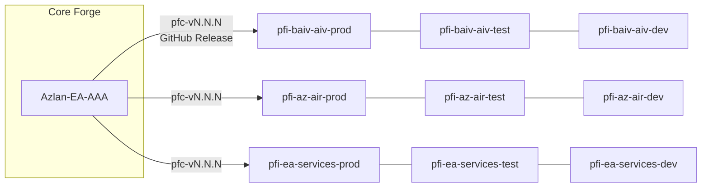
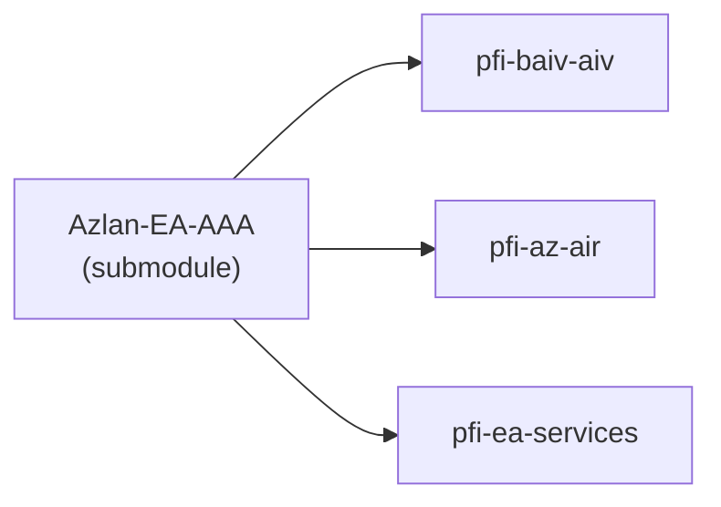
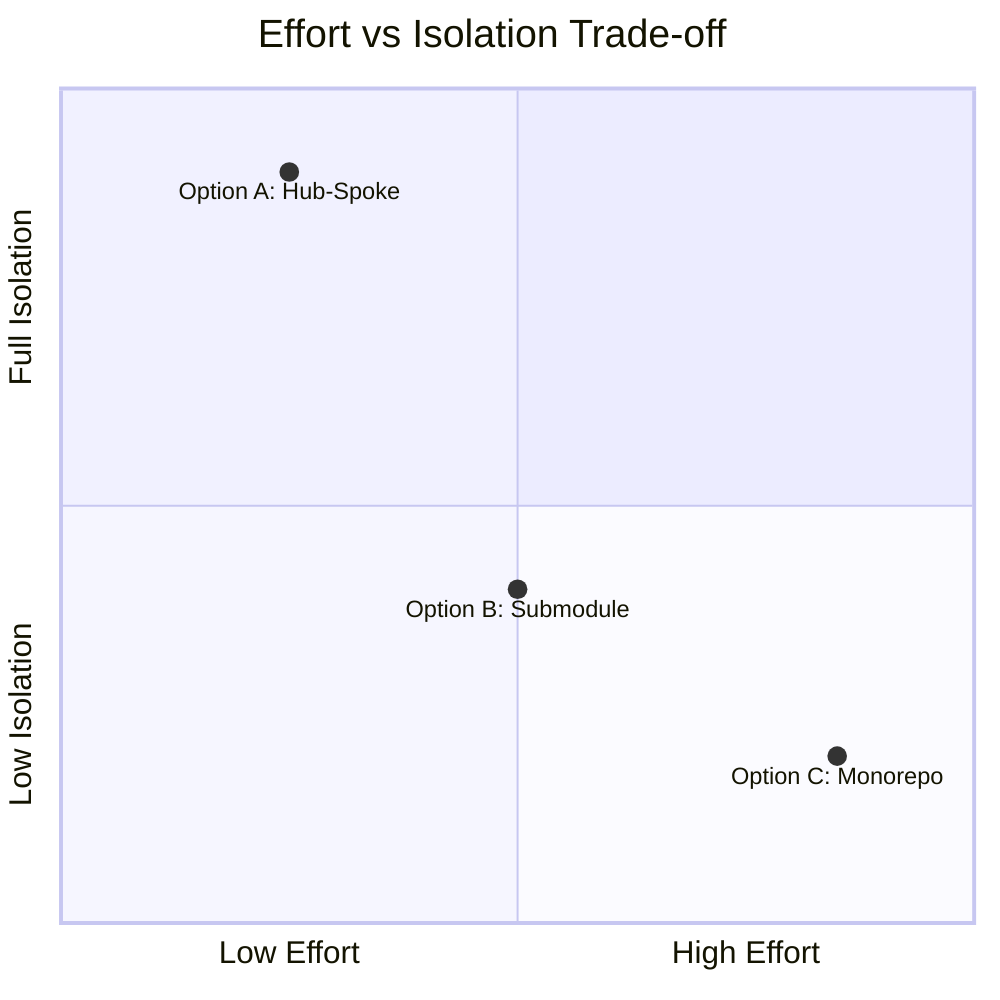
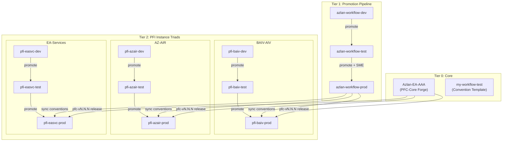
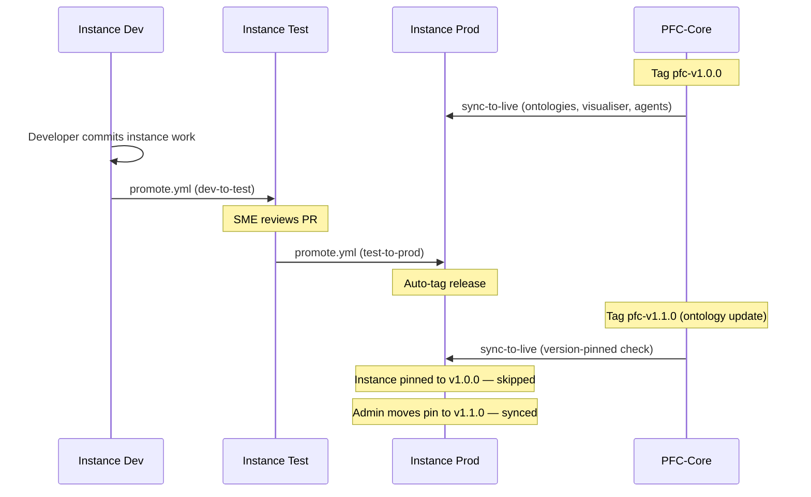
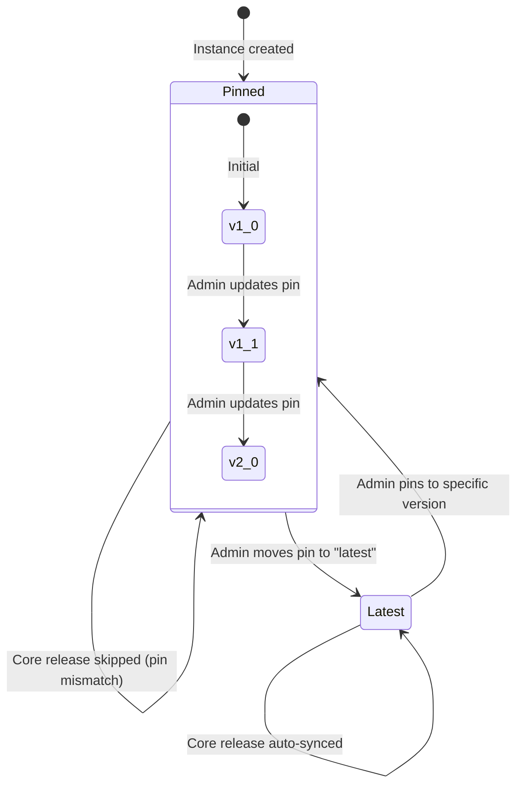
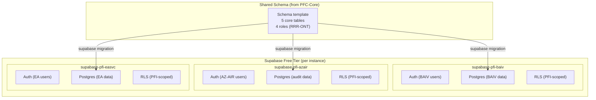
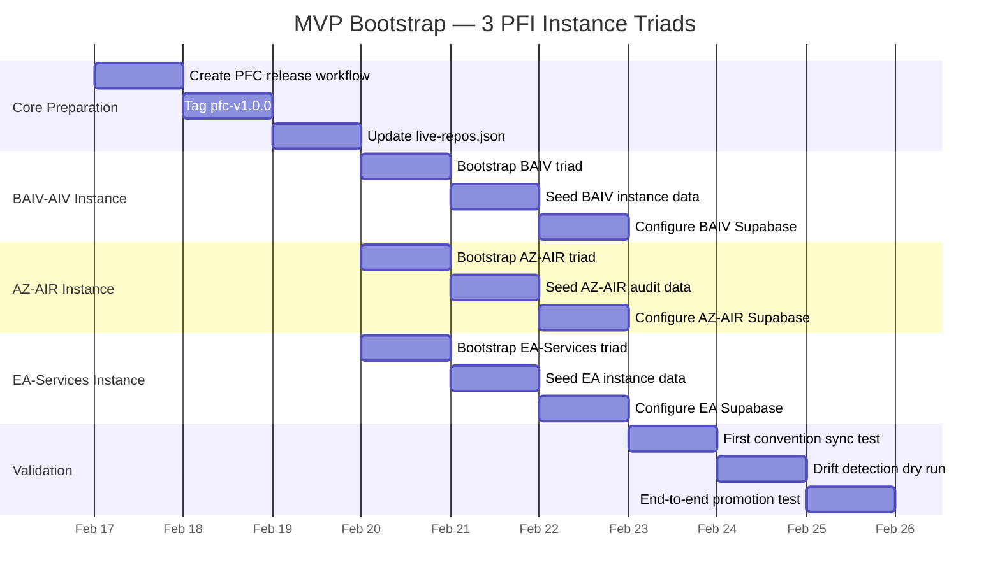

# ARCH-CICD-001: Hub-and-Spoke Multi-Instance Platform Architecture

**Version:** 1.0.0
**Date:** 2026-02-16
**Status:** Proposal
**Author:** Azlan Architecture Team
**Relates to:** Epic 10 (PE E2E), Epic 10A (Security MVP), Epic 12-16 (PFI Instances), Epic 19 (Graph-Scope Rules)

---

## 1. Executive Summary

This proposal defines the CI/CD and repository architecture for distributing PF-Core (PFC) assets to multiple parallel Platform Foundation Instances (PFI). It leverages the existing `my-workflow-test` promotion pipeline (dev-test-prod three-repo model) and extends it to support 3-4 concurrent PFI delivery teams while maintaining ontology integrity, design system consistency, and licence control.

**Recommendation:** Hub-and-Spoke with existing promotion pipeline (Option A).

---

## 2. Architecture Overview

```mermaid
graph TB
    subgraph "PFC-Core Forge (Azlan-EA-AAA)"
        ONT["Ontology Library<br/>40 ontologies"]
        VIS["Ontology Visualiser<br/>12 ES modules"]
        AGT["Agent Prompts<br/>OAA v6.1"]
        DS["Design System Core<br/>Token taxonomy"]
        REG["Registry Index<br/>v7.2.0"]
    end

    subgraph "Workflow Template (my-workflow-test)"
        TPL["Convention Manifest"]
        BST["Bootstrap Script"]
        PRO["Promotion Pipeline"]
        SKL["Claude Code Skills"]
        DRF["Drift Detection"]
    end

    ONT & VIS & AGT & DS & REG --> REL["GitHub Releases<br/>pfc-vN.N.N"]
    REL --> PAGES["GitHub Pages<br/>Static Deploy"]

    TPL & BST & PRO & SKL --> SYNC["sync-to-live.yml"]

    REL --> BAIV
    REL --> AZAIR
    REL --> EASVC
    SYNC --> BAIV
    SYNC --> AZAIR
    SYNC --> EASVC

    subgraph "PFI-BAIV-AIV"
        BAIV["pfi-baiv-aiv<br/>(dev / test / prod)"]
        BAIV_SB["Supabase Project"]
        BAIV_TK["BAIV Brand Tokens"]
        BAIV_ID["Instance Data"]
    end

    subgraph "PFI-AZ-AIR"
        AZAIR["pfi-az-air<br/>(dev / test / prod)"]
        AZAIR_SB["Supabase Project"]
        AZAIR_TK["AZ-AIR Configs"]
        AZAIR_ID["Audit Instance Data"]
    end

    subgraph "PFI-EA-Services"
        EASVC["pfi-ea-services<br/>(dev / test / prod)"]
        EASVC_SB["Supabase Project"]
        EASVC_TK["EA Brand Tokens"]
        EASVC_ID["TOGAF Instance Data"]
    end
```



---

## 3. Options Evaluated

### Option A: Hub-and-Spoke (Recommended)

PFC-Core stays as the single source of truth. Each PFI gets its own repo triad (dev/test/prod). Core assets flow downstream via GitHub Releases and the sync workflow.



| Criteria | Score |
|----------|:-----:|
| Effort to implement | Low |
| Team isolation | Full |
| Reuses existing pipeline | Yes |
| Licence control | Built-in (version pinning) |
| Ontology integrity | GitHub Pages (immutable per release) |
| Supabase isolation | Per-project (free tier) |

### Option B: Shared-Core Submodule

PFC-Core as a Git submodule inside each instance repo. Fewer repos but painful submodule management.



| Criteria | Score |
|----------|:-----:|
| Effort to implement | Medium |
| Team isolation | Partial (branch-based) |
| Reuses existing pipeline | No |
| Licence control | Manual |
| Ontology integrity | Submodule ref (can drift) |
| Supabase isolation | Per-project |

### Option C: Monorepo Workspaces

Everything in one repo with npm/pnpm workspaces. Requires build tooling.

| Criteria | Score |
|----------|:-----:|
| Effort to implement | High |
| Team isolation | None (shared repo) |
| Reuses existing pipeline | No |
| Licence control | Complex |
| Ontology integrity | Good (atomic commits) |
| Supabase isolation | Environment-based |

### Decision Matrix



---

## 4. Hub-and-Spoke Architecture Detail

### 4.1 Repository Topology



### 4.2 Promotion Flow



### 4.3 Core Asset Distribution

| Asset | Distribution Method | Consumer |
|-------|-------------------|----------|
| Ontology Library | GitHub Pages URL | Visualiser multi-loader |
| Visualiser | GitHub Release artifact | Instance deploy pipeline |
| Agent Prompts | GitHub Release artifact | Claude Code plugin |
| Design System Tokens | GitHub Release artifact | Instance build |
| Convention Files | sync-to-live.yml | Instance repo |
| Claude Code Skills | Convention manifest | Instance repo |

### 4.4 Instance Repo Structure

Each PFI instance repo (created by `bootstrap-new-repo.sh`) contains:

```
pfi-{instance}-{tier}/
  .github/
    workflows/           # Convention workflows (synced from prod)
    ISSUE_TEMPLATE/      # Convention templates (synced from prod)
    labels.yml           # Convention labels (synced from prod)
  azlan-github-workflow/ # Claude Code skills (synced from prod)
  instance-data/
    ontologies/          # Instance-specific ontology data (*.jsonld)
    tokens/              # Brand-specific design tokens
    config/              # Instance configuration
  supabase/
    migrations/          # Supabase schema migrations
    seed.sql             # Instance seed data
  tools/
    custom/              # Instance-specific tools
  pfc-core/
    azlan-workflow-version    # Pinned PFC version
    ontology-registry.json    # Cached registry snapshot
    .claude-plugin/
      plugin.json             # Sealed skills plugin manifest
    skills/
      close-out/SKILL.md      # Sealed: 6-stage post-change pipeline
    sealed-skills-manifest.json # Governance metadata
  docs/
    instance-readme.md
```

### 4.5 Sealed Skill Distribution (F31.9)

Some skills must be **executable but not editable** in PFI triad repos. These are distributed via `pfc-release.yml` and protected by `guard-core.yml`.

**Two-phase delivery:**

| Phase | Mechanism | What arrives |
|-------|-----------|-------------|
| Bootstrap (day 0) | `bootstrap-triad.sh` from AZLAN-CI-CD | `guard-core.yml`, `plugin.json`, `pfc-core/skills/.gitkeep` (scaffolding) |
| First PFC release (day 1+) | `pfc-release.yml` from Azlan-EA-AAA | Sealed SKILL.md files, `sealed-skills-manifest.json` |

**Governance controls:**
- `guard-core.yml` CI gate blocks any PR touching `pfc-core/` unless authored by `github-actions[bot]`
- `sealed-skills-manifest.json` declares which skills are sealed with `overrideType: "none"`
- Claude Code discovers sealed skills via `--plugin-dir ./pfc-core`

**Adding a new sealed skill:**
1. Create the SKILL.md in `azlan-github-workflow/skills/{name}/` (Azlan-EA-AAA)
2. Add an entry to `azlan-github-workflow/sealed-skills-manifest.json` with source/target paths
3. Tag a new `pfc-v*` release — `pfc-release.yml` distributes automatically

---

## 5. Licence and Version Control

### 5.1 Version Pinning Model



### 5.2 live-repos.json Registry

```json
{
  "repos": [
    {
      "name": "ajrmooreuk/Azlan-EA-AAA",
      "pin": true,
      "notes": "Main ontology and visualiser repo"
    },
    {
      "name": "clientorg/pfi-baiv-aiv",
      "pin": "pfc-v1.0.0",
      "license": "pfc-standard",
      "ontologies": ["VE-Series", "PE-Series", "Foundation"],
      "notes": "BAIV AI Visibility instance"
    },
    {
      "name": "clientorg/pfi-az-air",
      "pin": "pfc-v1.0.0",
      "license": "pfc-compliance",
      "ontologies": ["RCSG-Series", "PE-Series", "Foundation"],
      "notes": "Azure AI Readiness - Audits & Assessments"
    },
    {
      "name": "clientorg/pfi-ea-services",
      "pin": "pfc-v1.0.0",
      "license": "pfc-enterprise",
      "ontologies": ["PE-Series", "VE-Series", "Foundation"],
      "notes": "EA Services practice"
    }
  ]
}
```

---

## 6. Supabase Multi-Instance Strategy



Each Supabase project:
- Free tier (500MB database, 50K monthly active users)
- Shared schema template from PFC-Core (Epic 10A)
- RLS at database layer scoped to PFI
- Instance-specific seed data
- Independent auth configuration

---

## 7. MVP Execution Sequence



---

## 8. Risk Register

| Risk | Impact | Likelihood | Mitigation |
|------|--------|------------|------------|
| Repo sprawl (9-12 repos) | Medium | High | Naming convention, drift detection, Claude skills automate management |
| PAT secret management across repos | High | Medium | Single PROMOTION_PAT with scoped access, rotate quarterly |
| Instance divergence from core | Medium | Medium | Weekly drift detection, version pinning |
| Supabase free-tier limits | Low | Low | 500MB per project is generous; monitor usage |
| Team onboarding complexity | Medium | Medium | `bootstrap-new-repo.sh` one-command setup, onboarding.md |

---

## 9. Next Steps

1. Create PFC release workflow in Azlan-EA-AAA (GitHub Action to tag and package core assets)
2. Tag first PFC release (`pfc-v1.0.0`)
3. Bootstrap first PFI triad (BAIV-AIV) as proof-of-concept
4. Run end-to-end promotion test
5. Create Epic for formal implementation (Epic 29: Multi-Instance Platform Delivery)
