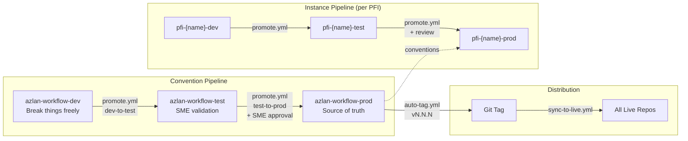
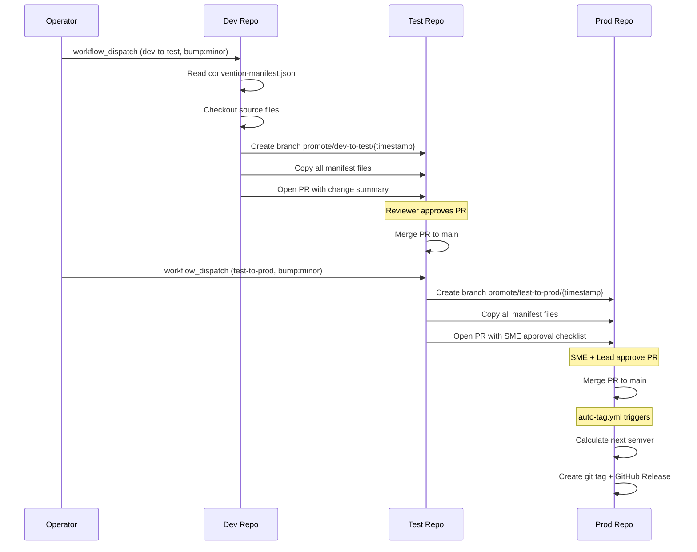
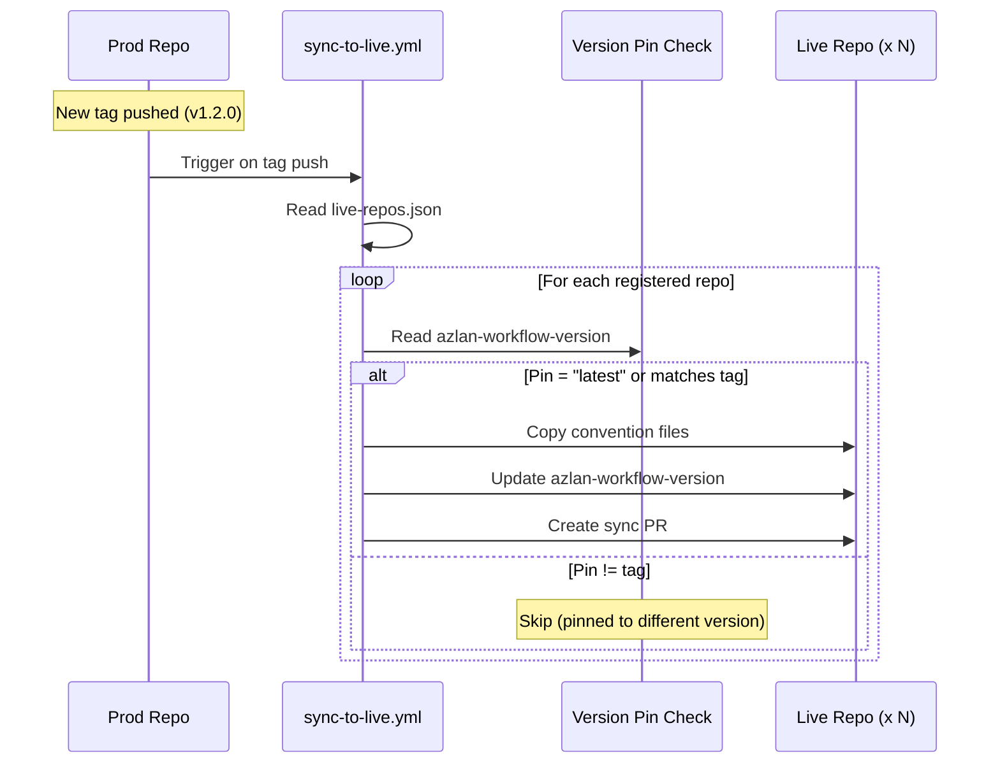
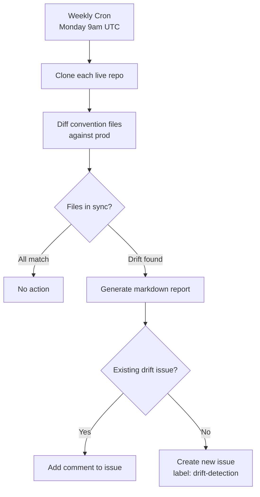
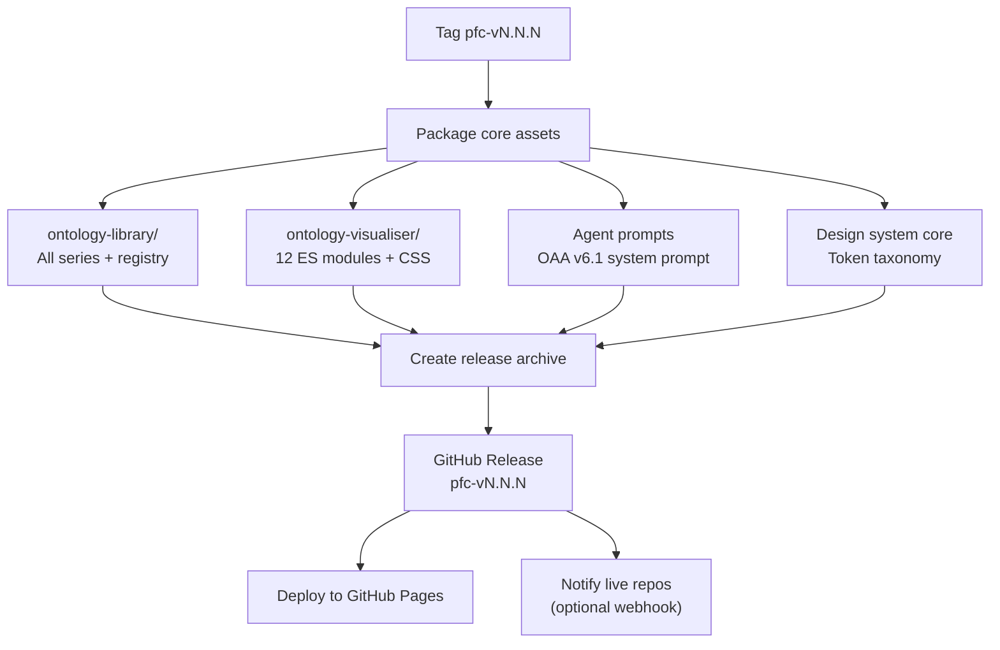
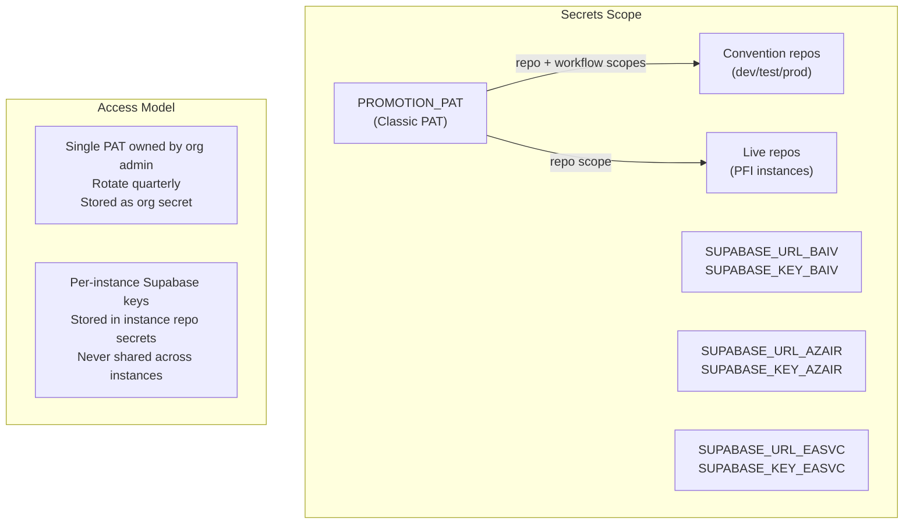
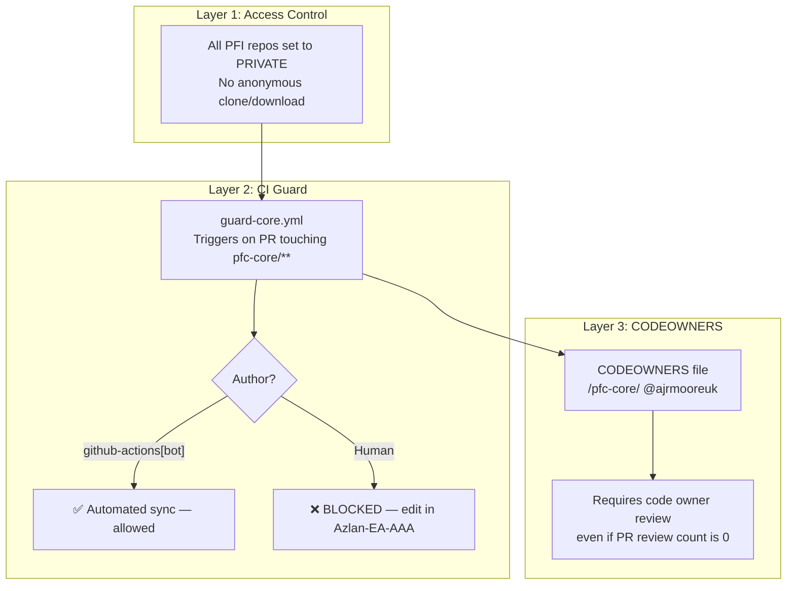

# ARCH-CICD-002: Promotion Pipeline — Technical Detail

**Version:** 1.2.0
**Date:** 2026-02-19
**Status:** Implemented (All Sections)
**Parent:** ARCH-CICD-001 (Hub-and-Spoke Proposal)

---

## 1. Three-Repo Promotion Model

The promotion pipeline uses three separate repositories per concern (conventions, instance) rather than three branches. This provides full isolation of secrets, CI quota, webhooks, and permissions.



---

## 2. Workflow Execution Detail

### 2.1 Convention Promotion (promote.yml)



### 2.2 Live Repo Sync (sync-to-live.yml)



### 2.3 Drift Detection (drift-detection.yml)



---

## 3. Convention Manifest

The `convention-manifest.json` defines exactly which files are promoted across repos:

| Category | Files | Count |
|----------|-------|:-----:|
| Issue Templates | epic.yml, feature.yml, story.yml, pbs.yml, wbs.yml, config.yml | 6 |
| PR Template | pull_request_template.md | 1 |
| Labels | labels.yml | 1 |
| Enforcement Workflows | validate-issue-naming.yml, validate-labels.yml, enforce-registry-link.yml | 3 |
| Setup Scripts | setup-labels.sh, setup-branch-protection.sh, setup-gh-project.sh, setup-all.sh, bootstrap-new-repo.sh, migrate-issues-into-hierarchy.sh | 6 |
| Claude Plugin | azlan-github-workflow/ (entire directory) | 1 |
| **Total** | | **18** |

---

## 4. PFC-Core Release Workflow (Implemented 2026-02-19)

The `pfc-release.yml` workflow in Azlan-EA-AAA packages and releases core assets to PFI instance dev repos. First production release: `pfc-v1.0.0` (6 PFIs, 29–40 ontologies each). See `PFC-Release-Audit-Log.md` for full run history.



### Release Archive Structure

```
pfc-v1.0.0.tar.gz
  pfc-core/
    ontology-library/
      ont-registry-index.json
      VE-Series/
      PE-Series/
      RCSG-Series/
      Foundation/
      Orchestration/
    ontology-visualiser/
      js/
      css/
      lib/
      index.html
    agents/
      oaa-v6/system-prompt.md
    design-system/
      token-taxonomy.json
    VERSION           # pfc-v1.0.0
    CHANGELOG.md
    LICENSE.md
```

---

## 5. Secret Management



| Secret | Scope | Rotation | Storage |
|--------|-------|----------|---------|
| `PROMOTION_PAT` | All repos (classic PAT, repo+workflow) | Quarterly | Org-level secret |
| `SUPABASE_URL` | Per instance | On project recreation | Instance repo secret |
| `SUPABASE_ANON_KEY` | Per instance | On key rotation | Instance repo secret |
| `SUPABASE_SERVICE_KEY` | Per instance (CI only) | On key rotation | Instance repo secret |

---

## 6. Branch Protection per Tier

| Tier | Mode | PRs Required | Reviews | Force Push | CODEOWNERS Review | Status Checks |
|------|------|:------------:|:-------:|:----------:|:-----------------:|:-------------:|
| Dev | Multi-dev | Yes | 0 (self-merge) | Blocked | Yes (`pfc-core/`) | validate-conventions, guard-core |
| Test | Team | Yes | 1 | Blocked | Yes (`pfc-core/`) | validate-conventions, guard-core |
| Prod | Team | Yes | 1 + enforce admins | Blocked | Yes (`pfc-core/`) | validate-conventions, guard-core |

### Multi-Dev Mode (Dev Repos)

Multi-dev is the default for PFI dev repos. It balances PR-based traceability with solo-developer productivity:

- **PRs required** — no direct push to main (all changes are auditable)
- **0 reviews** — author can self-merge (no blocking on solo dev)
- **No force push** — commit history is immutable
- **Linear history** — clean `git log` for promotion tracking

Upgrade to 1 required review when a second developer joins the instance.

### Branch Mode Summary

| Mode | When to Use | Self-Merge | Reviews |
|------|-------------|:----------:|:-------:|
| `multi-dev` | Dev repo, 1-4 devs | Yes | 0 |
| `team` | Test/prod repos | No | 1+ |

---

## 7. Core Content Protection (Implemented 2026-02-19)

PFI instance repos contain a `pfc-core/` directory with core platform content (ontology registry, version pin). This content is **read-only** in PFI repos — it can only be changed in `Azlan-EA-AAA` and distributed via the PFC-Core release pipeline.

### 7.1 Three-Layer Protection Model



### 7.2 Protection Components

| Layer | Mechanism | File | Purpose |
|:-----:|-----------|------|---------|
| 1 | Private repos | GitHub repo settings | Prevents unauthorized clone/download of core IP |
| 2 | CI guard | `.github/workflows/guard-core.yml` | Blocks human PRs touching `pfc-core/` — only `github-actions[bot]` may modify |
| 3 | CODEOWNERS | `CODEOWNERS` | Requires `@ajrmooreuk` review for any `pfc-core/` change as second safety net |

### 7.3 guard-core.yml Workflow

```yaml
on:
  pull_request:
    paths:
      - 'pfc-core/**'

jobs:
  guard:
    runs-on: ubuntu-latest
    steps:
      - name: Check author
        run: |
          # Only github-actions[bot] and dependabot[bot] may modify pfc-core/
          # All other authors are blocked with instructions to use Azlan-EA-AAA
```

### 7.4 Deployment Status (2026-02-19)

| Repo | Private | guard-core.yml | CODEOWNERS | Owner Review |
|------|:-------:|:--------------:|:----------:|:------------:|
| pfi-baiv-aiv-dev | ✅ | ✅ | ✅ | ✅ |
| pfi-baiv-aiv-test | ✅ | ✅ | ✅ | ✅ |
| pfi-baiv-aiv-prod | ✅ | ✅ | ✅ | ✅ |
| pfi-airl-caf-aza-dev | ✅ | ✅ | ✅ | ✅ |
| pfi-airl-caf-aza-test | ✅ | ✅ | ✅ | ✅ |
| pfi-airl-caf-aza-prod | ✅ | ✅ | ✅ | ✅ |

### 7.5 How Automated Sync Bypasses the Guard

The PFC-Core release workflow (Section 4) and convention sync (`sync-to-live.yml`) both run as `github-actions[bot]`. When they create PRs that modify `pfc-core/`, the guard-core CI check passes because the bot is in the allowed list. Human-authored PRs touching the same path are blocked.
