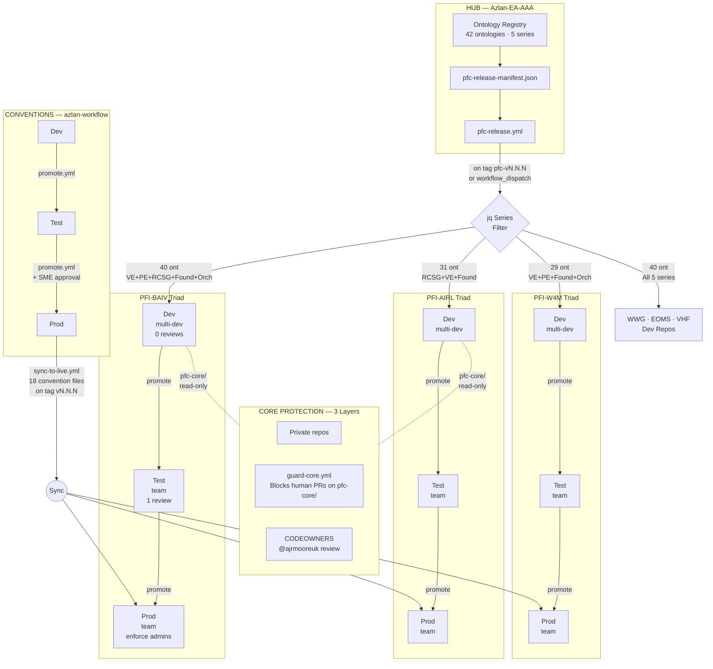

# PF-Core End-to-End CI/CD Pipeline

## Overview Diagram



## Flow Summary

### 1. Core Content Release (Hub → Spoke Dev)

```
Azlan-EA-AAA
  └─ pfc-release.yml (triggered by pfc-vN.N.N tag)
       ├─ Reads pfiInstances from ont-registry-index.json
       ├─ Builds matrix: 6 PFIs with hubSpokeConfig
       └─ Per PFI (parallel):
            ├─ Pin check (latest = always receive)
            ├─ jq filter: entries by ontologySeries prefix
            ├─ Write pfc-core/ontology-registry.json
            ├─ Write pfc-core/pfc-version
            └─ Create PR on PFI dev repo (label: pfc-core-release)
```

### 2. Convention Sync (Workflow Prod → Spoke Prod)

```
azlan-workflow-prod
  └─ sync-to-live.yml (triggered by tag vN.N.N)
       ├─ Reads live-repos.json
       ├─ Checks azlan-workflow-version pin
       └─ Per repo: copies 18 convention files, creates PR
```

### 3. Instance Promotion (Spoke Dev → Test → Prod)

```
pfi-{name}-dev
  └─ promote.yml (workflow_dispatch: dev-to-test)
       ├─ Copies instance-data/, pfc-core/, supabase/, tools/
       └─ Creates PR on test repo

pfi-{name}-test
  └─ promote.yml (workflow_dispatch: test-to-prod)
       ├─ Requires 1 reviewer approval
       └─ Creates PR on prod repo
```

### 4. Core Protection (All PFI Repos)

```
pfc-core/ directory:
  Layer 1: All PFI repos are PRIVATE (no anonymous access)
  Layer 2: guard-core.yml blocks human PRs touching pfc-core/**
           Only github-actions[bot] and dependabot[bot] allowed
  Layer 3: CODEOWNERS requires @ajrmooreuk review as safety net
```

## Distribution Matrix (pfc-v1.0.0)

| PFI | Series | Ontologies | Dev Repo |
|-----|--------|:----------:|----------|
| BAIV | VE, PE, RCSG, Foundation, Orchestration | 40 | pfi-baiv-aiv-dev |
| AIRL | RCSG, VE, Foundation | 31 | pfi-airl-caf-aza-dev |
| W4M | VE, PE, Foundation, Orchestration | 29 | pfi-w4m-dev |
| W4M-WWG | VE, PE, RCSG, Foundation, Orchestration | 40 | pfi-w4m-wwg-dev |
| W4M-EOMS | VE, PE, RCSG, Foundation, Orchestration | 40 | pfi-w4m-eoms-dev |
| VHF | VE, PE, RCSG, Foundation, Orchestration | 40 | pfi-vhf-nutrition-app-dev |

## Branch Protection by Tier

| Tier | Mode | PRs | Reviews | Force Push | Key Rule |
|------|------|:---:|:-------:|:----------:|----------|
| **Dev** | multi-dev | Yes | 0 (self-merge) | Blocked | Solo devs can work fast |
| **Test** | team | Yes | 1 | Blocked | Peer review gate |
| **Prod** | team | Yes | 1 + enforce admins | Blocked | SME sign-off required |

## Version Pinning (Two Systems)

| File | Purpose | Checked By |
|------|---------|------------|
| `pfc-core/pfc-version` | Core content version | `pfc-release.yml` |
| `pfc-core/azlan-workflow-version` | Convention version | `sync-to-live.yml` |
