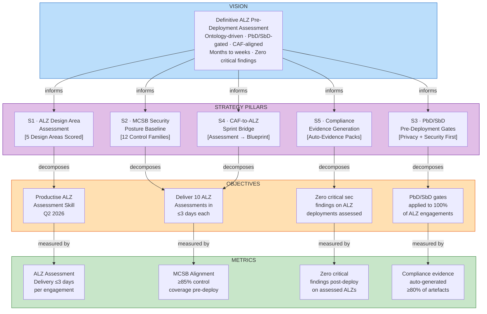
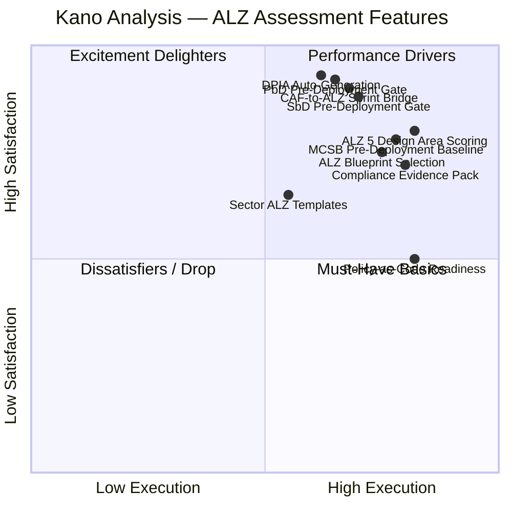

# PFI-W4M-RCS-AZA — Azure Landing Zone Assessment: VE Skill Chain Strategy Brief

> **Document Reference:** PFI-W4M-RCS-AZA-STRAT-BRIEF-Azure-Landing-Zone-Assessment-v1.0.0.md
> **Type:** VE Skill Chain Strategy Brief
> **Product:** PFI-W4M-RCS-AZA — Azure Landing Zone Assessment (W4M-RCS channel · pre-AIRL promotion)
> **Version:** v1.0.0 | **Date:** 2026-03-13
> **Author:** PF-Core / PFI-W4M-RCS-AZA Programme (AI-assisted)
> **VE Chain Method:** VSOM → OKR → KPI → ValueProp → Kano → PMF
> **PFC Lineage:** [Epic 16 (#91)](https://github.com/ajrmooreuk/Azlan-EA-AAA/issues/91) — Azlan-EA-AAA
> **AIRL Staging:** [Epic 3 (#50)](https://github.com/ajrmooreuk/pfi-airl-caf-aza-dev/issues/50) · [F3.6 (#161)](https://github.com/ajrmooreuk/pfi-airl-caf-aza-dev/issues/161) — pfi-airl-caf-aza-dev
> **Epic 68:** [#1005](https://github.com/ajrmooreuk/Azlan-EA-AAA/issues/1005) — Azure Assessment Platform via Azure-RCS Instance
> **Ontology Alignment:** AZALZ-ONT (placeholder), MCSB-ONT v2.0.0, GRC-FW-ONT v3.0.0, RMF-IS27005-ONT v1.0.0
> **Design Principles:** ISO 31700 (PbD) · NCSC Secure by Design · NIST AI RMF · ICO UK GDPR · Microsoft CAF/WAR
> **Classification:** INTERNAL — STRATEGIC

---

## Executive Summary

This brief applies the **VE Skill Chain** (VSOM → OKR → KPI → VP → Kano → PMF) to the Azure Landing Zone (ALZ) Assessment capability within the W4M-RCS-AZA product. ALZ assessment is the bridge between Microsoft's Cloud Adoption Framework (CAF) discovery outputs and an executable, PbD/SbD-gated Azure deployment programme.

The strategic finding: **every Azure migration begins with a landing zone decision, but most organisations lack the structured assessment capability to evaluate their ALZ design against security, privacy, governance, and operational readiness standards.** Microsoft's Well-Architected Review (WAR) scores the platform after deployment. PFI-AIRL's ALZ Assessment scores the design *before* deployment — preventing costly rework, compliance gaps, and security exposure from day one.

The ALZ Assessment sits at the intersection of three PFC capabilities:
1. **AZALZ-ONT** — the ontology-driven landing zone design area model (5 design areas, maturity scoring)
2. **MCSB-ONT** — Microsoft Cloud Security Benchmark alignment (12 control families)
3. **AIRL 9-Domain Scoring** — the PbD/SbD-extended assessment framework that captures what WAR omits

---

## 1. VSOM — Vision, Strategy, Objectives, Metrics

### 1.1 Vision

> **"To deliver the definitive pre-deployment Azure Landing Zone assessment — ontology-driven, PbD/SbD-gated, and CAF-aligned — that converts landing zone design decisions into scored, auditable, sprint-ready deployment programmes, compressing ALZ delivery from months to weeks with zero critical security findings."**

### Vision Decomposition

| Dimension | Statement |
|---|---|
| **Competitive Position** | First-mover: no UK advisory firm offers a structured, scored ALZ pre-deployment assessment with PbD/SbD gates |
| **Target Beneficiary** | Cloud architects, CISOs, DPOs, infrastructure leads in UK Public Sector & Mid-Market |
| **Core Belief** | Landing zone quality is determined before deployment, not discovered after — assess first, deploy once |
| **Distinctive Mechanism** | AZALZ-ONT × MCSB-ONT × AIRL 9-domain scoring — ontology-driven, agentic, evidence-generating |
| **Design Standard** | ISO 31700 PbD · NCSC Secure by Design · Microsoft CAF · Azure Well-Architected Framework |
| **Time Horizon** | 12 months to productised ALZ assessment capability within AIRL |

### 1.2 Strategy Pillars

| Pillar | Description | Ontology Link |
|---|---|---|
| **S1 · ALZ Design Area Assessment** | Score each of the 5 ALZ design areas (Identity, Network, Management, Platform, Security) against maturity criteria | AZALZ-ONT |
| **S2 · MCSB Security Posture Baseline** | Map ALZ design to MCSB v2.0 control families — pre-deployment security validation | MCSB-ONT |
| **S3 · PbD/SbD Pre-Deployment Gates** | Apply privacy-by-design and security-by-design gates before any ALZ resources are provisioned | AIRL D07 (PbD) + D08 (SbD) |
| **S4 · CAF-to-ALZ Sprint Bridge** | Convert CAF assessment outputs into ALZ blueprint selection + sprint sequencing | GRC-FW-ONT + VP-ONT |
| **S5 · Compliance Evidence Generation** | Auto-generate compliance evidence packs (ICO, NHS DSP, CE+, ISO 27001) from ALZ assessment outputs | RMF-IS27005-ONT |

### 1.3 VSOM Cascade



---

## 2. OKR Cascade

### Objective 1: Productise ALZ Assessment as a Repeatable Skill

| Key Result | Target | Timeline |
|---|---|---|
| KR1.1: `pfc-alz-assess` skill operational with AZALZ-ONT scoring | Skill registered + passing tests | Q2 2026 |
| KR1.2: ALZ assessment template deployed to AIRL + BAIV instances | 2 PFI instances consuming | Q2 2026 |
| KR1.3: Assessment delivery time | ≤3 days from engagement start to scored report | Q3 2026 |

### Objective 2: Establish ALZ Assessment as Pre-Deployment Standard

| Key Result | Target | Timeline |
|---|---|---|
| KR2.1: ALZ assessments completed | 10 engagements in first 6 months | Q4 2026 |
| KR2.2: MCSB control coverage pre-deployment | ≥85% across all 12 control families | Ongoing |
| KR2.3: Post-assessment ALZ deployment time | ≤21 days from assessment to live ALZ | Ongoing |

### Objective 3: Zero Critical Findings on Assessed Deployments

| Key Result | Target | Timeline |
|---|---|---|
| KR3.1: Critical security findings on assessed ALZs | Zero | Ongoing |
| KR3.2: PbD/SbD gate pass rate | ≥90% first-pass | Ongoing |
| KR3.3: Client CISO sign-off rate pre-deployment | ≥80% of engagements | Q4 2026 |

### Objective 4: PbD/SbD as ALZ Differentiator

| Key Result | Target | Timeline |
|---|---|---|
| KR4.1: PbD/SbD gates applied | 100% of ALZ assessments | Q2 2026 |
| KR4.2: DPIA auto-generated for ALZ data workloads | <2 hours per engagement | Q3 2026 |
| KR4.3: PbD/SbD cited as ALZ purchase driver | ≥30% of assessed clients | Q4 2026 |

---

## 3. KPI Framework — BSC Balanced Scorecard

### Financial Perspective

| KPI | Target | Rationale |
|---|---|---|
| ALZ Assessment Revenue per Engagement | ≥£15K | Standalone assessment value — upsell to ALZ deployment |
| ALZ Assessment → Deployment Conversion Rate | ≥70% | Assessment creates the deployment pipeline |
| ALZ ARR Contribution | £500K within 12 months | Assessment + deployment combined stream |

### Customer Perspective

| KPI | Target | Rationale |
|---|---|---|
| Assessment NPS | ≥65 | Post-assessment satisfaction — are clients acting on findings? |
| CISO/DPO Sponsor Rate | ≥50% | Security/privacy buyers validate the PbD/SbD positioning |
| Time-to-Decision | ≤5 days from report to client decision | Assessment must compress the decision cycle, not extend it |

### Internal Process Perspective

| KPI | Target | Rationale |
|---|---|---|
| Assessment Delivery Time | ≤3 days | Competitive vs 4–8 week traditional ALZ reviews |
| MCSB Control Coverage | ≥85% pre-deployment | Security baseline must be provably high before first resource deploys |
| AZALZ Design Area Completeness | 5/5 design areas scored per engagement | No gaps — Identity, Network, Management, Platform, Security all assessed |
| DPIA Auto-Generation Time | <2 hours | Privacy evidence must not be a bottleneck |

### Learning & Growth Perspective

| KPI | Target | Rationale |
|---|---|---|
| AZALZ-ONT Maturity | From placeholder to v1.0.0 published | Ontology must be production-grade for skill chain execution |
| ALZ Assessment Reuse Rate | ≥75% template components reused | Scalability depends on repeatable, composable assessment patterns |
| Team ALZ Certification | ≥2 Azure Expert MSP-level practitioners | Credibility for partner co-sell |

---

## 4. Value Proposition Canvas

### Customer Profile

| Customer Job | Pain | Gain Sought |
|---|---|---|
| Deploy Azure estate compliantly | ALZ design decisions are ad-hoc — no structured assessment before deployment | Confidence that ALZ design is secure, compliant, and right-sized before provisioning |
| Prove security posture to board/CISO | WAR scores the platform *after* deployment — rework is expensive | Pre-deployment security evidence that prevents post-build findings |
| Satisfy DPO before data workloads launch | No ALZ assessment includes privacy design review — PbD is an afterthought | DPIA and PbD evidence generated as part of ALZ assessment, not bolted on later |
| Select the right ALZ blueprint variant | Microsoft offers multiple ALZ patterns — clients don't know which fits | AIRL maps CAF findings to the correct ALZ variant with scored rationale |
| Meet NHS DSP / CE+ / ISO 27001 requirements | Compliance evidence is assembled manually weeks after deployment | Compliance evidence auto-generated from assessment — audit-ready on day one |

### Value Map

| Product/Service | Pain Reliever | Gain Creator |
|---|---|---|
| **ALZ Design Area Assessment** (5 areas scored) | Replaces ad-hoc design reviews with structured, repeatable scoring | Board-ready ALZ maturity report with design area heatmap |
| **MCSB Pre-Deployment Baseline** | Identifies security gaps *before* resources are provisioned — no rework | CISO confidence: MCSB alignment score ≥85% before go-live |
| **PbD/SbD Pre-Deployment Gates** | Privacy and security validated before deployment, not discovered after | DPO sign-off with evidence pack — DPIA in <2 hours |
| **CAF→ALZ Sprint Bridge** | Eliminates the post-CAF void — assessment outputs become sprint inputs | ALZ deployment starts within 5 days of assessment, not 5 weeks |
| **Compliance Evidence Pack** | Auto-generates NHS DSP, CE+, ISO 27001 evidence from assessment data | Audit-ready on deployment day — zero additional documentation effort |

### The Pre-Deployment Moat

The single most important positioning insight: **Microsoft's WAR reviews the platform after deployment. PFI-AIRL's ALZ Assessment reviews the design before deployment.** This is not a competing product — it is a complementary capability that makes WAR scores better by preventing the findings WAR would otherwise surface. No Azure partner in the UK market currently offers a structured, PbD/SbD-gated pre-deployment ALZ assessment.

---

## 5. Kano Analysis — Feature Classification

| Feature | Kano Category | Rationale | Priority |
|---|---|---|---|
| **ALZ 5 Design Area Scoring** | Performance | More design areas scored = more confidence — linear satisfaction | P0 — Core capability |
| **MCSB Pre-Deployment Baseline** | Performance | Security coverage directly reduces post-deployment risk | P0 — Ship with v1 |
| **PbD Gate — Pre-Deployment Privacy Review** | Excitement / Moat | No ALZ assessment includes this — DPOs will demand it once seen | P0 — Structural moat |
| **SbD Gate — Pre-Deployment Security Review** | Excitement | Prevents costly post-build rework — CISOs recognise immediate value | P0 — Differentiator |
| **CAF→ALZ Sprint Bridge** | Excitement | Eliminates post-assessment void — no competitor does this automatically | P0 — Core differentiator |
| **Compliance Evidence Auto-Generation** | Performance | Growing mandate — NHS DSP, CE+, ISO 27001 all require pre-evidence | P1 — Q3 |
| **ALZ Blueprint Variant Selection** | Performance | Removes decision paralysis — scored rationale for blueprint choice | P1 — Q3 |
| **DPIA Auto-Generation for Data Workloads** | Excitement | <2 hours vs 4 weeks — no competitor offers this for ALZ engagements | P0 — Differentiator |
| **Azure Policy-as-Code Readiness Score** | Must-Have (emerging) | Clients on G-Cloud/DOS require policy-as-code evidence | P1 — Q4 |
| **Sector-Specific ALZ Templates** (NHS, Local Gov, Mid-Market) | Performance | Sector tuning increases relevance and reduces assessment time | P2 — 2027 |



---

## 6. PMF — Product-Market Fit Model

### 6.1 Ideal Customer Profile

| Attribute | Profile |
|---|---|
| **Organisation Type** | UK Public Sector (NHS, Local Government, Central Government) · Mid-Market (≤£500M revenue) |
| **Azure Commitment** | Active Azure CSP/EA agreement — migrating or expanding workloads |
| **ALZ Status** | Planning or early-stage ALZ deployment — design decisions not yet finalised |
| **Compliance Pressure** | NHS DSP Toolkit, Cyber Essentials Plus, ISO 27001, or sector-specific obligations |
| **Decision Maker** | Cloud Architect or Infrastructure Lead with CISO/DPO sign-off requirement |
| **Budget** | £15K–£50K for assessment + blueprint — upsell to £100K+ for managed ALZ deployment |

### 6.2 PMF Signal — The Pre-Deployment Conversion Funnel

```text
Microsoft CSP/MPN Partner delivers CAF assessment
              ↓
Client receives CAF maturity score — no ALZ blueprint prescribed
              ↓
Post-CAF Void begins (typically 6–12 weeks)
              ↓
PFI-AIRL engages — ALZ Assessment (5 design areas + MCSB + PbD/SbD)
              ↓
Scored ALZ design report + blueprint variant selection in ≤3 days
              ↓
PbD/SbD gates validated — DPIA auto-generated if data workloads scoped
              ↓
ALZ deployment sprint starts within 5 days — ≤21 days to live ALZ
              ↓
Compliance evidence pack auto-generated — audit-ready on day one
```

### 6.3 PMF Measurement

| Signal | Target | Measurement Method |
|---|---|---|
| **Sean Ellis Test** | ≥40% "Very Disappointed" if ALZ Assessment withdrawn | Post-assessment survey |
| **Assessment → Deployment Conversion** | ≥70% of assessed clients proceed to ALZ deployment | Pipeline tracking |
| **Repeat Engagement Rate** | ≥50% of clients request assessment for additional workloads within 6 months | CRM |
| **DPO/CISO Referral Rate** | ≥30% of new engagements sourced from DPO/CISO referral | Lead attribution |
| **Post-CAF Capture Rate** | ≥25% of AIRL engagements originate from a prior CAF assessment | Pipeline tracking |

### 6.4 Competitive Differentiation

| Dimension | Traditional ALZ Review | Microsoft WAR | PFI-AIRL ALZ Assessment |
|---|---|---|---|
| **Timing** | Post-deployment review | Post-deployment scoring | **Pre-deployment assessment** |
| **Duration** | 4–8 weeks | 1–2 days (automated) | **≤3 days (structured + scored)** |
| **PbD Coverage** | None | None | **ISO 31700 PbD gate — 15% of score** |
| **SbD Coverage** | Partial (NCSC alignment varies) | Security pillar only | **NCSC SbD + Zero Trust + MCSB — 15% of score** |
| **Output** | Recommendations document | Pillar scores + recommendations | **Scored design report + blueprint selection + sprint plan + compliance evidence** |
| **Sprint Bridge** | None — client must plan separately | None | **CAF→ALZ→Sprint in ≤5 days** |
| **Compliance Evidence** | Manual assembly | Azure Policy dashboard | **Auto-generated NHS DSP, CE+, ISO 27001 packs** |

---

## 7. ALZ Design Area Assessment Model

### 7.1 The 5 ALZ Design Areas (AZALZ-ONT Planned)

| Design Area | Assessment Focus | MCSB Control Families | AIRL Domain Link |
|---|---|---|---|
| **Identity & Access** | Entra ID configuration, PIM, Conditional Access, Zero Trust identity posture | NS (Network Security), IM (Identity Management) | D08: SbD Maturity |
| **Network & Connectivity** | Hub-spoke topology, private endpoints, NSG/firewall rules, DNS, ExpressRoute/VPN | NS, ES (Endpoint Security) | D03: Infrastructure Readiness |
| **Management & Monitoring** | Azure Monitor, Log Analytics, Sentinel, cost governance, tagging standards | LT (Logging & Threat Detection), IR (Incident Response) | D04: Process & Operational Maturity |
| **Platform Automation** | IaC (Bicep/Terraform), CI/CD pipelines, policy-as-code, DevSecOps | PA (Posture & Vulnerability), DS (DevOps Security) | D03: Infrastructure Readiness |
| **Security & Governance** | Azure Policy, Defender for Cloud, RBAC scoping, data classification, encryption | DP (Data Protection), AM (Asset Management), GS (Governance & Strategy) | D08: SbD + D07: PbD |

### 7.2 Maturity Scoring per Design Area

| Level | Score | Definition |
|---|---|---|
| **1 — Ad Hoc** | 0–20% | No structured design — decisions made reactively, no documentation |
| **2 — Developing** | 21–40% | Some design decisions documented but not consistently applied; no policy enforcement |
| **3 — Defined** | 41–60% | Design areas documented, policies defined but not all enforced; partial MCSB alignment |
| **4 — Managed** | 61–80% | Design areas consistently applied, policy-as-code enforced, Defender for Cloud active, PbD/SbD gates in place |
| **5 — Optimised** | 81–100% | Continuous improvement, automated compliance, full MCSB alignment, PbD/SbD embedded, evidence auto-generated |

### 7.3 Composite ALZ Readiness Score

| Component | Weight | Source |
|---|---|---|
| ALZ Design Area Average (5 areas) | 40% | AZALZ-ONT scoring |
| MCSB Control Coverage | 25% | MCSB-ONT alignment check |
| PbD Maturity (AIRL D07) | 15% | AIRL 9-domain scoring |
| SbD Maturity (AIRL D08) | 15% | AIRL 9-domain scoring |
| Compliance Readiness (AIRL D09) | 5% | AIRL 9-domain scoring |

---

## 8. AIRL 9-Domain Integration — ALZ Assessment Lens

| AIRL Domain | ALZ Assessment Application | Weight |
|---|---|---|
| D01: AI Strategy & Governance | AI workload readiness within ALZ scope — governance policies for AI services | 15% |
| D02: Data Readiness & Quality | Data classification, Purview coverage, PII identification within ALZ data workloads | 15% |
| D03: Azure Platform Maturity | **Primary** — ALZ design area scores map directly to platform maturity | 10% |
| D04: Process & Operational Maturity | Management & monitoring design area — operational readiness for ALZ workloads | 10% |
| D05: Financial & Commercial Readiness | Cost governance, tagging, budget alerts within ALZ subscription design | 10% |
| D06: Compliance & Regulatory | NHS DSP, CE+, ISO 27001 alignment — auto-evidence from ALZ assessment | 5% |
| D07: Privacy by Design Maturity | **PbD gate** — data workload privacy review, DPIA scoping, consent architecture | 15% |
| D08: Security by Design Maturity | **SbD gate** — Zero Trust, MCSB alignment, Defender score, pen test readiness | 15% |
| D09: Talent & Change Readiness | ALZ operations team capability — IaC skills, DevSecOps maturity, policy management | 5% |

---

## 9. Delivery Architecture

### 9.1 Agentic Pipeline

```text
Input Sources
├── CAF Assessment Output (JSON/CSV)     → CAF maturity model structured output
├── Existing ALZ Config (Azure export)   → Current-state ALZ resource configuration
├── WAR Export (if available)            → Post-deployment WAR for comparison
└── Client Questionnaire                 → Organisation-specific context + constraints
         ↓
ALZ Assessment Agent (pfc-alz-assess)
├── Parse → normalise to AZALZ-ONT 5-design-area schema
├── Score → apply maturity levels 1–5 per design area
├── MCSB-map → check alignment against 12 MCSB control families
├── PbD-gate → apply ISO 31700 privacy review to data workloads
├── SbD-gate → apply NCSC SbD + Zero Trust validation
└── Sequence → generate ALZ deployment sprint plan
         ↓
Ontology Layer
├── AZALZ-ONT: design area entities + maturity scores
├── MCSB-ONT: control family alignment + gap register
├── VP-ONT: map findings to customer jobs/pains/gains
├── RRR-ONT: map risks → requirements → results
└── GRC-FW-ONT: compliance evidence mapping
         ↓
Output Artefacts
├── ALZ Design Area Scorecard (5 areas, maturity levels, heatmap)
├── MCSB Alignment Report (12 control families, coverage %)
├── ALZ Blueprint Variant Recommendation (scored rationale)
├── PbD/SbD Gate Report (pass/fail per gate, remediation register)
├── Sprint Plan (Velocity Framework sequenced — ≤21 days to live ALZ)
├── DPIA Scope Register (auto-generated if data workloads scoped)
└── Compliance Evidence Pack (NHS DSP, CE+, ISO 27001 mappings)
```

### 9.2 Target Delivery Timeline

| Phase | Duration | Output |
|---|---|---|
| **Discovery** | Day 1 | Client questionnaire + Azure config export + CAF data (if available) |
| **Assessment** | Day 1–2 | 5 design areas scored, MCSB aligned, PbD/SbD gates applied |
| **Report & Sprint Plan** | Day 2–3 | Scored report, blueprint recommendation, sprint plan, compliance evidence |
| **Client Review** | Day 3–5 | Findings walkthrough, decision on ALZ deployment engagement |
| **ALZ Deployment Sprint** | Day 5–26 | ≤21-day ALZ deployment via Velocity Framework (if client proceeds) |

---

## 10. OAA GRC Ontology Series — RCSG-Series Reference

The ALZ Assessment capability draws on the **RCSG-Series** (Risk, Compliance, Security & Governance) ontology family within the OAA ontology library. The RCSG-Series provides the semantic backbone for all GRC-driven assessment, scoring, and compliance evidence generation.

### RCSG-Series Directory Structure

```text
PBS/ONTOLOGIES/ontology-library/RCSG-Series/
├── GRC-01-GOV/                              ← Governance Domain
│   └── GRC-FW-ONT/                          ← GRC Framework Ontology v3.0.0 (hub)
│       ├── grc-framework-ontology-v3.0.0.json
│       ├── grc-fw-domain-authorities-v3.0.0.json
│       ├── grc-fw-mapping-instances-v3.0.0.json
│       └── Entry-ONT-GRC-FW-001.json
├── GRC-02-RISK/                             ← Risk Domain
│   ├── RMF-IS27005-ONT/                     ← ISO 27005 Risk Management Framework
│   └── ERM-ONT/                             ← Enterprise Risk Management
├── GRC-03-COMP/                             ← Compliance Domain
│   ├── GDPR-ONT/                            ← GDPR Regulatory Framework v1.0.0
│   │   ├── gdpr-regulatory-framework-v1.0.0.json
│   │   └── Entry-ONT-GDPR-001.json
│   ├── NCSC-CAF-ONT/                        ← NCSC Cyber Assessment Framework v1.0.0
│   │   ├── ncsc-caf-ontology-v1.0.0.json
│   │   └── Entry-ONT-NCSC-CAF-001.json
│   └── DSPT-ONT/                            ← NHS Data Security & Protection Toolkit v1.0.0
│       ├── dspt-ontology-v1.0.0.json
│       └── Entry-ONT-DSPT-001.json
├── GRC-04-SEC/                              ← Security Domain
│   ├── MCSB-ONT/                            ← Microsoft Cloud Security Benchmark v2.0.0
│   │   ├── mcsb-v2.0.0-oaa-v6.json
│   │   ├── source/v2/MCSB-ONTOLOGY-V2.0.0.json
│   │   └── Entry-ONT-ALZ-001.json
│   ├── MCSB2-ONT/                           ← MCSB v2 Extended
│   │   └── Entry-ONT-MCSB2-001.json
│   ├── PII-ONT/                             ← PII Governance (Microsoft-native) v3.3.0
│   │   ├── pii-governance-microsoft-native-v3.3.0.json
│   │   └── Entry-ONT-PII-001.json
│   └── AZALZ-ONT/                           ← Azure Landing Zone Assessment (PLACEHOLDER)
│       └── Entry-ONT-AZALZ-001.json
├── GRC-05-RES/                              ← Resilience Domain
├── GRC-06-AI/                               ← AI Governance Domain
├── RCSG-04-GOV/                             ← RCSG Governance Framework v2.0.0
│   ├── RCSG-FW-ONT/
│   │   ├── rcsg-framework-ontology-v2.0.0.json
│   │   ├── rcsg-fw-mapping-instances-v2.0.0.json
│   │   └── Cyber-Risk-ONT/                  ← Cyber Risk Domain Ontology
│   │       ├── cyber-risk-domain-ontology.json
│   │       ├── cyber-risk-vsom.json
│   │       ├── cyber-risk-bsc.json
│   │       └── *.mermaid (vsom-hierarchy, bsc-strategy, vsem-execution)
│   └── Cyber_Governance_Code_of_Practice.pdf
└── SECURITY_STANDARDS_REFERENCE_AI_CICD.md
```

### Ontology Dependency Chain for ALZ Assessment

```text
GRC-FW-ONT v3.0.0 (hub)
├── RMF-IS27005-ONT (risk assessment methodology)
├── ERM-ONT (enterprise risk register)
├── MCSB-ONT v2.0.0 (Azure security benchmark — 12 control families)
│   └── AZALZ-ONT (Azure Landing Zone design area assessment) ← PLACEHOLDER
├── GDPR-ONT (GDPR regulatory mapping → PbD evidence)
├── NCSC-CAF-ONT (NCSC Cyber Assessment Framework → SbD evidence)
├── DSPT-ONT (NHS Data Security & Protection Toolkit)
├── PII-ONT v3.3.0 (PII governance — Purview/Microsoft-native)
└── RCSG-FW-ONT v2.0.0 (Cyber Governance Code of Practice)
    └── Cyber-Risk-ONT (cyber risk domain + VSOM + BSC)
```

### AZALZ-ONT Status

AZALZ-ONT is currently a **placeholder** (status: `placeholder`, all compliance gates: `pending`). The ontology entry defines planned components:

| Component | Description |
|---|---|
| **Design Areas** | ALZ design areas: Identity, Network, Management, Platform, Security |
| **Compliance Checks** | Landing zone compliance assessment criteria |
| **Governance Policies** | Azure Policy and governance evaluation |
| **Maturity Levels** | ALZ implementation maturity assessment (Levels 1–5) |
| **Remediation Guidance** | Gap remediation and improvement recommendations |

**Dependencies:** `Entry-ONT-ALZ-001` (MCSB-ONT), `Entry-ONT-MCSB2-001` (MCSB v2 Extended)

**Priority:** AZALZ-ONT must be promoted from placeholder to v1.0.0 as a prerequisite for the `pfc-alz-assess` skill (KR1.1). This is a blocking dependency for ALZ Assessment productisation.

---

## 11. Relationship to Existing Briefs & Docs

| Document | Relationship |
|---|---|
| `PFI-W4M-RCS-AZA-STRAT-BRIEF-Azure-Assessments-Strategy-v1.0.0.md` | Parent — establishes Microsoft assessment leverage; this brief specialises for ALZ |
| `PFC-GRC-BRIEF-Azure-RCS-Assessment-Platform-v1.0.0.md` | Platform — Epic 68 defines the Azure-RCS assessment platform infrastructure |
| `PFC-GRC-BRIEF-Generic-Risk-Management-Framework-v1.0.0.md` | Framework — RMF provides the risk assessment methodology used in ALZ scoring |
| `PFI-AIRL-VE-BRIEF-01-Vision-Strategy-VSOM-v2.0.0.md` | Upstream — AIRL VSOM cascade; ALZ assessment is S2 execution |
| `PFI-AIRL-GRC-BRIEF-06-Domains-Compliance-v2.0.0.md` | Upstream — AIRL 9-domain model; ALZ assessment applies all 9 domains |

---

## 12. Summary — VE Skill Chain Position

| VE Layer | Finding |
|---|---|
| **Vision** | Definitive pre-deployment ALZ assessment — assess first, deploy once, PbD/SbD-native |
| **Strategy** | 5 pillars: design area scoring, MCSB baseline, PbD/SbD gates, CAF→ALZ bridge, compliance evidence |
| **Objectives** | Productise skill (Q2), 10 engagements (Q4), zero critical findings, 100% PbD/SbD gate coverage |
| **KPIs** | ≤3-day delivery, ≥85% MCSB coverage, ≥70% assessment→deployment conversion, ≥65 NPS |
| **Value Prop** | Pain: ALZ design is ad-hoc, security discovered post-build, privacy absent. AIRL: scored, gated, sprint-ready in 3 days |
| **Kano** | PbD/SbD gates = Excitement/Moat. CAF→ALZ bridge = Excitement. Design area scoring = Performance. DPIA auto-gen = Excitement |
| **PMF** | Post-CAF clients at peak intent. Microsoft creates ALZ demand; AIRL captures the pre-deployment assessment gap. Sean Ellis target ≥40% |

The structural insight: **WAR scores after deployment; AIRL ALZ Assessment scores before.** This is not a timing difference — it is a fundamentally different value proposition. Pre-deployment assessment prevents findings. Post-deployment review discovers them. Prevention is worth more than discovery, and the PbD/SbD gates make it structurally uncopyable by any partner without an ontology-driven scoring model.

---

*PFI-W4M-RCS-AZA-STRAT-BRIEF-Azure-Landing-Zone-Assessment-v1.0.0.md*
*VE Skill Chain Brief | v1.0.0 | 2026-03-13*
*INTERNAL — STRATEGIC | PFC Programme*
