# PFC-ARCH: EFS GitHub Integration — TDD & Acceptance Testing Pre-Close-Out VE Evaluation

**Product Code:** PFC-ARCH (Platform Architecture)
**Version:** 1.0.0
**Date:** 2026-03-18
**Status:** For Decision
**Parent Epic:** [Epic 61 (#947)](https://github.com/ajrmooreuk/Azlan-EA-AAA/issues/947) — DevSecOps, CI/CD & Change Control
**Feature:** [F61.32 (#1287)](https://github.com/ajrmooreuk/Azlan-EA-AAA/issues/1287) — EFS-TDD Close-Out Integration
**Cross-Ref Epics:** [Epic 76 (#1196)](https://github.com/ajrmooreuk/Azlan-EA-AAA/issues/1196) — TDD Dual-Layer · [Epic 49 (#747)](https://github.com/ajrmooreuk/Azlan-EA-AAA/issues/747) — VSOM Application Planner (F49.12 Close-Out)
**Audience:** PE, VE, CA, SA
**Prerequisite:** [PFC-ARCH-SPEC-TDD-Dual-Layer-Architecture-Reference-v1.3.0.md](https://github.com/ajrmooreuk/Azlan-EA-AAA/blob/main/PBS/STRATEGY/PFC-ARCH-SPEC-TDD-Dual-Layer-Architecture-Reference-v1.3.0.md)

---

## 1. Executive Summary

This brief evaluates the end-to-end EFS (Epic-Feature-Story) GitHub integration pipeline — from issue creation through TDD/acceptance testing to close-out — using the VE Skill Chain (VSOM → OKR → VP → Kano → PMF). It identifies which features deliver the highest value at lowest cost, classifies each by Kano category, and recommends a Pareto-optimised investment strategy.

The pipeline spans three domains and bridges three epics:

| Domain | Current State | Maturity | Governing Epic |
|--------|--------------|----------|---------------|
| **EFS AC Updates** (GitHub Issues + Projects) | Partially automated — creation uplinks automated, close-out body updates via skill | 60% | [Epic 61 (#947)](https://github.com/ajrmooreuk/Azlan-EA-AAA/issues/947) |
| **TDD Pre-Close-Out** (Dual-Layer TDD1/TDD2) | Architecture defined, TDD2 regression tracker in Red stub phase | 35% | [Epic 76 (#1196)](https://github.com/ajrmooreuk/Azlan-EA-AAA/issues/1196) |
| **Close-Out Pipeline** (6-stage skill) | Live, Stage 4 test plan functional but not yet consuming TDD artefacts | 55% | [Epic 49 (#747)](https://github.com/ajrmooreuk/Azlan-EA-AAA/issues/747) F49.12 |

### Cross-Epic Dependency Map

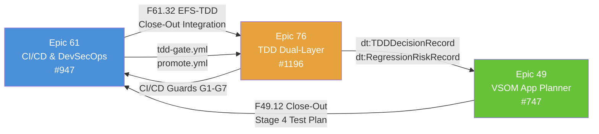

---

## 2. Problem Space

### 2.1 Current Pain Points

| ID | Problem | Impact | VP Alignment |
|----|---------|--------|-------------|
| P1 | Epic body checkbox updates are manual Markdown rewrites via `--body-file` | Error-prone, time-consuming, inconsistent state | vp:Problem → rrr:Risk |
| P2 | No automated validation that AC checkboxes match actual test results | AC can be marked "done" without evidence | vp:Problem → rrr:Risk |
| P3 | TDD2 regression tracker tests are Red stubs — no live regression risk tracking | Close-out Stage 4 cannot consume `dt:RegressionRiskRecord` | vp:Problem → rrr:Risk |
| P4 | GitHub Projects custom fields (PBS ID, WBS, Cascade Tier) set on creation but not updated on close | Stale project board state after feature completion | vp:Problem → rrr:Risk |
| P5 | Close-out Stage 4 runs vitest but doesn't cross-reference TDD specification Red→Green mapping | Test plan document lacks traceability to acceptance criteria | vp:Problem → rrr:Risk |
| P6 | No automated Kano decay tracking on EFS features over time | Cannot detect when Attractive features decay to Must-Be | vp:Problem → rrr:Risk |

### 2.2 Problem-to-Epic Traceability

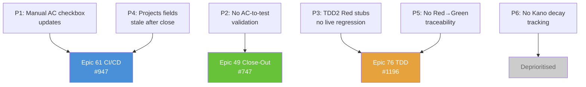

### 2.3 Cost of Inaction

- **P1+P2**: Manual AC updates risk false-positive close-outs — a feature marked "Done" in the epic without passing tests erodes trust in the EFS hierarchy.
- **P3+P5**: Without TDD artefact consumption, close-out Stage 4 produces a test plan disconnected from the TDD evidence chain — CI/CD gates (G1–G7) cannot enforce promotion quality.
- **P4**: Stale Projects fields mean portfolio reporting (`programme-tracker.json`) diverges from reality.

---

## 3. VSOM Situational Assessment

### 3.1 Vision

> Every EFS close-out produces a machine-verifiable evidence chain — from acceptance criteria definition through TDD specification to test execution — with zero manual checkbox manipulation.

### 3.2 Strategic Objectives

| SO | Objective | Type |
|----|-----------|------|
| SO-1 | Automate EFS AC state propagation (story→feature→epic) on issue close events | Operational Excellence |
| SO-2 | Connect TDD dual-layer artefacts to close-out Stage 4 test plan generation | Quality & Assurance |
| SO-3 | Validate AC checkboxes against actual test evidence before marking Done | Governance |
| SO-4 | Keep GitHub Projects fields current through issue lifecycle events | Operational Excellence |

---

## 4. OKR Cascade

### O1: Eliminate Manual AC Checkbox Updates

| KR | Key Result | Measure | Target |
|----|-----------|---------|--------|
| KR-1.1 | Feature close event auto-updates parent epic body | % of features with auto-updated parent | 100% |
| KR-1.2 | Story close event auto-updates parent feature body | % of stories with auto-updated parent | 100% |
| KR-1.3 | Close-out skill no longer contains manual body rewrite logic | Lines of manual Markdown manipulation removed | 0 lines |

### O2: TDD Evidence Chain Feeds Close-Out

| KR | Key Result | Measure | Target |
|----|-----------|---------|--------|
| KR-2.1 | Close-out Stage 4 consumes `dt:TDDDecisionRecord` | % of close-outs with TDD record attached | ≥80% |
| KR-2.2 | Close-out Stage 4 embeds `dt:RegressionRiskRecord` from TDD2-R09 | % of close-outs with regression risk data | ≥60% |
| KR-2.3 | TEST-PLAN document maps each test to Red case → Green criterion | Traceability coverage | 100% |

### O3: Projects Board Reflects Reality

| KR | Key Result | Measure | Target |
|----|-----------|---------|--------|
| KR-3.1 | Issue close/reopen events update Projects Status field | Event coverage | 100% |
| KR-3.2 | Programme-tracker.json sync includes close-out metadata | Fields synced | Status + completion date + test pass count |

---

## 5. Value Proposition Canvas

### 5.1 Customer Segments

| Segment | Role | Primary Job-to-be-Done |
|---------|------|----------------------|
| **PE (Process Engineer)** | Delivery owner | Know that close-out is complete, accurate, and evidence-backed |
| **CA (Context Architect)** | Quality governance | Verify AC alignment between issue state and test results |
| **SA (Solution Architect)** | Architecture assurance | Confirm regression risk is tracked and mitigated before promotion |
| **VE (Value Engineer)** | Strategic alignment | Validate that features deliver intended value (Kano classification holds) |

### 5.2 Problem-Solution-Benefit Triplets (JP-VP-RRR-001)

| # | Problem (→ Risk) | Solution (→ Requirement) | Benefit (→ Result) |
|---|-----------------|-------------------------|-------------------|
| 1 | Manual checkbox updates are error-prone (→ false-positive close-outs) | GitHub Actions workflow on `issues.closed` event rewrites parent body (→ auto-propagation required) | Zero manual AC manipulation (→ trustworthy EFS state) |
| 2 | TDD artefacts not consumed by close-out (→ test plan lacks evidence) | Stage 4 resolver reads `dt:TDDDecisionRecord` + `dt:RegressionRiskRecord` from issue/commit metadata (→ artefact consumption required) | Every test plan has traceability to Red→Green spec (→ auditable quality chain) |
| 3 | Projects fields stale after close (→ portfolio reporting drift) | Extend `set-pbs-id.yml` to fire on close/reopen events, update Status field (→ lifecycle field sync required) | Projects board always reflects current state (→ reliable portfolio view) |
| 4 | No AC-to-test cross-validation (→ AC marked done without evidence) | Pre-close-out gate checks AC checkboxes against test results before allowing mark-done (→ evidence gate required) | AC state is machine-verified (→ governance compliance) |

### 5.3 VP-RRR Alignment Diagram

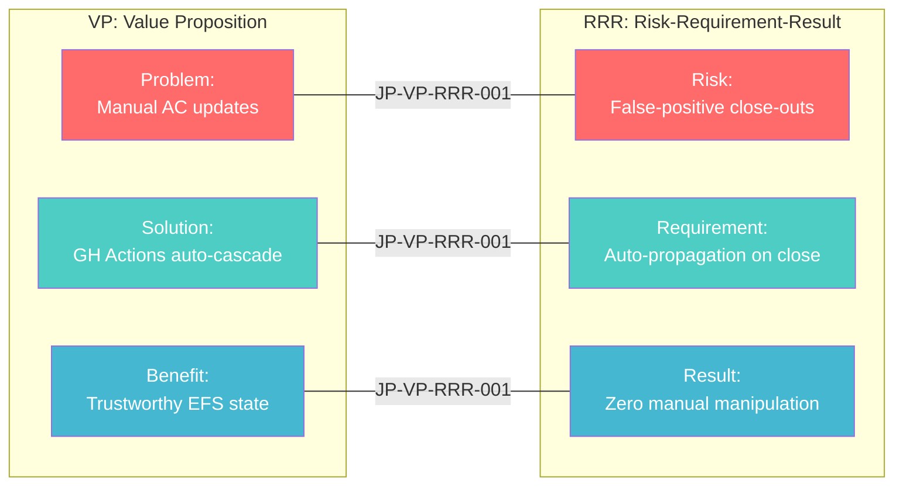

---

## 6. Kano Feature Classification

### 6.1 Feature Inventory & Classification

| ID | Feature | Kano Category | Rationale | Investment Strategy |
|----|---------|--------------|-----------|-------------------|
| **F-EFS-01** | Auto-update parent epic body on feature close (GH Action) | **Must-Be** | Table stakes for any EFS hierarchy — users already expect this | Maintain: 10–15% budget. Build once, low maintenance |
| **F-EFS-02** | Auto-update parent feature body on story close (GH Action) | **Must-Be** | Same as above, story level | Maintain: included in F-EFS-01 implementation |
| **F-EFS-03** | Projects Status field auto-sync on issue close/reopen | **Must-Be** | Extends existing [`set-pbs-id.yml`](https://github.com/ajrmooreuk/Azlan-EA-AAA/blob/main/.github/workflows/set-pbs-id.yml) — expected behaviour | Maintain: 5% budget. Trivial extension |
| **F-TDD-01** | Implement TDD2 regression tracker Green tests (from Red stubs) | **Performance** | More regression coverage = proportionally more confidence. Linear satisfaction curve | Invest: 25–30% budget. Core quality differentiator |
| **F-TDD-02** | Close-out Stage 4 consumes `dt:TDDDecisionRecord` | **Performance** | Connects existing TDD1 output to existing close-out — incremental value per connection made | Invest: 15–20% budget. High leverage on existing infrastructure |
| **F-TDD-03** | Close-out Stage 4 embeds `dt:RegressionRiskRecord` | **Attractive** | Surprise + delight — regression risk visible in test plan without manual curation | Sprint: 10–15% budget. First-mover within platform |
| **F-TDD-04** | Pre-close-out AC-to-test evidence gate | **Attractive** | Nobody expects machine-verified AC — high satisfaction when present, no dissatisfaction when absent (today) | Sprint: 10–15% budget. Monitor for decay to Performance |
| **F-TDD-05** | Red→Green traceability in TEST-PLAN document | **Performance** | Auditors and SA expect traceability — more detail = more confidence | Invest: 5–10% budget. Template change, low implementation cost |
| **F-VE-01** | Kano decay tracking on EFS features over time | **Indifferent** | No current consumer for this data — nice concept, zero pull | Deprioritise: 0% budget now. Revisit when PMF signals exist |
| **F-CI-01** | CI/CD gate enforcement (G1–G7) consuming TDD artefacts | **Performance** | Promotion quality scales with gate strictness — expected for dev→test, surprising for test→prod | Invest: 10–15% budget. Staged rollout (dev→test first) |

### 6.2 Kano Quadrant Chart

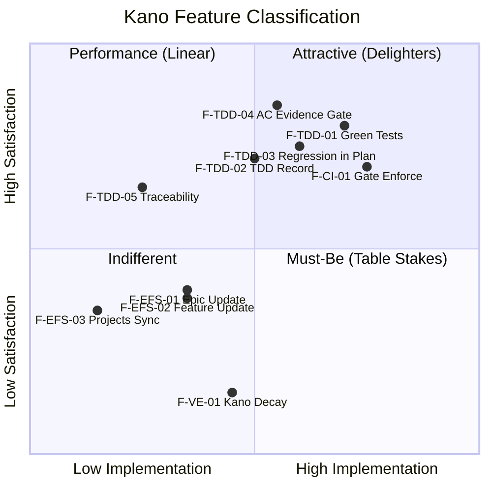

### 6.3 Decay Forecast

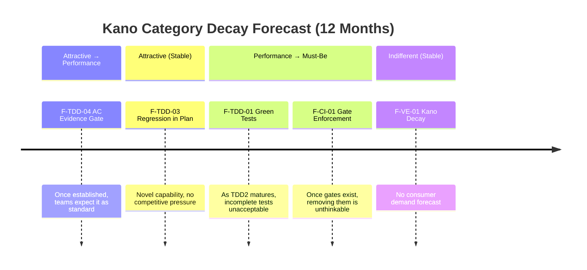

---

## 7. Pareto Analysis — Vital Few (80/20)

### 7.1 Value-to-Cost Matrix

| Feature | Value Score (1–10) | Cost Score (1–10, 10=cheapest) | Value/Cost Ratio | Pareto Class |
|---------|-------------------|-------------------------------|-----------------|-------------|
| **F-EFS-03** (Projects sync) | 6 | 9 | **6.7** | **Vital Few** |
| **F-EFS-01** (Epic body auto-update) | 8 | 7 | **5.7** | **Vital Few** |
| **F-EFS-02** (Feature body auto-update) | 7 | 7 | **5.0** | **Vital Few** |
| **F-TDD-05** (Red→Green traceability) | 7 | 8 | **4.4** | **Vital Few** |
| **F-TDD-02** (Stage 4 consumes TDD record) | 8 | 6 | **4.0** | Borderline |
| **F-TDD-04** (AC evidence gate) | 9 | 5 | **3.6** | Useful Many |
| **F-TDD-01** (Green tests from stubs) | 9 | 4 | **2.3** | Useful Many |
| **F-TDD-03** (Regression in test plan) | 7 | 4 | **1.8** | Useful Many |
| **F-CI-01** (Gate enforcement) | 8 | 3 | **1.0** | Useful Many |
| **F-VE-01** (Kano decay tracking) | 2 | 5 | **0.4** | Deprioritise |

### 7.2 Pareto Value Distribution

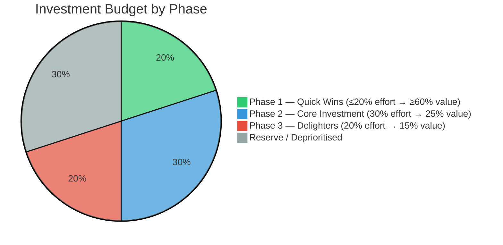

### 7.3 Pareto Recommendation

**Phase 1 — Quick Wins (Vital Few, ≤20% effort → ≥60% value):**

| Priority | Feature | Action | Rationale |
|----------|---------|--------|-----------|
| 1 | F-EFS-03 | Extend [`set-pbs-id.yml`](https://github.com/ajrmooreuk/Azlan-EA-AAA/blob/main/.github/workflows/set-pbs-id.yml) to fire on `issues.closed` / `issues.reopened` | Trivial YAML change, immediate Projects accuracy |
| 2 | F-EFS-01 + F-EFS-02 | New GH Action: `efs-cascade-update.yml` — on issue close, detect parent ref, rewrite parent body with updated checkboxes | Single workflow covers both. Uses existing `--body-file` pattern |
| 3 | F-TDD-05 | Update close-out Stage 4 TEST-PLAN template to include Red→Green mapping columns | Template change only — no logic change needed if TDD spec JSON is accessible |

**Phase 2 — Core Investment (Performance features, 30% effort → 25% value):**

| Priority | Feature | Action | Rationale |
|----------|---------|--------|-----------|
| 4 | F-TDD-02 | Add TDD artefact resolver to close-out Stage 4 — scan issue body / linked commits for `dt:TDDDecisionRecord` | Connects two existing systems. Moderate implementation |
| 5 | F-TDD-01 | Implement Green tests for TDD2 regression tracker (13 Red cases → Green) | Required for F-TDD-03 to have data. Core quality infrastructure |
| 6 | F-CI-01 | Implement CI/CD gate checks (G1–G5) for dev→test promotion via [`tdd-gate.yml`](https://github.com/ajrmooreuk/Azlan-EA-AAA/blob/main/.github/workflows/tdd-gate.yml) | Staged rollout — warn-only first, then enforce |

**Phase 3 — Delighters (Attractive features, 20% effort → 15% value):**

| Priority | Feature | Action | Rationale |
|----------|---------|--------|-----------|
| 7 | F-TDD-03 | Close-out Stage 4 embeds `dt:RegressionRiskRecord` in TEST-PLAN | Depends on F-TDD-01 completion. High satisfaction, moderate cost |
| 8 | F-TDD-04 | Pre-close-out AC evidence gate — compare AC checkboxes to test pass list | Governance differentiator. Monitor decay to Performance |

**Deprioritise:**

| Feature | Action | Revisit When |
|---------|--------|-------------|
| F-VE-01 | Do not build | PMF signals show demand for feature-level Kano tracking |

---

## 8. How TDD & Acceptance Testing Works Pre-Close-Out (Going Forward)

### 8.1 End-to-End Pipeline

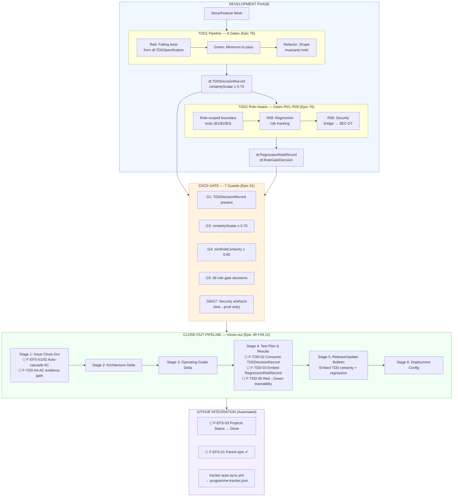

### 8.2 Artefact Chain

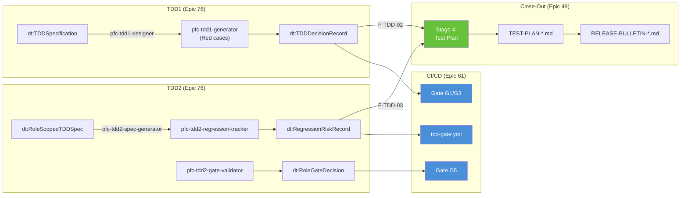

### 8.3 Role Boundaries in TDD2 Regression Tracker (SKL-137)

| Boundary | Role | Permissions | Test File |
|----------|------|------------|-----------|
| B1 | CA (Context Architect) | Track + report; cannot modify risk levels | [`regression-tracker-ca-boundary.test.js`](https://github.com/ajrmooreuk/Azlan-EA-AAA/blob/main/azlan-github-workflow/skills/pfc-tdd2-regression-tracker/tests/role-scoped/regression-tracker-ca-boundary.test.js) |
| B2 | TDD Expert | Assess + set risk levels; override with rationale (append-only) | [`regression-tracker-tdd-expert-boundary.test.js`](https://github.com/ajrmooreuk/Azlan-EA-AAA/blob/main/azlan-github-workflow/skills/pfc-tdd2-regression-tracker/tests/role-scoped/regression-tracker-tdd-expert-boundary.test.js) |
| B3 | SA (Solution Architect) | Read-only review; cannot modify | [`regression-tracker-sa-boundary.test.js`](https://github.com/ajrmooreuk/Azlan-EA-AAA/blob/main/azlan-github-workflow/skills/pfc-tdd2-regression-tracker/tests/role-scoped/regression-tracker-sa-boundary.test.js) |

### 8.4 Coverage Targets

| Layer | Security | Contract | Integration | Unit |
|-------|----------|----------|-------------|------|
| TDD2 Regression Tracker | 100% | 100% | ≥80% | ≥90% |

---

## 9. Implementation Phasing

### 9.1 Phase Gantt

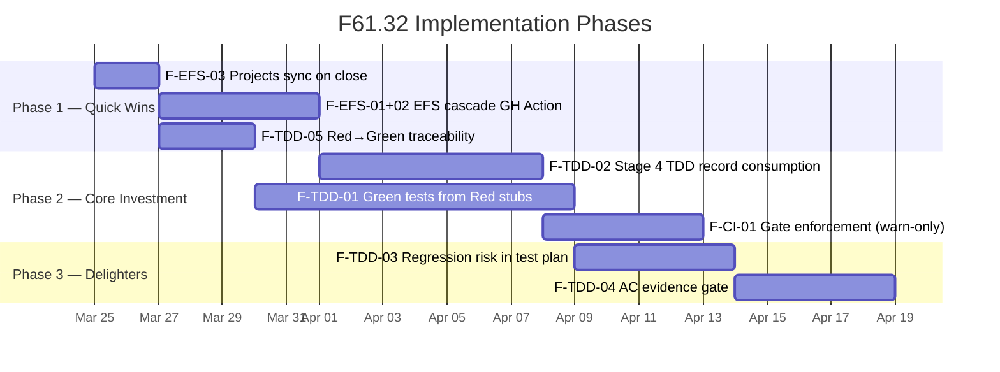

### 9.2 Dependency Graph

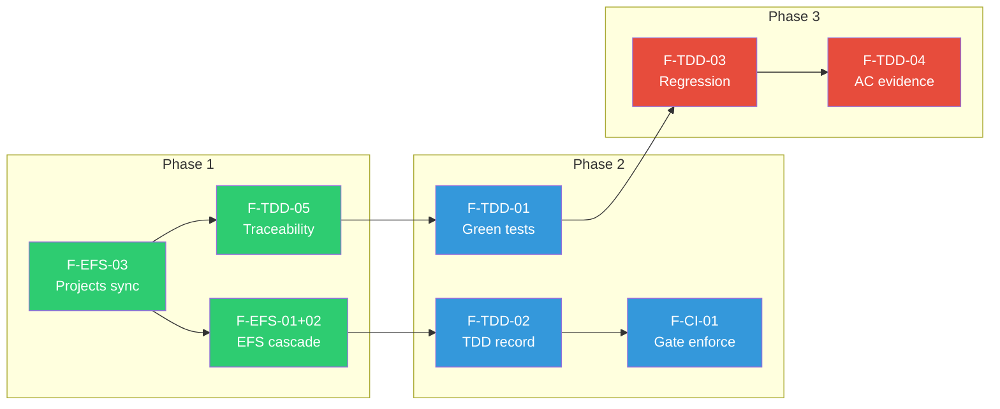

---

## 10. PMF Signals (Validation Criteria)

| Signal | Threshold | Measurement | Status |
|--------|-----------|-------------|--------|
| Close-out skill invocation rate | ≥80% of feature closures use `/close-out` | Monthly audit of closed features vs close-out runs | Not yet measured |
| Manual AC checkbox edits post-close-out | ≤5% of features need manual correction | Audit epic bodies after close-out | Not yet measured |
| TDD artefact attachment rate | ≥60% of features have `dt:TDDDecisionRecord` at close | Stage 4 resolver hit rate | Not yet measured |
| Projects board accuracy | ≥95% of closed issues show "Done" status | Weekly Projects audit | Not yet measured |
| Test plan traceability coverage | 100% of Red cases mapped to Green criteria in TEST-PLAN | Stage 4 output audit | Not yet measured |

---

## 11. Risk Assessment (RRR Alignment)

| Risk | Likelihood | Impact | Mitigation | Requirement |
|------|-----------|--------|------------|-------------|
| GH Action body rewrite corrupts epic Markdown | Medium | High | Use `--body-file` with temp file (standing rule). Validate checkbox count before/after | F-EFS-01 must preserve all non-checkbox content |
| TDD artefacts not present at close-out time | High (today) | Medium | Stage 4 degrades gracefully — runs vitest without TDD record, notes gap in TEST-PLAN | F-TDD-02 must handle missing artefacts |
| CI/CD gates block promotion for legacy features without TDD | Medium | High | Warn-only mode for first 3 months, then enforce | F-CI-01 staged rollout required |
| Role boundary tests incomplete at gate enforcement time | Medium | Medium | Gate G5 checks for decision presence, not test count — acceptable at low maturity | F-TDD-01 can ship incrementally |

---

## 12. Decision Framework

### 12.1 Recommended Implementation Order

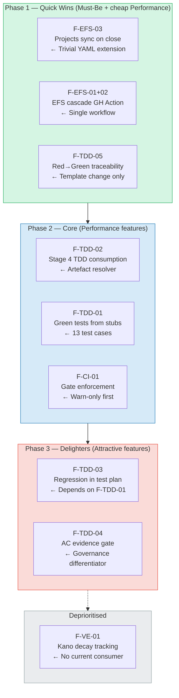

### 12.2 Decision Required

| Decision | Options | Recommendation |
|----------|---------|---------------|
| Should Phase 1 proceed immediately? | Yes / Defer | **Yes** — all items are Must-Be or near-zero cost |
| Should CI/CD gates start as warn-only? | Warn-only / Hard-enforce / Skip | **Warn-only** — build confidence before enforcement |
| Should F-TDD-04 (AC evidence gate) be Phase 2 or 3? | Phase 2 (enforce early) / Phase 3 (delight later) | **Phase 3** — let teams adapt to auto-updates first |
| Should close-out Stage 4 fail if no TDD record found? | Fail / Warn + continue / Silent | **Warn + continue** — graceful degradation during adoption |

---

## 13. Cross-Reference Matrix

### 13.1 Epic-to-Feature Traceability

| Feature | Epic 61 (CI/CD) | Epic 76 (TDD) | Epic 49 (Close-Out) | Workflow / Skill |
|---------|:-:|:-:|:-:|---|
| F-EFS-01 | **Primary** | — | Consumer | `efs-cascade-update.yml` (new) |
| F-EFS-02 | **Primary** | — | Consumer | `efs-cascade-update.yml` (new) |
| F-EFS-03 | **Primary** | — | — | [`set-pbs-id.yml`](https://github.com/ajrmooreuk/Azlan-EA-AAA/blob/main/.github/workflows/set-pbs-id.yml) (extend) |
| F-TDD-01 | — | **Primary** | Consumer | SKL-137 test suite |
| F-TDD-02 | — | Producer | **Primary** | [`close-out/SKILL.md`](https://github.com/ajrmooreuk/Azlan-EA-AAA/blob/main/azlan-github-workflow/skills/close-out/SKILL.md) Stage 4 |
| F-TDD-03 | — | Producer | **Primary** | [`close-out/SKILL.md`](https://github.com/ajrmooreuk/Azlan-EA-AAA/blob/main/azlan-github-workflow/skills/close-out/SKILL.md) Stage 4 |
| F-TDD-04 | — | Producer | **Primary** | [`close-out/SKILL.md`](https://github.com/ajrmooreuk/Azlan-EA-AAA/blob/main/azlan-github-workflow/skills/close-out/SKILL.md) Stage 1 |
| F-TDD-05 | — | Producer | **Primary** | TEST-PLAN template |
| F-CI-01 | **Primary** | Consumer | — | [`tdd-gate.yml`](https://github.com/ajrmooreuk/Azlan-EA-AAA/blob/main/.github/workflows/tdd-gate.yml) + [`promote.yml`](https://github.com/ajrmooreuk/Azlan-EA-AAA/blob/main/.github/workflows/promote.yml) |

### 13.2 Document Cross-References

| Document | Type | Epic | Relationship |
|----------|------|------|-------------|
| [PFC-ARCH-SPEC-TDD-Dual-Layer-Architecture-Reference-v1.3.0.md](https://github.com/ajrmooreuk/Azlan-EA-AAA/blob/main/PBS/STRATEGY/PFC-ARCH-SPEC-TDD-Dual-Layer-Architecture-Reference-v1.3.0.md) | SPEC | Epic 76 | Defines TDD1/TDD2 artefact types consumed by this feature |
| [PFC-ARCH-HLD-TDD-Dual-Layer-Skill-Chain-v1.0.0.md](https://github.com/ajrmooreuk/Azlan-EA-AAA/blob/main/PBS/STRATEGY/PFC-ARCH-HLD-TDD-Dual-Layer-Skill-Chain-v1.0.0.md) | HLD | Epic 76 | Master TDD HLD — VP ask, SWOT, skill manifest |
| [PFC-ARCH-TST-TDD-Skill-Chain-Test-Guide-v1.3.0.md](https://github.com/ajrmooreuk/Azlan-EA-AAA/blob/main/PBS/STRATEGY/PFC-ARCH-TST-TDD-Skill-Chain-Test-Guide-v1.3.0.md) | TST | Epic 76 | Test patterns and coverage targets for TDD skills |
| [PFC-ARCH-OPS-TDD-Skill-Chain-Operations-Guide-v1.5.0.md](https://github.com/ajrmooreuk/Azlan-EA-AAA/blob/main/PBS/STRATEGY/PFC-ARCH-OPS-TDD-Skill-Chain-Operations-Guide-v1.5.0.md) | OPS | Epic 76 | TDD2 activation criteria (T1/T2/T3 triggers, G5a gate) |
| [PFC-CICD-BRIEF-PBS-Architecture-DevSecOps-v1.0.0.md](https://github.com/ajrmooreuk/Azlan-EA-AAA/blob/main/PBS/STRATEGY/PFC-CICD-BRIEF-PBS-Architecture-DevSecOps-v1.0.0.md) | BRIEF | Epic 61 | CI/CD architecture — promotion pipeline, PAT governance |
| [PFC-CICD-GUIDE-PFI-Release-and-Promotion-v1.0.0.md](https://github.com/ajrmooreuk/Azlan-EA-AAA/blob/main/PBS/STRATEGY/PFC-CICD-GUIDE-PFI-Release-and-Promotion-v1.0.0.md) | GUIDE | Epic 61 | Release flow — hub→dev→test→prod promotion steps |
| [PFC-ARCH-HLD-VE-Value-Engineering-Skill-Chain-v1.0.0.md](https://github.com/ajrmooreuk/Azlan-EA-AAA/blob/main/PBS/STRATEGY/PFC-ARCH-HLD-VE-Value-Engineering-Skill-Chain-v1.0.0.md) | HLD | Epic 48/67 | VE methodology — Kano classification, Pareto, PMF signals |
| [PFC-STRAT-BRIEF-VE-Skill-Chain-OKR-VP-Kano-PMF-v1.0.0.md](https://github.com/ajrmooreuk/Azlan-EA-AAA/blob/main/PBS/STRATEGY/PFC-STRAT-BRIEF-VE-Skill-Chain-OKR-VP-Kano-PMF-v1.0.0.md) | BRIEF | Epic 48 | VE skill chain strategy — evaluation framework used in this brief |
| [PFC-STRAT-BRIEF-TDD-Platform-Quality-Assurance-Strategy-v1.0.0.md](https://github.com/ajrmooreuk/Azlan-EA-AAA/blob/main/PBS/STRATEGY/PFC-STRAT-BRIEF-TDD-Platform-Quality-Assurance-Strategy-v1.0.0.md) | BRIEF | Epic 76 | TDD platform QA strategy — supersedes earlier TDD strategy brief |
| [Close-Out SKILL.md](https://github.com/ajrmooreuk/Azlan-EA-AAA/blob/main/azlan-github-workflow/skills/close-out/SKILL.md) | SKILL | Epic 49 F49.12 | 6-stage close-out pipeline — Stage 4 is primary integration point |
| [TDD2 Regression Tracker SKILL.md](https://github.com/ajrmooreuk/Azlan-EA-AAA/blob/main/azlan-github-workflow/skills/pfc-tdd2-regression-tracker/SKILL.md) | SKILL | Epic 76 | SKL-137 — produces dt:RegressionRiskRecord consumed by Stage 4 |
| [dt-tdd-specification-Entry-SKL-137.json](https://github.com/ajrmooreuk/Azlan-EA-AAA/blob/main/azlan-github-workflow/skills/pfc-tdd2-regression-tracker/tdd-artefacts/dt-tdd-specification-Entry-SKL-137.json) | TDD | Epic 76 | 13 Red test cases with Green acceptance criteria for regression tracker |

### 13.3 Workflow Cross-References

| Workflow | Epic | Role in F61.32 |
|----------|------|---------------|
| [`set-pbs-id.yml`](https://github.com/ajrmooreuk/Azlan-EA-AAA/blob/main/.github/workflows/set-pbs-id.yml) | Epic 61 | F-EFS-03 extends this — add close/reopen triggers |
| [`tracker-auto-sync.yml`](https://github.com/ajrmooreuk/Azlan-EA-AAA/blob/main/.github/workflows/tracker-auto-sync.yml) | Epic 61 | Downstream consumer — syncs close-out metadata to programme-tracker.json |
| [`tdd-gate.yml`](https://github.com/ajrmooreuk/Azlan-EA-AAA/blob/main/.github/workflows/tdd-gate.yml) | Epic 76/61 | F-CI-01 — enforces G1–G7 guards using TDD artefacts |
| [`promote.yml`](https://github.com/ajrmooreuk/Azlan-EA-AAA/blob/main/.github/workflows/promote.yml) | Epic 61 | F-CI-01 — TDD-gated promotion (dev→test→prod) |
| [`auto-add-to-projects.yml`](https://github.com/ajrmooreuk/Azlan-EA-AAA/blob/main/.github/workflows/auto-add-to-projects.yml) | Epic 61 | Existing — auto-adds issues to project board #33 |
| `efs-cascade-update.yml` (NEW) | Epic 61 | F-EFS-01/02 — auto-cascades AC checkboxes on issue close |

---

*This document follows [PFC-PBS-STD-Document-Controls-Naming-Convention-v1.0.0.md](https://github.com/ajrmooreuk/Azlan-EA-AAA/blob/main/PBS/STRATEGY/PFC-PBS-STD-Document-Controls-Naming-Convention-v1.0.0.md)*
