# PFC-ARCH-EVAL-URG-Schema-Architecture-Review-v1.0.0

| Field | Value |
| --- | --- |
| **Document ID** | `PFC-ARCH-EVAL-URG-Schema-Architecture-Review-v1.0.0` |
| **Date** | 2026-03-16 |
| **Status** | **For Review** |
| **Epic** | Epic 77 [#1204](https://github.com/ajrmooreuk/Azlan-EA-AAA/issues/1204) — Unified Registry & Governance |
| **Strategy Brief** | [PFC-ARCH-BRIEF-URG-Access-Scope-Model-v1.0.0](https://github.com/ajrmooreuk/Azlan-EA-AAA/blob/main/PBS/STRATEGY/PFC-ARCH-BRIEF-URG-Access-Scope-Model-v1.0.0.md) |
| **Reviewed Input** | Oliver's `supabase-schema.sql` (multi-tenant SaaS) |
| **Owners** | Amanda Moore, Oliver Bardenheier |

---

## 1. Purpose & Approach

### 1.1 Top-Down: Epic Plan Drives Architecture

This document evaluates the database architecture **top-down from the Epic 77 plan** — URG access control is the architecture; everything else sits below it.

The question is not "how do we extend Oliver's schema?" The question is: **"What does URG need to control access to every resource across PFC-PFI, and where does existing work fit?"**

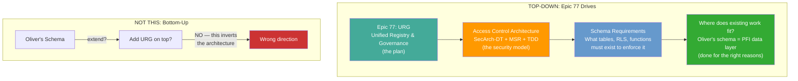

### 1.2 Oliver's Work — Done for the Right Reasons

Oliver's multi-tenant Supabase schema is **good PFI-level work**. It proves:

- Tenant isolation patterns that work
- JSONB for ontology-mapped data
- RLS at the database layer
- The `tenants → users` relationship model

This work is **not wasted** — it becomes the PFI data layer (Layer 4) in the URG architecture. But the architecture starts from the top: **what does URG need to control?**

### 1.3 What This Document Covers

1. **§2–3**: The URG access architecture (top-down from Epic 77)
2. **§4–5**: How Oliver's schema fits as the PFI data layer
3. **§6**: Gap analysis — what the schema has vs what URG needs
4. **§7**: Verdict and scorecard
5. **§8–9**: Evolution path and recommendations
6. **§10**: Full proposed modifications (DDL, functions, RLS, diagrams)

---

## 2. The URG Access Architecture (Epic 77 — Top Down)

### 2.1 URG is the Single Gate

The Unified Registry & Governance (URG) is not a database feature — it is the **platform access architecture**. Everything in PFC flows through URG:

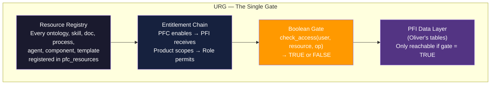

**Nothing reaches the PFI data layer without passing through URG.** Oliver's tables (discovery_results, gap_analysis, leads, etc.) are the destination — URG is the gatekeeper.

### 2.2 The 5-Level Cascade — What Epic 77 Requires

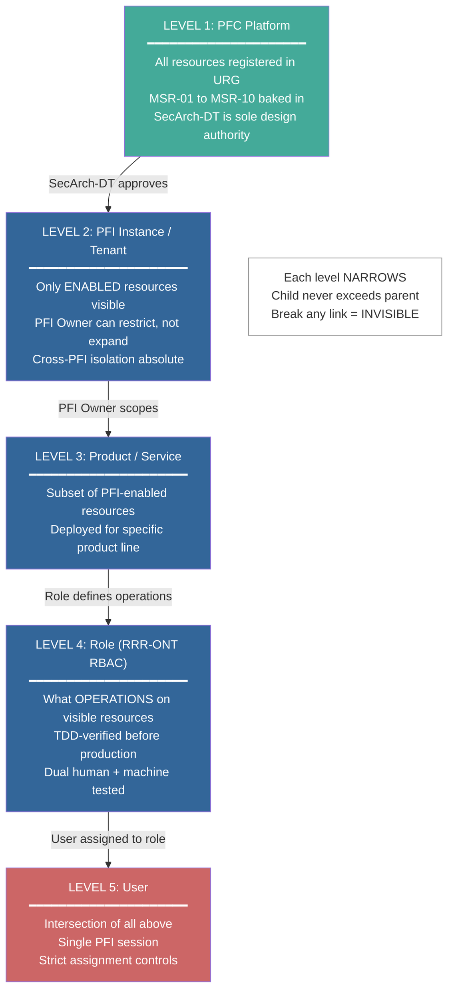

### 2.3 The Boolean Decision — Simple YES/NO

Every resource access resolves to a single boolean. This is the **contract** that the database must enforce:

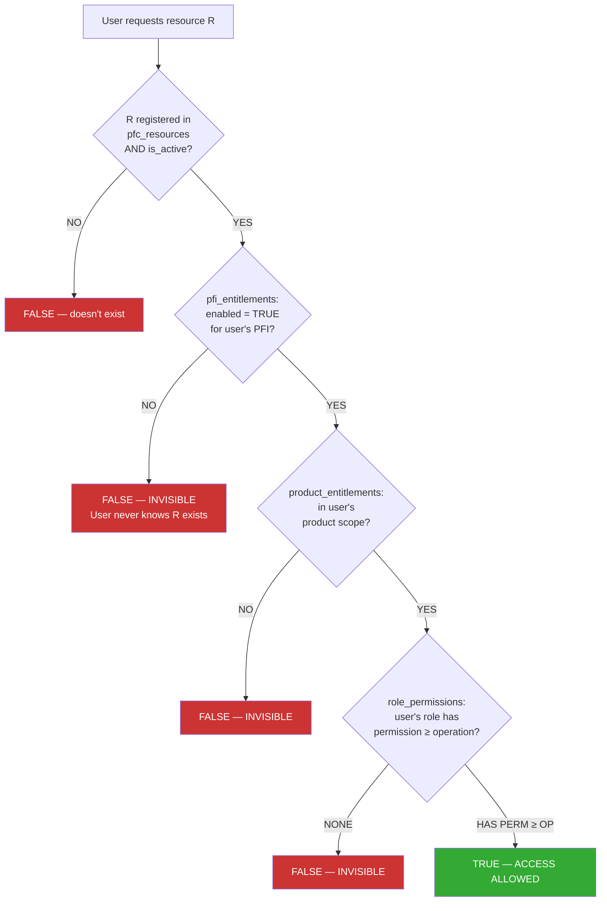

### 2.4 The Strict Binding Pattern — Same as DSY + Skill Builder

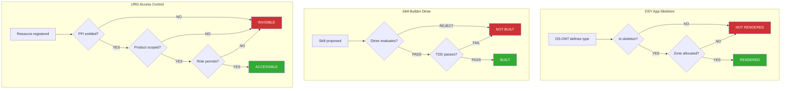

**Identical pattern:** Registration → Gate 1 → Gate 2 → Gate 3 → Result. Break any link = doesn't exist. Strict mapping. Strict bindings.

---

## 3. The Required Schema Layers (Top Down)

The database must implement 5 layers. **Layer 1 is the architecture. Layer 4 is where Oliver's work lives.**

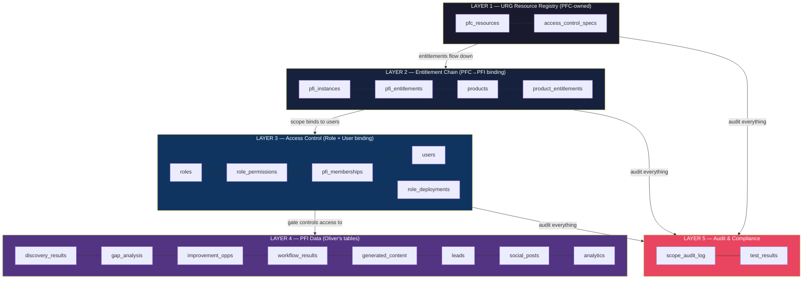

| Layer | Purpose | Tables | Source |
| --- | --- | --- | --- |
| **L1: URG Resource Registry** | What resources exist and how they're classified | `pfc_resources`, `access_control_specs` | NEW — Epic 77 |
| **L2: Entitlement Chain** | Which PFIs/products get which resources | `pfi_instances`, `pfi_entitlements`, `products`, `product_entitlements` | 1 RENAMED + 3 NEW |
| **L3: Access Control** | Which roles/users can do what | `users`, `pfi_memberships`, `roles`, `role_permissions`, `role_deployments` | 1 MODIFIED + 4 NEW |
| **L4: PFI Data** | The actual data users work with | 8 tables (discovery_results, gap_analysis, etc.) | Oliver's — UNCHANGED |
| **L5: Audit** | Immutable compliance trail | `scope_audit_log`, `test_results` | NEW — Epic 77 |

**Layer 4 is Oliver's contribution.** Layers 1–3 and 5 are the URG architecture that sits above and around it.

---

## 4. Oliver's Schema — Good Work, Right Reasons, Fits as Layer 4

### Feedback for Oliver

Oliver's multi-tenant Supabase schema was built for the right reasons — proving that tenant isolation, JSONB ontology mapping, and RLS work in Supabase for PFI-level data. **This work is valued and retained.** The 8 data tables (discovery_results through analytics) become Layer 4 of the URG architecture — the actual data users work with once the access gates above have said YES.

What changes is **where it sits in the architecture**: Oliver's schema is not the starting point that we extend upward — it is the PFI data layer that the URG access architecture protects from above.

### 4.1 Entity Relationship Diagram (Oliver's As-Is)

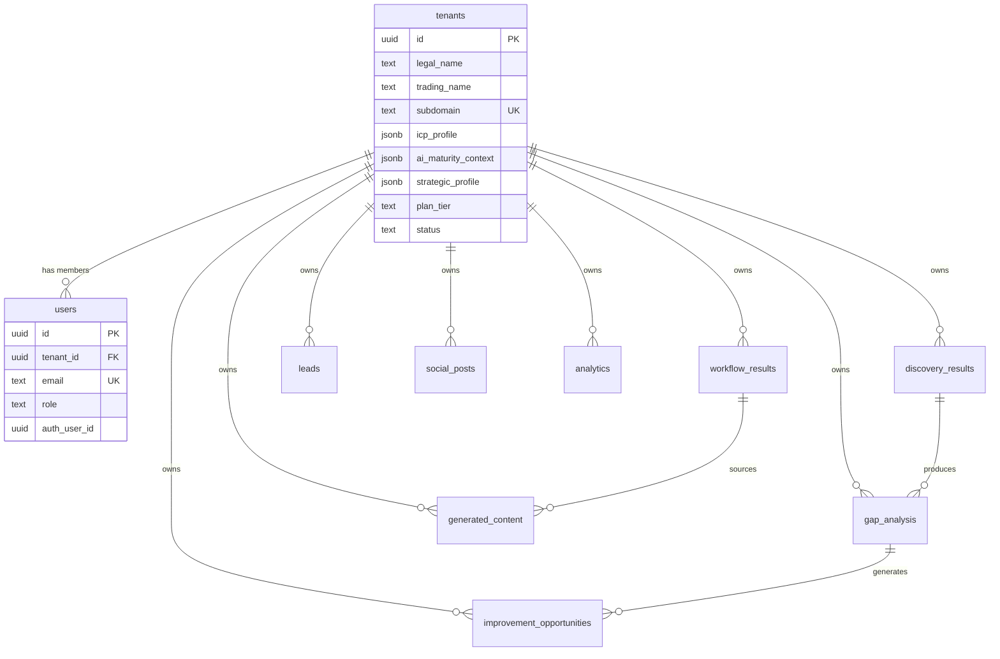

### 4.2 Current Access Model — Flat Tenant Isolation

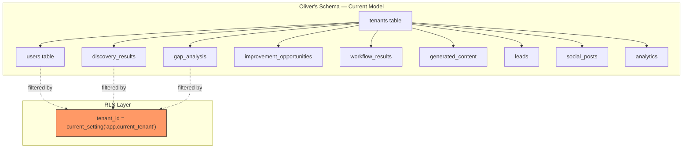

**What this gives us:** Single-level tenant isolation. Every row is owned by one tenant. RLS filters on `tenant_id`. Simple, effective for a single PFI.

---

## 5. Why Oliver's Schema Alone Can't Enforce URG

Oliver's schema answers: **"who owns this row?"** (tenant isolation). Epic 77 asks: **"is this user allowed to see this resource through a chain of approved entitlements?"** (access control). These are fundamentally different questions.

### 5.1 The Gap Illustrated

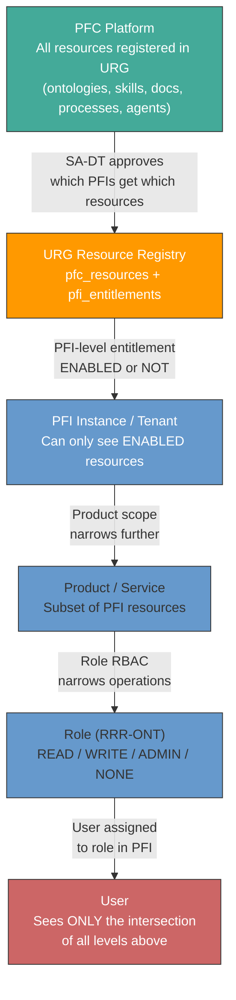

### 5.2 The Boolean Access Decision (What the Schema Must Enforce)

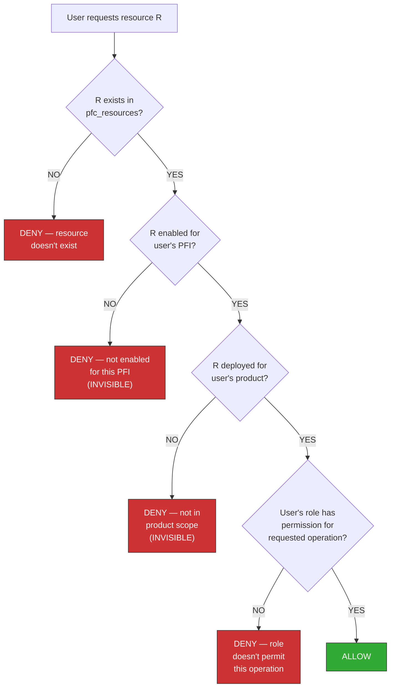

**Key:** At checks C2 and C3, the resource is not just denied — it is **invisible**. The user never knows it exists. At C4, the resource is visible but the operation is blocked.

---

## 6. Gap Analysis — Oliver's Schema vs Epic 77 Requirements

### 6.1 What the Schema HAS (strengths — carries forward)

| Requirement | Oliver's Schema | Verdict |
| --- | --- | --- |
| Tenant isolation | `tenant_id` FK on every table + RLS | GOOD — maps to PFI isolation |
| User-to-tenant binding | `users.tenant_id` FK | GOOD — maps to PFI membership |
| Role assignment | `users.role` (admin/member/viewer) | PARTIAL — flat string, needs RRR-ONT taxonomy |
| JSONB for ontology data | Extensive JSONB columns | GOOD — proven pattern for graph data |
| RLS enabled | All 10 tables | GOOD — foundation for cascading RLS |
| Session-based tenant context | `current_setting('app.current_tenant')` | GOOD — maps to session `pfi_id` |
| Indexes on tenant_id | Every table indexed | GOOD — query performance |
| Audit timestamps | `created_at`, `updated_at` on all | PARTIAL — needs append-only audit log |

### 6.2 What the Schema is MISSING (URG layers needed above)

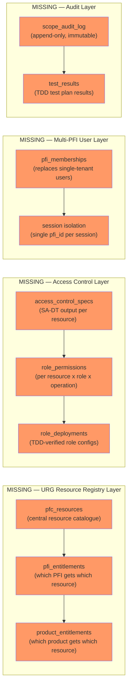

| Missing Element | Why Critical | Impact if Absent |
| --- | --- | --- |
| **`pfc_resources`** — central resource catalogue | URG cannot exist without a registry of what resources the platform offers | No "single source of truth" for what exists |
| **`pfi_entitlements`** — PFI-level enablement | Cannot enforce "nothing in PFI unless URG-enabled" (MSR-01) | All tenants see all resources — no top-down control |
| **`product_entitlements`** — product-level scoping | Cannot narrow within a PFI by product/service | Over-broad access within PFI |
| **`role_permissions`** — per-resource RBAC | `users.role` is a flat string, not bound to specific resources | Cannot do "admin on resource A, read-only on resource B" |
| **`pfi_memberships`** — multi-PFI user model | `users.email UNIQUE` means one user = one tenant | Multi-PFI users impossible (MSR-04 violation) |
| **`access_control_specs`** — SA-DT output | No record of what the Security Architect approved | No traceability, no TDD link |
| **`scope_audit_log`** — immutable audit trail | `updated_at` overwrites — no history | Cannot answer "who approved this, when, why" |
| **Cascading RLS functions** | RLS only checks `tenant_id`, not entitlement chain | No top-down boolean YES/NO decision |

### 6.3 The Critical Missing Concept: Quasi-Object Inheritance

Oliver's schema treats every table as **directly owned by a tenant**. Epic 75 requires **resource access determined by an inheritance chain**:

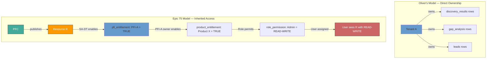

**The difference:** Oliver's model asks "does this tenant own this row?" Epic 75 asks "is this resource enabled through a chain of approvals from PFC down to this user's role in this PFI?"

Like **DSY App-Skeleton** where a component only renders if DS-ONT defines it and the skeleton template includes it and the zone allocator maps it — like **Skill Builder Decision Tree** where a skill only exists if the Dtree approved it — the URG model requires:

**Resource exists in URG** AND **PFI entitlement = enabled** AND **Product scope includes it** AND **Role has permission** = **ACCESS: YES**

Any break in the chain = **ACCESS: NO** (invisible, not denied).

---

## 7. Proposed Target Schema — What Epic 77 Needs

### 7.1 Full Target Architecture

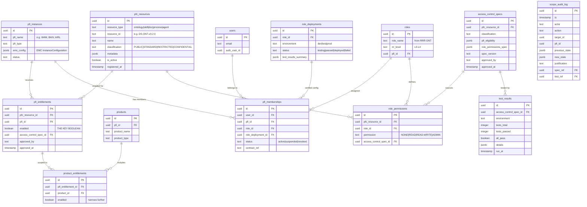

### 7.2 The Boolean Access Function

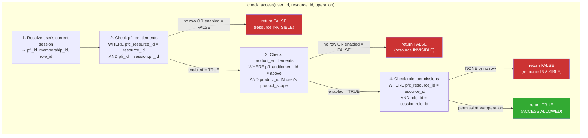

**This is the simple boolean result:** `check_access(user, resource, operation)` returns `TRUE` or `FALSE`. No ambiguity.

### 7.3 How RLS Enforces It — Automatic, Not Application Logic

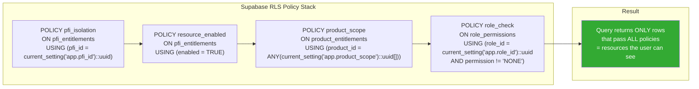

**The user never even knows disallowed resources exist.** The query simply returns fewer rows. No error messages, no "access denied" — just absence.

---

## 8. The Identical Pattern: DSY / Skill Builder / URG

The strict binding pattern is already proven twice in PFC. URG is the third instance:

### 8.1 Side-by-Side Comparison

```mermaid
flowchart TD
    subgraph "DSY App-Skeleton Pattern"
        DS1["DS-ONT defines<br/>component types"] --> DS2["Skeleton template<br/>includes component"]
        DS2 --> DS3["Zone allocator<br/>maps to zone"]
        DS3 --> DS4["Component renders"]
        DS2 -.->|"not in template"| DS5["Component doesn't exist<br/>in the app"]
    end

    subgraph "Skill Builder Dtree Pattern"
        SK1["Skill registered<br/>in registry"] --> SK2["Dtree evaluates<br/>(HG-01, HG-02)"]
        SK2 --> SK3["Dtree approves<br/>→ skill built"]
        SK2 -.->|"Dtree rejects"| SK4["Skill not built<br/>doesn't exist"]
    end

    subgraph "URG Access Pattern"
        U1["Resource registered<br/>in pfc_resources"] --> U2["SA-DT evaluates<br/>(SA-DT-01 to 07)"]
        U2 --> U3["SA-DT enables<br/>for PFI"]
        U3 --> U4["User can see<br/>resource"]
        U2 -.->|"SA-DT denies"| U5["Resource invisible<br/>to PFI users"]
    end

    style DS5 fill:#c33,color:#fff
    style SK4 fill:#c33,color:#fff
    style U5 fill:#c33,color:#fff
    style DS4 fill:#3a3,color:#fff
    style SK3 fill:#3a3,color:#fff
    style U4 fill:#3a3,color:#fff
```

**The binding is strict:** Just as a component only renders if DS-ONT + Skeleton + Zone all agree, a resource is only accessible if URG + PFI Entitlement + Product Scope + Role Permission all agree. Break any link in the chain = resource doesn't exist from the user's perspective.

---

## 9. Verdict — Does Oliver's Schema Support the URG Need?

### 9.1 Scorecard

| Requirement | Oliver's Schema | Gap | Severity |
| --- | --- | --- | --- |
| URG as single resource registry | NO `pfc_resources` table | `pfc_resources` + `pfi_entitlements` needed | **CRITICAL** |
| Top-down PFC → PFI entitlement | NO — flat tenant ownership only | Entitlement chain needed | **CRITICAL** |
| Product/service scoping | NO | `product_entitlements` needed | **HIGH** |
| Quasi-object inheritance (cascading deny) | NO — no parent-child scope chain | Cascading RLS policies needed | **CRITICAL** |
| Simple boolean YES/NO | PARTIAL — RLS gives tenant isolation but not resource-level | `check_access()` function needed | **CRITICAL** |
| Invisible if not in scope | PARTIAL — tenant rows hidden but all resources within tenant visible | Resource-level entitlement RLS needed | **CRITICAL** |
| Multi-PFI user | NO — `users.email UNIQUE` = one tenant only | `pfi_memberships` replaces `users.tenant_id` | **HIGH** |
| Role as RRR-ONT taxonomy | NO — flat string (admin/member/viewer) | `roles` table with RRR-ONT levels | **HIGH** |
| Per-resource role permissions | NO — role is per-user, not per-resource | `role_permissions` table needed | **HIGH** |
| SA-DT traceability | NO | `access_control_specs` table needed | **MEDIUM** |
| TDD-verified role deployment | NO | `role_deployments` + `test_results` needed | **MEDIUM** |
| Immutable audit trail | NO — only `updated_at` (overwritten) | `scope_audit_log` (append-only) needed | **MEDIUM** |
| Strict mapping and bindings | NO — no binding between resource registration and access | FK chain: resource → entitlement → permission → role → membership | **CRITICAL** |

### 9.2 Summary

**Oliver's schema is excellent PFI-level work** — it proves tenant isolation, JSONB for ontology data, RLS patterns, and the tenant → user model. These patterns carry forward directly as Layer 4.

**But it cannot enforce the URG top-down access model alone.** The fundamental difference: Oliver's schema asks "who owns this row?" (tenant isolation). Epic 77 asks "is this user allowed to see this resource through a chain of approved entitlements?" (access control).

The URG architecture needs **4 new table groups above** Oliver's tables:

1. **URG Resource Registry** — `pfc_resources` + `access_control_specs` (Layer 1)
2. **Entitlement Chain** — `pfi_entitlements` + `product_entitlements` (Layer 2)
3. **Access Control** — `pfi_memberships` + `roles` + `role_permissions` + `role_deployments` (Layer 3)
4. **Audit** — `scope_audit_log` + `test_results` (Layer 5)

### 9.3 The Good News — Oliver's Tables Stay

Oliver's 8 data tables **don't need to change** — they become PFI data (Layer 4) that sits below the URG entitlement layer. The `tenant_id` column on each table stays, but the RLS policies evolve:

```text
BEFORE:  RLS checks tenant_id = session.tenant_id
AFTER:   RLS checks tenant_id = session.pfi_id
         AND resource_type entitled for this PFI (via pfi_entitlements)
         AND product scope matches (via product_entitlements)
         AND role has permission (via role_permissions)
```

Oliver's tables become the **leaf data** — the stuff users actually work with once access is granted. The URG layer sits above and gates whether they can reach it at all.

---

## 10. Evolution Path — Top Down

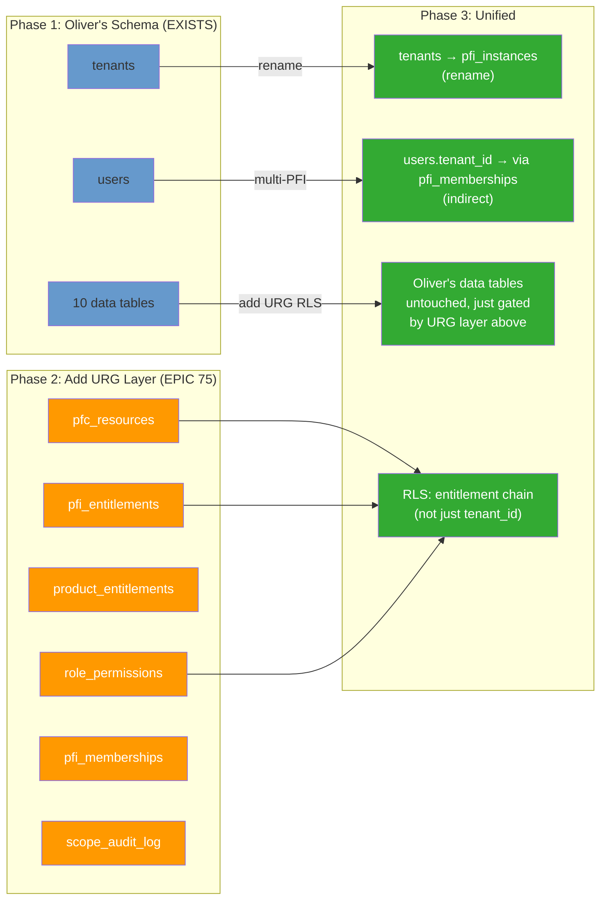

---

## 11. Recommendations

1. **Keep Oliver's schema as PFI data layer** — rename `tenants` to `pfi_instances`, keep all 10 data tables
2. **Add URG resource registry above** — `pfc_resources` + `pfi_entitlements` + `product_entitlements`
3. **Replace flat user-tenant binding** — `pfi_memberships` replaces `users.tenant_id` for multi-PFI support
4. **Add per-resource role permissions** — `role_permissions` replaces flat `users.role` string
5. **Add SA-DT traceability** — `access_control_specs` links every entitlement decision to its approval
6. **Add immutable audit** — `scope_audit_log` for compliance
7. **Implement `check_access()` function** — simple boolean, called by RLS or application
8. **Evolve RLS policies** — from flat `tenant_id` check to full entitlement chain

The result: Oliver's proven patterns + the URG top-down layer = a schema that delivers the simple boolean YES/NO access that Epic 75 requires, with strict bindings from resource registration through to user access.

---

## 12. Proposed Modifications — Full Architecture

### 12.1 Layered Architecture Overview

The modified schema has 4 distinct layers. Oliver's existing tables form Layer 4 (PFI Data). Layers 1–3 are new.

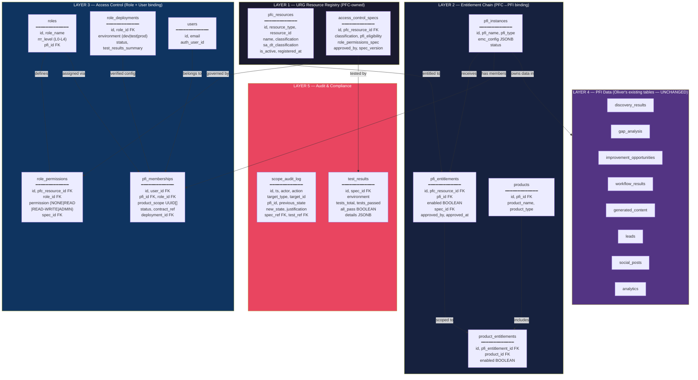

### 12.2 Modification Detail — What Changes, What Stays

```mermaid
flowchart TD
    subgraph "UNCHANGED — Oliver's Tables (keep as-is)"
        direction TB
        K1["discovery_results ✅"]
        K2["gap_analysis ✅"]
        K3["improvement_opportunities ✅"]
        K4["workflow_results ✅"]
        K5["generated_content ✅"]
        K6["leads ✅"]
        K7["social_posts ✅"]
        K8["analytics ✅"]
    end

    subgraph "RENAMED — Structural Changes"
        direction TB
        R1["tenants → pfi_instances<br/>(add emc_config, pfi_type)"]
        R2["users.tenant_id REMOVED<br/>(access via pfi_memberships)"]
        R3["users.role REMOVED<br/>(access via pfi_memberships.role_id)"]
        R4["users.email NO LONGER UNIQUE<br/>(can have multiple PFI memberships)"]
    end

    subgraph "NEW — URG Layer Tables"
        direction TB
        N1["pfc_resources (NEW)"]
        N2["pfi_entitlements (NEW)"]
        N3["products (NEW)"]
        N4["product_entitlements (NEW)"]
        N5["roles (NEW)"]
        N6["role_permissions (NEW)"]
        N7["pfi_memberships (NEW)"]
        N8["role_deployments (NEW)"]
        N9["access_control_specs (NEW)"]
        N10["test_results (NEW)"]
        N11["scope_audit_log (NEW)"]
    end

    style K1 fill:#3a3,color:#fff
    style K2 fill:#3a3,color:#fff
    style K3 fill:#3a3,color:#fff
    style K4 fill:#3a3,color:#fff
    style K5 fill:#3a3,color:#fff
    style K6 fill:#3a3,color:#fff
    style K7 fill:#3a3,color:#fff
    style K8 fill:#3a3,color:#fff
    style R1 fill:#f90,color:#fff
    style R2 fill:#f90,color:#fff
    style R3 fill:#f90,color:#fff
    style R4 fill:#f90,color:#fff
    style N1 fill:#c33,color:#fff
    style N2 fill:#c33,color:#fff
    style N3 fill:#c33,color:#fff
    style N4 fill:#c33,color:#fff
    style N5 fill:#c33,color:#fff
    style N6 fill:#c33,color:#fff
    style N7 fill:#c33,color:#fff
    style N8 fill:#c33,color:#fff
    style N9 fill:#c33,color:#fff
    style N10 fill:#c33,color:#fff
    style N11 fill:#c33,color:#fff
```

### 12.3 Proposed SQL DDL — New Tables

```sql
-- ================================================================
-- LAYER 1: URG RESOURCE REGISTRY (PFC-owned)
-- ================================================================

-- Central registry of ALL platform resources
CREATE TABLE pfc_resources (
    id UUID PRIMARY KEY DEFAULT gen_random_uuid(),
    resource_type TEXT NOT NULL CHECK (resource_type IN (
        'ontology', 'skill', 'document', 'process',
        'agent', 'component', 'template', 'capability'
    )),
    resource_id TEXT NOT NULL UNIQUE,       -- e.g. 'DS-ONT-v3.2.0', 'SKL-SEC-01'
    name TEXT NOT NULL,
    description TEXT,
    classification TEXT NOT NULL DEFAULT 'STANDARD' CHECK (classification IN (
        'PUBLIC', 'STANDARD', 'RESTRICTED', 'CONFIDENTIAL'
    )),
    metadata JSONB DEFAULT '{}'::jsonb,     -- ontology-specific data, version, series
    is_active BOOLEAN NOT NULL DEFAULT true,
    registered_at TIMESTAMPTZ NOT NULL DEFAULT now(),
    registered_by TEXT NOT NULL             -- SA-DT actor who registered
);

CREATE INDEX idx_pfc_resources_type ON pfc_resources(resource_type);
CREATE INDEX idx_pfc_resources_active ON pfc_resources(is_active) WHERE is_active = true;

-- SA-DT output: the approved access control specification per resource
CREATE TABLE access_control_specs (
    id UUID PRIMARY KEY DEFAULT gen_random_uuid(),
    pfc_resource_id UUID NOT NULL REFERENCES pfc_resources(id),
    classification TEXT NOT NULL,
    pfi_eligibility JSONB NOT NULL,         -- {"all": true} or {"pfi_types": ["W4M","BAIV"]}
    product_scope JSONB NOT NULL,           -- {"pfi_wide": true} or {"products": [...]}
    role_permissions_spec JSONB NOT NULL,   -- [{"role":"admin","access":"read-write"}, ...]
    msr_compliance BOOLEAN NOT NULL DEFAULT true,
    spec_version TEXT NOT NULL DEFAULT 'v1.0.0',
    approved_by TEXT NOT NULL,              -- Security Architect name
    approved_at TIMESTAMPTZ NOT NULL DEFAULT now(),
    sa_dt_gate TEXT NOT NULL DEFAULT 'SA-DT-06'  -- which gate produced this
);

CREATE INDEX idx_acs_resource ON access_control_specs(pfc_resource_id);

-- ================================================================
-- LAYER 2: ENTITLEMENT CHAIN (PFC → PFI → Product binding)
-- ================================================================

-- Replaces Oliver's 'tenants' table — same data, platform context added
CREATE TABLE pfi_instances (
    id UUID PRIMARY KEY DEFAULT gen_random_uuid(),
    pfi_name TEXT NOT NULL,                 -- e.g. 'W4M', 'BAIV', 'AIRL'
    pfi_type TEXT NOT NULL,                 -- e.g. 'marketing', 'insurance', 'rcs'
    legal_name TEXT NOT NULL,               -- from Oliver's tenants.legal_name
    trading_name TEXT NOT NULL,             -- from Oliver's tenants.trading_name
    domain TEXT,
    subdomain TEXT UNIQUE NOT NULL,
    industry TEXT,
    emc_config JSONB DEFAULT '{}'::jsonb,   -- EMC InstanceConfiguration
    plan_tier TEXT DEFAULT 'starter',
    status TEXT DEFAULT 'active',
    created_at TIMESTAMPTZ DEFAULT now(),
    updated_at TIMESTAMPTZ DEFAULT now()
);

-- THE KEY TABLE: which resources are enabled for which PFI
-- No row = resource not enabled = INVISIBLE to entire PFI
CREATE TABLE pfi_entitlements (
    id UUID PRIMARY KEY DEFAULT gen_random_uuid(),
    pfc_resource_id UUID NOT NULL REFERENCES pfc_resources(id),
    pfi_id UUID NOT NULL REFERENCES pfi_instances(id),
    enabled BOOLEAN NOT NULL DEFAULT false, -- THE BOOLEAN GATE
    access_control_spec_id UUID REFERENCES access_control_specs(id),
    approved_by TEXT NOT NULL,
    approved_at TIMESTAMPTZ NOT NULL DEFAULT now(),
    disabled_by_pfi_owner BOOLEAN DEFAULT false,  -- PFI owner can restrict
    UNIQUE(pfc_resource_id, pfi_id)         -- one entitlement per resource per PFI
);

CREATE INDEX idx_pe_pfi ON pfi_entitlements(pfi_id);
CREATE INDEX idx_pe_resource ON pfi_entitlements(pfc_resource_id);
CREATE INDEX idx_pe_enabled ON pfi_entitlements(pfi_id, enabled) WHERE enabled = true;

-- Products/services within a PFI
CREATE TABLE products (
    id UUID PRIMARY KEY DEFAULT gen_random_uuid(),
    pfi_id UUID NOT NULL REFERENCES pfi_instances(id),
    product_name TEXT NOT NULL,
    product_type TEXT,
    status TEXT DEFAULT 'active',
    UNIQUE(pfi_id, product_name)
);

-- Product-level scoping: narrows PFI entitlement to specific products
CREATE TABLE product_entitlements (
    id UUID PRIMARY KEY DEFAULT gen_random_uuid(),
    pfi_entitlement_id UUID NOT NULL REFERENCES pfi_entitlements(id),
    product_id UUID NOT NULL REFERENCES products(id),
    enabled BOOLEAN NOT NULL DEFAULT false,
    UNIQUE(pfi_entitlement_id, product_id)
);

CREATE INDEX idx_ppe_product ON product_entitlements(product_id);

-- ================================================================
-- LAYER 3: ACCESS CONTROL (Role + User binding)
-- ================================================================

-- Roles from RRR-ONT taxonomy, per PFI
CREATE TABLE roles (
    id UUID PRIMARY KEY DEFAULT gen_random_uuid(),
    pfi_id UUID NOT NULL REFERENCES pfi_instances(id),
    role_name TEXT NOT NULL,                -- e.g. 'Platform Admin', 'Delivery User'
    rrr_level TEXT NOT NULL CHECK (rrr_level IN ('L0','L1','L2','L3','L4')),
    description TEXT,
    UNIQUE(pfi_id, role_name)
);

-- Per-resource, per-role permission: the strict binding
CREATE TABLE role_permissions (
    id UUID PRIMARY KEY DEFAULT gen_random_uuid(),
    pfc_resource_id UUID NOT NULL REFERENCES pfc_resources(id),
    role_id UUID NOT NULL REFERENCES roles(id),
    permission TEXT NOT NULL DEFAULT 'NONE' CHECK (permission IN (
        'NONE', 'READ', 'READ_WRITE', 'ADMIN'
    )),
    access_control_spec_id UUID REFERENCES access_control_specs(id),
    UNIQUE(pfc_resource_id, role_id)       -- one permission per resource per role
);

CREATE INDEX idx_rp_role ON role_permissions(role_id);
CREATE INDEX idx_rp_resource ON role_permissions(pfc_resource_id);

-- TDD-verified role configurations
CREATE TABLE role_deployments (
    id UUID PRIMARY KEY DEFAULT gen_random_uuid(),
    role_id UUID NOT NULL REFERENCES roles(id),
    environment TEXT NOT NULL CHECK (environment IN ('dev', 'test', 'prod')),
    status TEXT NOT NULL DEFAULT 'pending' CHECK (status IN (
        'pending', 'testing', 'passed', 'deployed', 'failed', 'revoked'
    )),
    test_results_summary JSONB DEFAULT '{}'::jsonb,
    deployed_at TIMESTAMPTZ,
    deployed_by TEXT,
    UNIQUE(role_id, environment)
);

-- Users table (modified from Oliver's — email NOT unique, no tenant_id)
-- Users access PFIs via pfi_memberships, not direct FK
CREATE TABLE users (
    id UUID PRIMARY KEY DEFAULT gen_random_uuid(),
    email TEXT NOT NULL,                    -- NOT UNIQUE: same email, multiple PFI memberships
    auth_user_id UUID UNIQUE,              -- Supabase Auth link
    created_at TIMESTAMPTZ DEFAULT now(),
    last_login TIMESTAMPTZ
);

CREATE INDEX idx_users_email ON users(email);

-- Multi-PFI user memberships: replaces users.tenant_id + users.role
CREATE TABLE pfi_memberships (
    id UUID PRIMARY KEY DEFAULT gen_random_uuid(),
    user_id UUID NOT NULL REFERENCES users(id),
    pfi_id UUID NOT NULL REFERENCES pfi_instances(id),
    role_id UUID NOT NULL REFERENCES roles(id),
    role_deployment_id UUID REFERENCES role_deployments(id), -- must be TDD-verified
    product_scope UUID[] DEFAULT '{}',      -- which products this user can access
    status TEXT NOT NULL DEFAULT 'active' CHECK (status IN (
        'active', 'suspended', 'revoked'
    )),
    contract_ref TEXT,                      -- commercial/contractual reference
    signed_up_at TIMESTAMPTZ NOT NULL DEFAULT now(),
    UNIQUE(user_id, pfi_id)                -- one membership per user per PFI
);

CREATE INDEX idx_pm_user ON pfi_memberships(user_id);
CREATE INDEX idx_pm_pfi ON pfi_memberships(pfi_id);
CREATE INDEX idx_pm_active ON pfi_memberships(pfi_id, status) WHERE status = 'active';

-- ================================================================
-- LAYER 5: AUDIT & COMPLIANCE
-- ================================================================

-- Append-only, immutable audit log
CREATE TABLE scope_audit_log (
    id UUID PRIMARY KEY DEFAULT gen_random_uuid(),
    ts TIMESTAMPTZ NOT NULL DEFAULT now(),
    actor TEXT NOT NULL,
    action TEXT NOT NULL CHECK (action IN (
        'register', 'enable', 'disable', 'assign', 'revoke',
        'escalate', 'deploy', 'test', 'approve', 'emergency_revoke'
    )),
    target_type TEXT NOT NULL CHECK (target_type IN (
        'resource', 'entitlement', 'role', 'membership',
        'permission', 'deployment', 'spec'
    )),
    target_id UUID NOT NULL,
    pfi_id UUID REFERENCES pfi_instances(id),
    previous_state JSONB,
    new_state JSONB,
    justification TEXT NOT NULL,            -- MSR-06: cannot be blank
    access_control_spec_ref UUID REFERENCES access_control_specs(id),
    test_results_ref UUID,
    -- NO updated_at — this table is APPEND-ONLY
    CHECK (justification != '')             -- enforce non-empty justification
);

CREATE INDEX idx_sal_pfi ON scope_audit_log(pfi_id);
CREATE INDEX idx_sal_ts ON scope_audit_log(ts DESC);
CREATE INDEX idx_sal_target ON scope_audit_log(target_type, target_id);

-- Test results for TDD pipeline
CREATE TABLE test_results (
    id UUID PRIMARY KEY DEFAULT gen_random_uuid(),
    access_control_spec_id UUID NOT NULL REFERENCES access_control_specs(id),
    role_deployment_id UUID REFERENCES role_deployments(id),
    environment TEXT NOT NULL CHECK (environment IN ('dev', 'test', 'prod')),
    tests_total INTEGER NOT NULL,
    tests_passed INTEGER NOT NULL,
    all_pass BOOLEAN GENERATED ALWAYS AS (tests_total = tests_passed) STORED,
    scope_coverage_pct NUMERIC(5,2),
    boundary_coverage_pct NUMERIC(5,2),
    msr_compliance_pct NUMERIC(5,2),
    details JSONB DEFAULT '{}'::jsonb,
    run_at TIMESTAMPTZ NOT NULL DEFAULT now(),
    run_by TEXT NOT NULL
);

CREATE INDEX idx_tr_spec ON test_results(access_control_spec_id);
CREATE INDEX idx_tr_env ON test_results(environment);
```

### 12.4 The `check_access()` Function — Simple Boolean Gate

```sql
-- ================================================================
-- THE BOOLEAN GATE: check_access(user_id, resource_id, operation)
-- Returns TRUE (allowed) or FALSE (denied/invisible)
-- Called by RLS policies or application layer
-- ================================================================

CREATE OR REPLACE FUNCTION check_access(
    p_user_id UUID,
    p_resource_id UUID,
    p_operation TEXT DEFAULT 'READ'     -- READ, READ_WRITE, ADMIN
) RETURNS BOOLEAN AS $$
DECLARE
    v_pfi_id UUID;
    v_role_id UUID;
    v_product_scope UUID[];
    v_pfi_entitled BOOLEAN;
    v_product_entitled BOOLEAN;
    v_permission TEXT;
BEGIN
    -- 1. Resolve user's current session membership
    SELECT pfi_id, role_id, product_scope
    INTO v_pfi_id, v_role_id, v_product_scope
    FROM pfi_memberships
    WHERE user_id = p_user_id
      AND pfi_id = current_setting('app.pfi_id')::uuid
      AND status = 'active';

    IF v_pfi_id IS NULL THEN
        RETURN FALSE;  -- no active membership in this PFI
    END IF;

    -- 2. Check PFI entitlement (Layer 2 — DEFINITIVE DENY)
    SELECT enabled INTO v_pfi_entitled
    FROM pfi_entitlements
    WHERE pfc_resource_id = p_resource_id
      AND pfi_id = v_pfi_id
      AND enabled = true
      AND disabled_by_pfi_owner = false;

    IF v_pfi_entitled IS NULL OR v_pfi_entitled = false THEN
        RETURN FALSE;  -- INVISIBLE: not enabled for this PFI
    END IF;

    -- 3. Check product entitlement (Layer 2 — narrows further)
    -- If product_scope is empty, user has PFI-wide access
    IF array_length(v_product_scope, 1) > 0 THEN
        SELECT EXISTS(
            SELECT 1 FROM product_entitlements pe
            JOIN pfi_entitlements pfe ON pe.pfi_entitlement_id = pfe.id
            WHERE pfe.pfc_resource_id = p_resource_id
              AND pfe.pfi_id = v_pfi_id
              AND pe.product_id = ANY(v_product_scope)
              AND pe.enabled = true
        ) INTO v_product_entitled;

        IF NOT v_product_entitled THEN
            RETURN FALSE;  -- INVISIBLE: not in product scope
        END IF;
    END IF;

    -- 4. Check role permission (Layer 3 — operation gate)
    SELECT permission INTO v_permission
    FROM role_permissions
    WHERE pfc_resource_id = p_resource_id
      AND role_id = v_role_id;

    IF v_permission IS NULL OR v_permission = 'NONE' THEN
        RETURN FALSE;  -- INVISIBLE: role has no permission
    END IF;

    -- Check operation level
    IF p_operation = 'READ' AND v_permission IN ('READ', 'READ_WRITE', 'ADMIN') THEN
        RETURN TRUE;
    ELSIF p_operation = 'READ_WRITE' AND v_permission IN ('READ_WRITE', 'ADMIN') THEN
        RETURN TRUE;
    ELSIF p_operation = 'ADMIN' AND v_permission = 'ADMIN' THEN
        RETURN TRUE;
    END IF;

    RETURN FALSE;  -- operation exceeds permission level
END;
$$ LANGUAGE plpgsql SECURITY DEFINER STABLE;
```

### 12.5 The `check_access()` Decision Flow

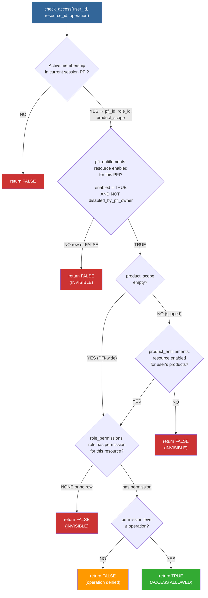

**Note:** F1–F4 = resource is **invisible** (user never knows it exists). F5 = resource is visible but operation is blocked. Only at ALLOW does the user see and use the resource.

### 12.6 RLS Policy Definitions — Cascading Enforcement

```sql
-- ================================================================
-- RLS POLICIES: Enforce the entitlement chain at database level
-- ================================================================

-- Enable RLS on all new tables
ALTER TABLE pfc_resources ENABLE ROW LEVEL SECURITY;
ALTER TABLE pfi_instances ENABLE ROW LEVEL SECURITY;
ALTER TABLE pfi_entitlements ENABLE ROW LEVEL SECURITY;
ALTER TABLE product_entitlements ENABLE ROW LEVEL SECURITY;
ALTER TABLE products ENABLE ROW LEVEL SECURITY;
ALTER TABLE roles ENABLE ROW LEVEL SECURITY;
ALTER TABLE role_permissions ENABLE ROW LEVEL SECURITY;
ALTER TABLE pfi_memberships ENABLE ROW LEVEL SECURITY;
ALTER TABLE scope_audit_log ENABLE ROW LEVEL SECURITY;

-- 1. PFI isolation: users only see their current PFI
CREATE POLICY pfi_isolation ON pfi_instances
    FOR SELECT USING (id = current_setting('app.pfi_id')::uuid);

-- 2. PFI memberships: users only see their own memberships in current PFI
CREATE POLICY membership_isolation ON pfi_memberships
    FOR SELECT USING (
        pfi_id = current_setting('app.pfi_id')::uuid
        AND user_id = current_setting('app.user_id')::uuid
    );

-- 3. PFI entitlements: only show ENABLED resources for current PFI
CREATE POLICY entitlement_filter ON pfi_entitlements
    FOR SELECT USING (
        pfi_id = current_setting('app.pfi_id')::uuid
        AND enabled = true
        AND disabled_by_pfi_owner = false
    );

-- 4. Resources: only show resources that have an active entitlement for current PFI
CREATE POLICY resource_visibility ON pfc_resources
    FOR SELECT USING (
        is_active = true
        AND EXISTS (
            SELECT 1 FROM pfi_entitlements
            WHERE pfi_entitlements.pfc_resource_id = pfc_resources.id
              AND pfi_entitlements.pfi_id = current_setting('app.pfi_id')::uuid
              AND pfi_entitlements.enabled = true
              AND pfi_entitlements.disabled_by_pfi_owner = false
        )
    );

-- 5. Products: only show products in current PFI
CREATE POLICY product_isolation ON products
    FOR SELECT USING (pfi_id = current_setting('app.pfi_id')::uuid);

-- 6. Roles: only show roles for current PFI
CREATE POLICY role_isolation ON roles
    FOR SELECT USING (pfi_id = current_setting('app.pfi_id')::uuid);

-- 7. Role permissions: only show permissions for roles in current PFI
CREATE POLICY permission_visibility ON role_permissions
    FOR SELECT USING (
        EXISTS (
            SELECT 1 FROM roles
            WHERE roles.id = role_permissions.role_id
              AND roles.pfi_id = current_setting('app.pfi_id')::uuid
        )
    );

-- 8. Audit log: only show entries for current PFI (or PFC-wide for admins)
CREATE POLICY audit_visibility ON scope_audit_log
    FOR SELECT USING (
        pfi_id = current_setting('app.pfi_id')::uuid
        OR pfi_id IS NULL  -- PFC-wide entries visible to platform admins
    );

-- 9. Audit log: append-only — no updates or deletes
CREATE POLICY audit_append_only ON scope_audit_log
    FOR INSERT WITH CHECK (true);
-- No UPDATE or DELETE policies = cannot modify audit log

-- 10. Oliver's data tables: add entitlement-aware RLS
-- (Example for discovery_results — apply same pattern to all 8 tables)
DROP POLICY IF EXISTS tenant_isolation ON discovery_results;
CREATE POLICY pfi_scoped_access ON discovery_results
    FOR SELECT USING (
        tenant_id = current_setting('app.pfi_id')::uuid
        -- Resource-level entitlement check via check_access() can be added
        -- for fine-grained resource-type scoping in Phase 2
    );
```

### 12.7 Session Setup — Login to Scope Resolution

```mermaid
sequenceDiagram
    participant U as User
    participant Auth as Supabase Auth
    participant App as Application
    participant DB as PostgreSQL + RLS

    U->>Auth: Login (email + password)
    Auth->>Auth: Authenticate
    Auth-->>App: JWT with user_id

    App->>DB: SELECT pfi_id, role_id, product_scope<br/>FROM pfi_memberships<br/>WHERE user_id = $1 AND status = 'active'

    alt Single PFI membership
        DB-->>App: One row: {pfi_id, role_id, product_scope}
    else Multiple PFI memberships
        DB-->>App: Multiple rows
        App->>U: PFI Selector: "Which instance?"
        U-->>App: Selected PFI
    end

    App->>DB: SET app.pfi_id = 'selected_pfi_id'<br/>SET app.user_id = 'user_id'<br/>SET app.role_id = 'role_id'<br/>SET app.product_scope = '{...}'

    Note over DB: All subsequent queries<br/>filtered by RLS policies<br/>using these session vars

    App->>DB: SELECT * FROM pfc_resources
    DB->>DB: RLS: resource_visibility policy<br/>→ only resources with<br/>pfi_entitlement.enabled = TRUE<br/>for session pfi_id
    DB-->>App: Only entitled resources returned
    App-->>U: User sees ONLY their scope<br/>No trace of other resources
```

### 12.8 Cross-PFI Isolation — Multi-PFI User Flow

```mermaid
flowchart TD
    subgraph "User: amanda@example.com"
        direction TB
        UM["users table:<br/>id=U1, email=amanda@example.com"]
    end

    subgraph "PFI Memberships"
        direction TB
        M1["pfi_memberships:<br/>user=U1, pfi=W4M<br/>role=PFI Admin<br/>products=[all]"]
        M2["pfi_memberships:<br/>user=U1, pfi=BAIV<br/>role=Delivery User<br/>products=[insurance]"]
    end

    subgraph "Session: Logged into W4M"
        direction TB
        S1["app.pfi_id = W4M"]
        S2["RLS filters ALL queries<br/>to W4M only"]
        S3["Resources: W4M-entitled only<br/>BAIV resources: INVISIBLE"]
        S4["Role: PFI Admin<br/>Products: all W4M products"]
    end

    subgraph "Session: Logged into BAIV"
        direction TB
        S5["app.pfi_id = BAIV"]
        S6["RLS filters ALL queries<br/>to BAIV only"]
        S7["Resources: BAIV-entitled only<br/>W4M resources: INVISIBLE"]
        S8["Role: Delivery User<br/>Products: insurance only"]
    end

    UM --> M1
    UM --> M2
    M1 -.->|"login as W4M"| S1
    M2 -.->|"login as BAIV"| S5

    style S3 fill:#3a3,color:#fff
    style S7 fill:#3a3,color:#fff
    style UM fill:#369,color:#fff
```

### 12.9 Complete Modified ER Diagram

```mermaid
erDiagram
    pfc_resources ||--o{ pfi_entitlements : "entitled to"
    pfc_resources ||--o{ role_permissions : "governed by"
    pfc_resources ||--o{ access_control_specs : "spec for"

    pfi_instances ||--o{ pfi_entitlements : "receives"
    pfi_instances ||--o{ pfi_memberships : "has members"
    pfi_instances ||--o{ products : "offers"
    pfi_instances ||--o{ roles : "defines"
    pfi_instances ||--o{ discovery_results : "owns data"
    pfi_instances ||--o{ gap_analysis : "owns data"
    pfi_instances ||--o{ leads : "owns data"

    pfi_entitlements ||--o{ product_entitlements : "scoped to"
    products ||--o{ product_entitlements : "includes"

    users ||--o{ pfi_memberships : "belongs to"
    roles ||--o{ pfi_memberships : "assigned"
    roles ||--o{ role_permissions : "defines"
    role_deployments ||--o{ pfi_memberships : "verified via"
    roles ||--o{ role_deployments : "deployed as"

    access_control_specs ||--o{ test_results : "tested by"
    access_control_specs ||--o{ role_permissions : "sources"
    access_control_specs ||--o{ pfi_entitlements : "approved by"

    pfc_resources {
        uuid id PK
        text resource_type
        text resource_id UK
        text name
        text classification
        boolean is_active
    }

    pfi_instances {
        uuid id PK
        text pfi_name
        text pfi_type
        text legal_name
        text subdomain UK
        jsonb emc_config
    }

    pfi_entitlements {
        uuid id PK
        uuid pfc_resource_id FK
        uuid pfi_id FK
        boolean enabled
        uuid spec_id FK
        boolean disabled_by_pfi_owner
    }

    products {
        uuid id PK
        uuid pfi_id FK
        text product_name
    }

    product_entitlements {
        uuid id PK
        uuid pfi_entitlement_id FK
        uuid product_id FK
        boolean enabled
    }

    users {
        uuid id PK
        text email
        uuid auth_user_id UK
    }

    pfi_memberships {
        uuid id PK
        uuid user_id FK
        uuid pfi_id FK
        uuid role_id FK
        uuid deployment_id FK
        uuid_arr product_scope
        text status
    }

    roles {
        uuid id PK
        uuid pfi_id FK
        text role_name
        text rrr_level
    }

    role_permissions {
        uuid id PK
        uuid pfc_resource_id FK
        uuid role_id FK
        text permission
        uuid spec_id FK
    }

    role_deployments {
        uuid id PK
        uuid role_id FK
        text environment
        text status
        jsonb test_summary
    }

    access_control_specs {
        uuid id PK
        uuid pfc_resource_id FK
        text classification
        jsonb pfi_eligibility
        text approved_by
    }

    test_results {
        uuid id PK
        uuid spec_id FK
        text environment
        int tests_total
        int tests_passed
        boolean all_pass
    }

    scope_audit_log {
        uuid id PK
        timestamptz ts
        text actor
        text action
        uuid target_id
        uuid pfi_id FK
        text justification
    }

    discovery_results {
        uuid id PK
        uuid tenant_id FK
        date audit_date
        jsonb citation_patterns
    }

    gap_analysis {
        uuid id PK
        uuid tenant_id FK
        text gap_id UK
        text dimension
    }

    leads {
        uuid id PK
        uuid tenant_id FK
        text source
        jsonb lead_data
    }
```

### 12.10 DSY App-Skeleton / Skill Builder / URG — The Identical Pattern

```mermaid
flowchart TD
    subgraph DSY["DSY App-Skeleton: Component Access"]
        D1["DS-ONT defines<br/>component type"] -->|"registered?"| D2{"In skeleton<br/>template?"}
        D2 -->|NO| D3["NOT RENDERED<br/>Component doesn't exist"]
        D2 -->|YES| D4{"Zone allocated?"}
        D4 -->|NO| D3
        D4 -->|YES| D5{"Brand tokens<br/>resolve?"}
        D5 -->|NO| D3
        D5 -->|YES| D6["RENDERED"]
    end

    subgraph SKL["Skill Builder: Skill Access"]
        S1["Skill proposed"] -->|"registered?"| S2{"Dtree HG-01<br/>evaluates?"}
        S2 -->|REJECT| S3["NOT BUILT<br/>Skill doesn't exist"]
        S2 -->|PASS| S4{"Dtree HG-02<br/>evaluates?"}
        S4 -->|REJECT| S3
        S4 -->|YES| S5{"TDD tests<br/>pass?"}
        S5 -->|FAIL| S3
        S5 -->|PASS| S6["BUILT + REGISTERED"]
    end

    subgraph URG["URG: Resource Access"]
        U1["Resource registered<br/>in pfc_resources"] -->|"registered?"| U2{"PFI entitlement<br/>enabled?"}
        U2 -->|NO| U3["INVISIBLE<br/>Resource doesn't exist<br/>for this user"]
        U2 -->|YES| U4{"Product scope<br/>includes?"}
        U4 -->|NO| U3
        U4 -->|YES| U5{"Role permission<br/>granted?"}
        U5 -->|NONE| U3
        U5 -->|HAS PERM| U6{"Operation ≤<br/>permission?"}
        U6 -->|NO| U7["BLOCKED<br/>Resource visible<br/>operation denied"]
        U6 -->|YES| U8["ACCESSIBLE<br/>Boolean: TRUE"]
    end

    style D3 fill:#c33,color:#fff
    style D6 fill:#3a3,color:#fff
    style S3 fill:#c33,color:#fff
    style S6 fill:#3a3,color:#fff
    style U3 fill:#c33,color:#fff
    style U7 fill:#f90,color:#fff
    style U8 fill:#3a3,color:#fff
```

**The binding principle is identical across all three:**

| | DSY App-Skeleton | Skill Builder | URG Access |
| --- | --- | --- | --- |
| **Registry** | DS-ONT component type | Skill Registry | `pfc_resources` |
| **Gate 1** | In skeleton template? | Dtree HG-01 | PFI entitled? |
| **Gate 2** | Zone allocated? | Dtree HG-02 | Product scoped? |
| **Gate 3** | Brand tokens resolve? | TDD tests pass? | Role has permission? |
| **Result if any gate fails** | Component doesn't exist | Skill doesn't exist | Resource invisible |
| **Result if all pass** | Component renders | Skill built + registered | Access = TRUE |
| **Decision authority** | DS-ONT + Skeleton + Zone | Dtree + TDD | SA-DT + TDD |

**Strict mapping. Strict bindings. No resource reaches the user without passing every gate. Break any link = invisible.**

---

## 13. Table Count Summary

| Layer | Tables | New / Modified / Unchanged |
| --- | --- | --- |
| **L1: URG Resource Registry** | `pfc_resources`, `access_control_specs` | 2 NEW |
| **L2: Entitlement Chain** | `pfi_instances`, `pfi_entitlements`, `products`, `product_entitlements` | 1 RENAMED + 3 NEW |
| **L3: Access Control** | `users`, `pfi_memberships`, `roles`, `role_permissions`, `role_deployments` | 1 MODIFIED + 4 NEW |
| **L4: PFI Data** | `discovery_results`, `gap_analysis`, `improvement_opportunities`, `workflow_results`, `generated_content`, `leads`, `social_posts`, `analytics` | 8 UNCHANGED |
| **L5: Audit** | `scope_audit_log`, `test_results` | 2 NEW |
| **TOTAL** | **21 tables** | 8 unchanged + 1 renamed + 1 modified + 11 new |

---

`PFC-ARCH-EVAL-URG-Schema-Architecture-Review-v1.0.0` · **For Review** · 2026-03-16
