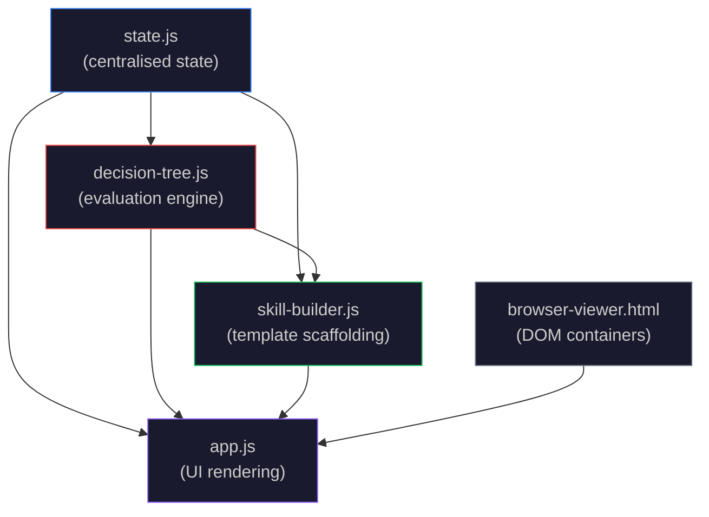
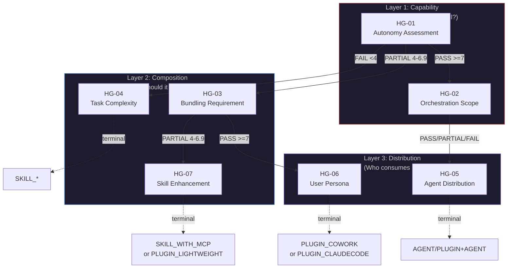
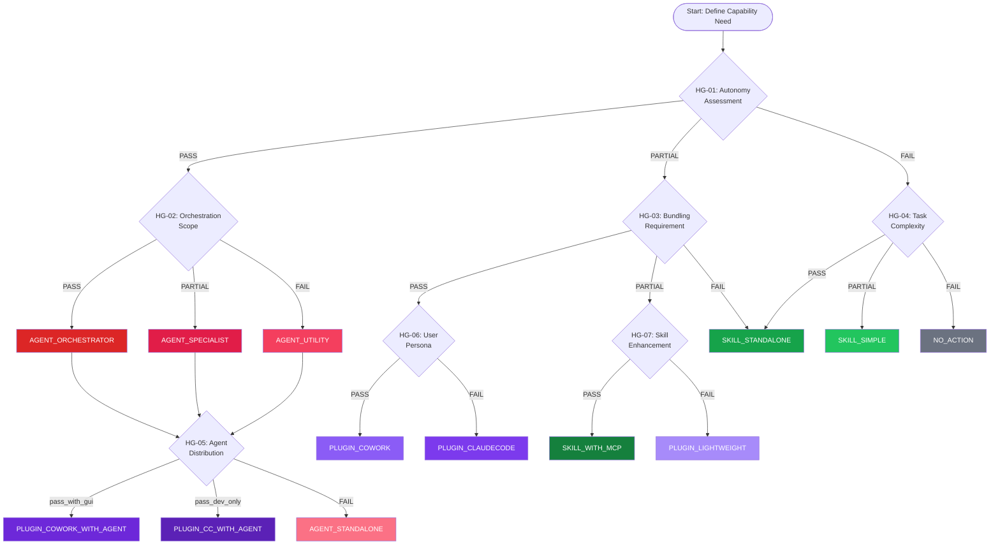
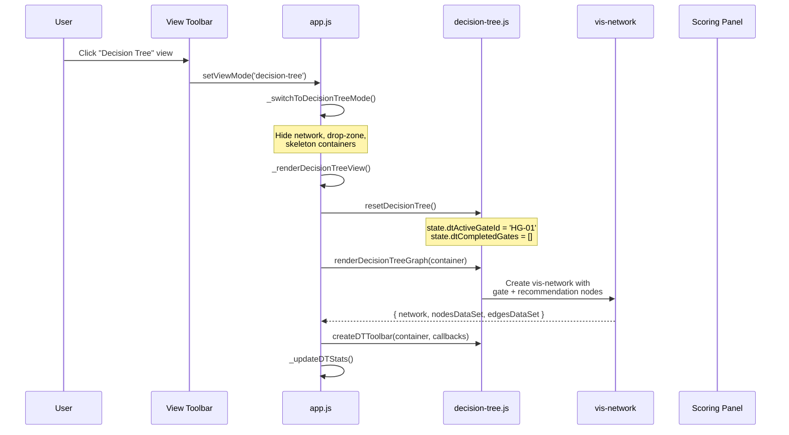
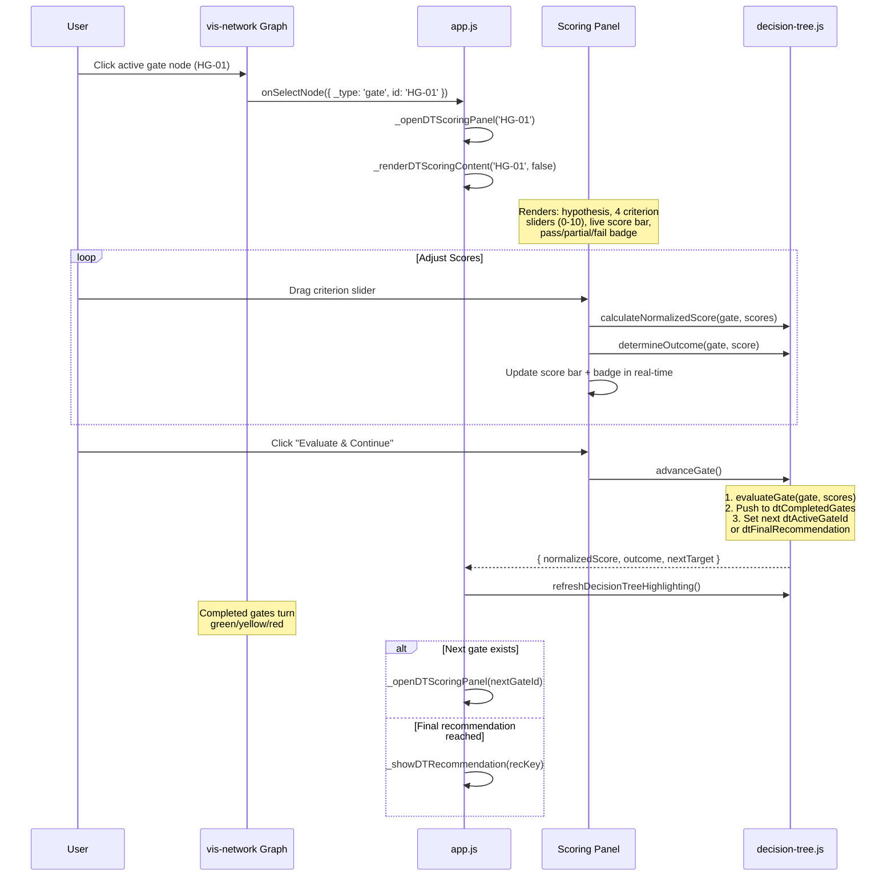
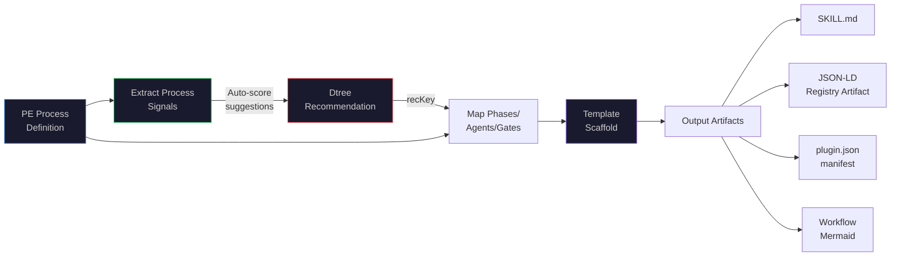
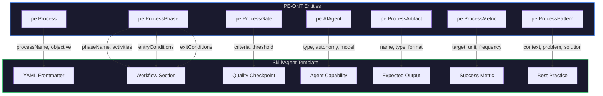
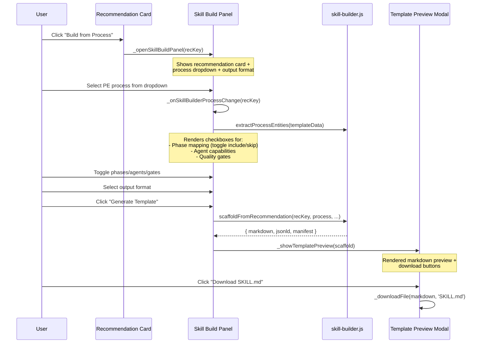

# Dtree (Decision Tree) Engine & Skill Builder — Architecture

**Feature:** F40.1 (Extensibility Decision Engine) + F34.11 (Process-to-Skill Scaffolding)
**Version:** 1.0.0
**Date:** 2026-02-25

---

## 1. Overview

The Decision Tree (Dtree) Engine is an interactive hypothesis-testing engine for choosing the correct automation mechanism — Skills, Plugins, or Agents — for any given capability need. It evaluates 7 hypothesis gates with weighted criterion scoring, routing through 3 architectural layers to reach one of 13 terminal recommendations.

The Skill Builder (F34.11) extends the Dtree by bridging PE-ONT process definitions to the recommendation output, auto-scaffolding ready-to-use template artifacts (SKILL.md, agent templates, plugin manifests) with process phases mapped to workflow steps.

---

## 2. Module Dependency Graph



| Module | Lines | Responsibility | Exports |
|--------|-------|----------------|---------|
| `state.js` | 8 new props | Centralised state for Dtree + Skill Builder | `state` object |
| `decision-tree.js` | 931 | Gate definitions, scoring engine, path traversal, vis-network graph, toolbar | 25+ functions/constants |
| `skill-builder.js` | 718 | Process signal extraction, template scaffolding, registry artifacts | 8 public functions |
| `app.js` | ~200 added | UI rendering: scoring panel, build panel, template preview | Window-exposed event handlers |

---

## 3. Decision Tree Architecture

### 3.1 Three-Layer Gate Model

The Dtree organises 7 hypothesis gates across 3 decision layers. Each layer addresses a different architectural concern:



### 3.2 Gate Routing Rules

| Gate | Layer | PASS (>=7) | PARTIAL (4-6.9) | FAIL (<4) |
|------|-------|-----------|-----------------|-----------|
| HG-01 | Capability | -> HG-02 | -> HG-03 | -> HG-04 |
| HG-02 | Capability | AGENT_ORCHESTRATOR -> HG-05 | AGENT_SPECIALIST -> HG-05 | AGENT_UTILITY -> HG-05 |
| HG-03 | Composition | -> HG-06 | -> HG-07 | SKILL_STANDALONE |
| HG-04 | Composition | SKILL_STANDALONE | SKILL_SIMPLE | NO_ACTION |
| HG-05* | Distribution | PLUGIN_COWORK_WITH_AGENT (>=8) | PLUGIN_CC_WITH_AGENT (>=6) | AGENT_STANDALONE (<6) |
| HG-06 | Distribution | PLUGIN_COWORK (>=7) | - | PLUGIN_CLAUDECODE (<7) |
| HG-07 | Composition | SKILL_WITH_MCP (>=7) | - | PLUGIN_LIGHTWEIGHT (<7) |

*HG-05 uses special 3-tier thresholds: pass_with_gui (>=8), pass_dev_only (>=6), fail (<6)

### 3.3 Gate Scoring Formula

Each gate has 4 evaluation criteria, each with a weight (2 or 3). User scores each criterion 0-10:

```
normalizedScore = sum(weight_i * score_i) / sum(weight_i * 10) * 10
```

Example (HG-01 with weights [3, 3, 2, 2] and scores [8, 6, 7, 5]):
```
weightedSum = (3*8) + (3*6) + (2*7) + (2*5) = 24 + 18 + 14 + 10 = 66
maxWeighted = (3*10) + (3*10) + (2*10) + (2*10) = 100
normalizedScore = (66 / 100) * 10 = 6.6 → PARTIAL (4 <= 6.6 < 7)
```

### 3.4 Complete Gate-to-Recommendation Flow



### 3.5 Thirteen Terminal Recommendations

| Key | Label | Complexity | Effort | Template |
|-----|-------|-----------|--------|----------|
| `AGENT_ORCHESTRATOR` | Full Agent (Orchestrator) | High | 2-4 weeks | Agent Template v6.1 S0-S14 |
| `AGENT_SPECIALIST` | Full Agent (Specialist) | Medium-High | 1-2 weeks | Agent Template v6.1 domain-specific |
| `AGENT_UTILITY` | Full Agent (Utility) | Medium | 3-5 days | Simplified Agent (T1+S6) |
| `AGENT_STANDALONE` | Standalone Agent | Medium | 3-5 days | Agent Template (no plugin) |
| `SKILL_STANDALONE` | Standalone Skill | Low-Medium | 1-3 days | SKILL.md + YAML + scripts |
| `SKILL_SIMPLE` | Simple Skill | Low | Hours | SKILL.md frontmatter only |
| `SKILL_WITH_MCP` | Skill + MCP | Medium | 3-5 days | SKILL.md + MCP config |
| `PLUGIN_CLAUDECODE` | Claude Code Plugin | Medium-High | 1-2 weeks | plugin.json + commands/skills |
| `PLUGIN_COWORK` | Cowork Plugin | Medium-High | 1-2 weeks | plugin.json + connectors |
| `PLUGIN_COWORK_WITH_AGENT` | Cowork + Agent | High | 3-4 weeks | Agent + Plugin + Cowork UI |
| `PLUGIN_CLAUDECODE_WITH_AGENT` | CC Plugin + Agent | High | 2-3 weeks | Agent + Plugin packaging |
| `PLUGIN_LIGHTWEIGHT` | Lightweight Plugin | Low-Medium | 2-3 days | Minimal plugin.json |
| `NO_ACTION_INLINE_PROMPTING` | No Extensibility | None | None | Inline prompting guidance |

---

## 4. UI Flow — Dtree Interaction

### 4.1 View Activation



### 4.2 Gate Scoring Flow



### 4.3 Recommendation Card

When the Dtree reaches a terminal recommendation, the scoring panel shows:

```
+---------------------------------------------+
| [Gate breadcrumb: HG-01 -> HG-02 -> REC]   |
|                                              |
| AGENT_ORCHESTRATOR                           |
| Full Agent (Orchestrator Tier)               |
| Autonomous agent with sub-agent              |
| coordination, workflow state...              |
|                                              |
| Complexity: High    Effort: 2-4 weeks        |
| Template: Full Agent Template v6.1            |
|                                              |
| [Export Decision Record (JSON-LD)]            |
| [Export Mermaid Path]                         |
| [Build from Process]  <-- F34.11             |
| [Close]                                      |
+---------------------------------------------+
```

### 4.4 State Properties (decision-tree)

```javascript
// Dtree state in state.js
dtActiveGateId: 'HG-01',      // Currently scoring gate
dtCompletedGates: [],          // [{gateId, scores[], normalizedScore, outcome}]
dtPath: ['HG-01'],             // Ordered gate IDs traversed
dtFinalRecommendation: null,   // Terminal recommendation key
dtAllScores: {},               // {gateId: [s0,s1,s2,s3]}
dtScoringPanelOpen: false,     // Panel visibility
dtProblemStatement: '',        // User's capability description
dtEvaluator: '',               // Who ran the evaluation
```

---

## 5. Skill Builder Architecture (F34.11)

### 5.1 Pipeline



### 5.2 Process Signal Extraction

`extractProcessSignals()` maps PE process characteristics to Dtree criterion scores for all 7 gates:

| PE Process Field | Gate | Criterion | Score Heuristic |
|------------------|------|-----------|-----------------|
| `automationLevel` (0-100%) | HG-01 | C0 (ambiguity) | >50 → `round(level/10)`, else `round(level/15)` |
| `AIAgent[].autonomyLevel` | HG-01 | C1 (decisions) | highly-auto=9, hybrid=7, supervised=5, manual=2 |
| `processType` | HG-01 | C2 (state) | discovery/optimization=7, analysis=6, governance=5, development=4, deployment=3 |
| `AIAgent[].length` | HG-01 | C3 (coordinates) | >2 agents=8, >0=5, 0=1 |
| `ProcessPhase[].parallelExecution` | HG-02 | C1 (parallel) | any parallel=7, else=3 |
| `ProcessGate[].automated` | HG-04 | C3 (quality) | automated gates=8, else=4 |
| `ProcessPattern[].length` | HG-04 | C2 (repeatable) | patterns exist=8, else=3 |

### 5.3 Template Scaffolding — PE-to-Skill Mapping

The core mapping logic shared across all 12 scaffold generators:



### 5.4 Scaffold Dispatch Map

```javascript
SCAFFOLD_MAP = {
  SKILL_SIMPLE:                   scaffoldSkillSimple,
  SKILL_STANDALONE:               scaffoldSkillStandalone,
  SKILL_WITH_MCP:                 scaffoldSkillWithMcp,
  AGENT_UTILITY:                  scaffoldAgentUtility,
  AGENT_SPECIALIST:               scaffoldAgentSpecialist,
  AGENT_ORCHESTRATOR:             scaffoldAgentOrchestrator,
  AGENT_STANDALONE:               scaffoldAgentStandalone,
  PLUGIN_LIGHTWEIGHT:             scaffoldPluginLightweight,
  PLUGIN_CLAUDECODE:              scaffoldPluginClaudeCode,
  PLUGIN_COWORK:                  scaffoldPluginCowork,
  PLUGIN_CLAUDECODE_WITH_AGENT:   scaffoldPluginCCAgent,
  PLUGIN_COWORK_WITH_AGENT:       scaffoldPluginCoworkAgent,
  NO_ACTION_INLINE_PROMPTING:     scaffoldNoAction,
}
```

Each generator returns `{ markdown: string, jsonld: object|null, manifest: object|null }`.

### 5.5 Build Panel UI Flow



### 5.6 Skill Builder State Properties

```javascript
// Skill Builder state in state.js
skillBuilderOpen: false,              // Build panel visibility
skillBuilderSelectedProcess: null,    // Selected PE process entity ID
skillBuilderPhaseMap: [],             // [{phaseId, included, sectionNumber}]
skillBuilderAgentMap: [],             // [{agentId, included}]
skillBuilderGateMap: [],              // [{gateId, included}]
skillBuilderOutputFormat: 'markdown', // 'markdown' | 'jsonld' | 'manifest'
skillBuilderLastScaffold: null,       // Last generated scaffold result
skillBuilderProcessData: null,        // Extracted process entities
```

---

## 6. JSON-LD Decision Record

When the user exports a decision record, `generateDecisionRecord()` produces:

```jsonld
{
  "@context": {
    "pfc": "https://platformcore.io/ontology/",
    "dt": "https://platformcore.io/ontology/dt/",
    "schema": "https://schema.org/"
  },
  "@type": "dt:AutomationDecisionRecord",
  "@id": "dt:decision-1740500000000",
  "dt:problemStatement": "BAIV Discovery Agent needs...",
  "dt:evaluator": "architect@example.com",
  "dt:evaluationDate": "2026-02-25T10:00:00.000Z",
  "dt:gateResults": [
    {
      "@type": "dt:HypothesisGateResult",
      "dt:gateId": "HG-01",
      "dt:gateName": "Autonomy Assessment",
      "dt:criterionScores": [
        { "dt:criterion": "Requires interpretation...", "dt:weight": 3, "dt:score": 8 },
        { "dt:criterion": "Must make decisions...", "dt:weight": 3, "dt:score": 7 }
      ],
      "dt:normalizedScore": 7.2,
      "dt:outcome": "PASS"
    }
  ],
  "dt:path": ["HG-01", "HG-02", "HG-05"],
  "dt:recommendation": {
    "@type": "dt:TerminalRecommendation",
    "dt:key": "PLUGIN_CLAUDECODE_WITH_AGENT",
    "dt:label": "Claude Code Plugin wrapping Agent(s)",
    "dt:complexity": "High",
    "dt:estimatedEffort": "2-3 weeks"
  }
}
```

---

## 7. JSON-LD Registry Artifact

When the Skill Builder scaffolds a template, `buildRegistryArtifact()` produces:

```jsonld
{
  "@context": {
    "pfc": "https://platformcore.io/ontology/",
    "pe": "https://platformcore.io/ontology/pe/",
    "dt": "https://platformcore.io/ontology/dt/"
  },
  "@type": "pfc:RegistryArtifact",
  "@id": "pfc:skill-ins-ea-assessment-v1.0.0",
  "pfc:artifactType": "skill",
  "pfc:scope": "instance",
  "pfc:derivedFromProcess": "pe:ins-ea-assessment",
  "pfc:decisionRecord": "dt:decision-1740500000000",
  "pfc:version": "1.0.0",
  "pfc:recommendation": "SKILL_STANDALONE",
  "pfc:components": ["SKILL.md"],
  "pfc:dependencies": ["PE-ONT", "VP-ONT"],
  "pfc:phaseCount": 5,
  "pfc:agentCount": 3,
  "pfc:gateCount": 4
}
```

---

## 8. Test Coverage

| Suite | Tests | File |
|-------|-------|------|
| Process Signal Extraction | 7 | `tests/skill-builder.test.js` |
| Heuristic Scoring | 5 | `tests/skill-builder.test.js` |
| Dtree Prefill Integration | 3 | `tests/skill-builder.test.js` |
| Phase-to-Section Mapping | 4 | `tests/skill-builder.test.js` |
| Agent Capability Mapping | 3 | `tests/skill-builder.test.js` |
| Gate Mapping | 3 | `tests/skill-builder.test.js` |
| Template Scaffolding (12 recs) | 12 | `tests/skill-builder.test.js` |
| Registry Artifact Output | 2 | `tests/skill-builder.test.js` |
| Mermaid Workflow Export | 2 | `tests/skill-builder.test.js` |
| Edge Cases | 3 | `tests/skill-builder.test.js` |
| Extract Process Entities | 2 | `tests/skill-builder.test.js` |
| **Total Skill Builder** | **46** | |
| Dtree Scoring Engine | ~25 | `tests/decision-tree.test.js` |
| Dtree Path Traversal | ~15 | `tests/decision-tree.test.js` |

---

## 9. File Reference

| File | Feature | Key Functions |
|------|---------|---------------|
| `js/decision-tree.js:323` | Scoring | `calculateNormalizedScore(gate, scores)` |
| `js/decision-tree.js:346` | Outcome | `determineOutcome(gate, normalizedScore)` |
| `js/decision-tree.js:420` | Traversal | `advanceGate()` |
| `js/decision-tree.js:503` | Export | `generateDecisionRecord()` |
| `js/skill-builder.js:59` | Signals | `extractProcessSignals(...)` |
| `js/skill-builder.js:161` | Prefill | `prefillDTFromProcess(...)` |
| `js/skill-builder.js:183` | Mapping | `mapPhasesToSections(...)` |
| `js/skill-builder.js:232` | Mapping | `mapAgentsToCapabilities(...)` |
| `js/app.js:5152` | UI | `_renderDecisionTreeView()` |
| `js/app.js:5263` | UI | `_renderDTScoringContent(gateId, readOnly)` |
| `js/app.js:5430` | UI | `_renderDTRecommendationContent(recKey)` |
| `js/app.js:5503` | UI | `_openSkillBuildPanel(recKey)` |
| `js/app.js:5689` | UI | `_generateSkillTemplate(recKey)` |
