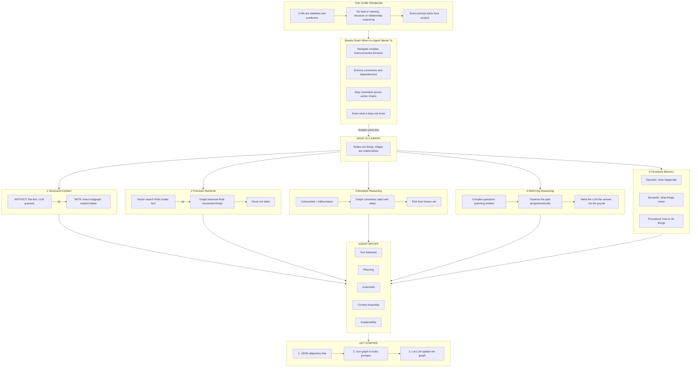

# Why Graphs Enhance LLM Performance

> A primer for anyone starting to learn about building agents.

---

## The Core Problem

Large Language Models (LLMs) like Claude are **stateless text predictors**. They have no built-in way to remember structure, enforce rules, or reason about how things relate to each other. Every time you send a prompt, the model starts from scratch — it has to reconstruct context from whatever text you give it.

That works fine for simple questions and answers. It breaks down when an agent needs to:

- **Navigate complex domains** with many interconnected concepts
- **Make decisions that respect constraints** and dependencies between things
- **Stay consistent** across a long chain of actions
- **Know what it doesn't know** instead of guessing

---

## So What Is a Graph?

A graph is simply **nodes** (things) connected by **edges** (relationships). That's it.

```
[User] --owns--> [Project] --contains--> [Task] --blocked-by--> [Task]
```

Nodes are the things you care about. Edges describe how they relate. This simple structure turns out to solve several critical LLM weaknesses at once.

---

## Five Ways Graphs Make LLMs Better

### 1. Structured Context — Not Token Soup

**Without a graph**, you stuff context into the prompt as flat text. The LLM has to figure out relationships from prose — and it often gets them wrong.

**With a graph**, you retrieve exactly the relevant piece and present it as explicit connections:

```
User --owns--> Project --contains--> Task --blocked-by--> Task
```

The LLM doesn't have to guess the structure. It reads it directly. Less guessing means fewer mistakes.

---

### 2. Precision Retrieval — Not Just Similarity

Most people know about RAG (Retrieval-Augmented Generation), where you use vector search to find relevant documents. Vector search finds text that **looks similar**. Graph traversal finds things that are **actually connected**.

The difference matters:

- **Vector search**: "Find documents about authentication" — returns anything that mentions auth, even if it's irrelevant
- **Graph traversal**: "Find all services that depend on the auth service" — returns the exact dependency chain, nothing more

When an agent is making decisions, you want **facts, not vibes**.

---

### 3. Bounded Reasoning

LLMs hallucinate most when the solution space is wide open and unbounded. Graphs constrain the space by defining what's actually valid.

Instead of asking the model to invent the next step, a graph can say: "Here are the only valid next steps."

```
Current state:  order_placed
Valid moves:    payment_pending  OR  cancelled
```

The LLM picks from a known set instead of generating freely. Hallucination drops dramatically because the model can't wander off into territory that doesn't exist.

---

### 4. Multi-Hop Reasoning Without the Gymnastics

Consider this question: *"Who manages the team that owns the service that has the most incidents?"*

Without a graph, the LLM has to reason through multiple joins in its head — hopping from incidents to services to teams to managers, all in one go. That's error-prone and burns through tokens.

With a graph, you traverse the path programmatically:

```
Incident --> Service --> Team --> Manager
```

You hand the LLM the answer path, not the puzzle. The hard work is done by graph traversal, not by hoping the model figures it out.

---

### 5. Persistent, Evolving Memory

Agents need memory that lasts longer than a single conversation. Graphs give you three kinds:

- **Episodic memory** — *what happened*: event nodes connected by time-based edges. The agent remembers past interactions and outcomes.
- **Semantic memory** — *what things mean*: concept nodes connected by relationship edges. The agent understands your domain.
- **Procedural memory** — *how to do things*: workflow nodes connected by sequence edges. The agent knows processes and procedures.

Each conversation updates the graph. The next conversation reads from it. Over time, the agent accumulates knowledge instead of starting cold every single time.

---

## Why This Matters Specifically for Agents

If you're building agents, graphs solve the orchestration problem — how the agent decides what to do, in what order, and within what boundaries.

| Agent Challenge | How Graphs Help |
|---|---|
| **Tool selection** | The graph encodes which tools apply to which states — the agent looks up what it can do rather than guessing |
| **Planning** | Graph traversal generates valid action sequences — the agent follows real paths, not imagined ones |
| **Guardrails** | Graph constraints prevent invalid transitions — the agent literally cannot take a wrong step |
| **Context assembly** | Subgraph extraction gives the LLM exactly what it needs — no more, no less |
| **Explainability** | The traversal path IS the reasoning trace — you can see exactly why the agent did what it did |

---

## Practical Starting Points

You don't need a graph database to get started. Here's the progression:

**Step 1 — JSON adjacency lists.** Store your nodes and edges as plain JSON objects. This is good enough for prototypes and learning.

```json
{
  "nodes": [
    { "id": "user_1", "type": "User", "name": "Alice" },
    { "id": "project_1", "type": "Project", "name": "My App" }
  ],
  "edges": [
    { "from": "user_1", "to": "project_1", "relationship": "owns" }
  ]
}
```

**Step 2 — Use the graph to build prompts.** Traverse the relationships, serialize the relevant subgraph, and inject it into the system prompt. Now the LLM has structured context instead of a wall of text.

**Step 3 — Let the LLM update the graph.** Give the agent tool calls that add or modify nodes and edges. Now it has persistent, structured memory that grows with every interaction.

**When to graduate to a graph database** (like Neo4j): when your node count exceeds what fits in a prompt window, or when you need complex multi-hop queries at low latency. Not before.

---

## The One-Line Summary

> **Graphs turn the LLM from a text guesser into a structure-aware reasoner** by replacing *"figure out the relationships from prose"* with *"here are the relationships — now decide."*

---


