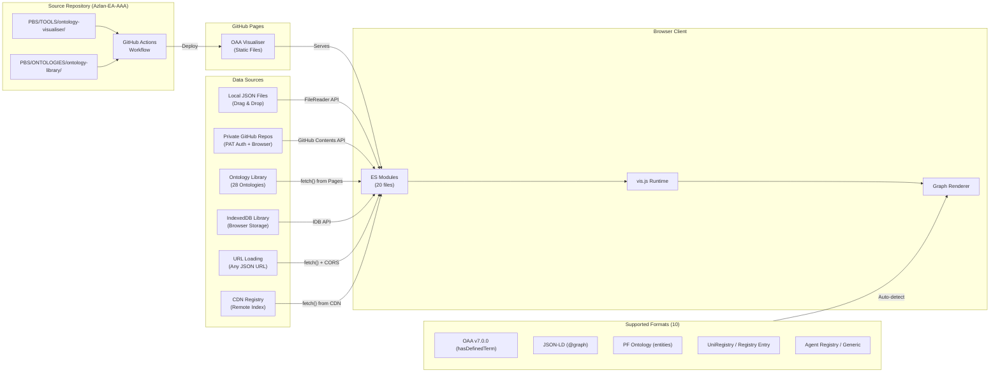

# OAA Ontology Visualiser — Architecture & Deployment

**Version:** 5.7.0
**Last Updated:** 2026-02-24

---

## Overview

The OAA Ontology Visualiser is a zero-build-step, client-side browser application for interactive graph visualisation of JSON ontologies produced by OAA (Ontology Architect Agent). It supports single-ontology inspection with OAA v7.0.0 compliance validation, multi-ontology registry loading with cross-reference detection, three-tier progressive disclosure navigation (series rollup → ontology drill-down → entity graph), per-series highlight selectors (all 6 series, with VE/PE lineage chain logic), cross-ontology edge navigation, ontology authoring with revision management, EMC-driven composition with platform instances, domain-specific ontology instance management, and Design System integration with Figma MCP extraction, multi-brand CSS theming, and three-tier token cascade visualisation.

No server-side processing, no Node.js, no bundler. The only external dependency is vis-network v9.1.2, loaded via CDN.

---

## Architecture Diagram



---

## Module Architecture (ES Modules)

All JavaScript is split into native ES modules loaded via `<script type="module">`. No build step, no bundler (see [ADR-009](./ADR-LOG.md#adr-009)).

```
browser-viewer.html           <- HTML shell (incl. breadcrumb bar + series selectors + DS panel + layer panel)
├── css/viewer.css             <- All styles (20 CSS custom properties, full var conversion, DS panel styles, layer panel styles, .skeleton-lock-icon)
└── js/
    ├── app.js                 <- Entry point, event wiring, navigation, setViewMode() centralised view switcher
    ├── state.js               <- Shared state, constants (dsInstances, activeDSBrand, dsAppliedCSSVars)
    ├── ontology-parser.js     <- Format detection + parsing (10 formats incl. ds-instance)
    ├── graph-renderer.js      <- vis.js rendering (single + multi + Tier 0/1 renderers + series highlight)
    ├── multi-loader.js        <- Registry batch loading, merged graph, cross-ref detection, lineage
    ├── audit-engine.js        <- OAA v7.0.0 validation gates (G1-G8, 10 gates) + completeness scoring
    ├── compliance-reporter.js <- Compliance panel rendering + completeness score gauge
    ├── ui-panels.js           <- Sidebar (DS instance data in Data tab), audit, modals, tabs
    ├── library-manager.js     <- IndexedDB ontology library + recent files + bookmarks
    ├── github-loader.js       <- Registry index loading + GitHub browser API + PAT management
    ├── export.js              <- PNG/SVG/Mermaid/D3 graph export, PDF report, audit JSON
    ├── diff-engine.js         <- Ontology version comparison + changelog generation
    ├── ontology-author.js     <- Ontology authoring engine (Epic 7.1)
    ├── authoring-ui.js        <- Authoring UI panel rendering (Epic 7.1)
    ├── revision-manager.js    <- Revision documentation + glossary (Epic 7.2)
    ├── agentic-prompts.js     <- Agentic ontology generation (Epic 7.5)
    ├── emc-composer.js        <- EMC composition engine (Epic 7.3)
    ├── domain-manager.js      <- Domain instance management (Epic 7.4)
    ├── ds-loader.js           <- DS instance loader, 3-tier token cascade, CSS var generation, PFI brand resolution (Epic 7.6/8), SEMANTIC_LAYERS, LAYER_PRESETS constants
    ├── design-token-tree.js   <- Token Map admin panel: 21-zone tree, token inspection, zone boundary overlay
    ├── pfi-loader.js          <- PFI instance config + data loading from registry (Epic 9D/8.4)
    ├── pfi-lifecycle-ui.js    <- PFI lifecycle panel: snapshot manager, binding inspector
    ├── layer-filter.js        <- Multilayer semantic filtering (F8.7). Pure logic: getNodeLayer(), computeLayerFilter(), computeLayerCounts(), buildCrossRefNodeSet(), serializeLayerState(), deserializeLayerState(). No DOM.
    ├── mermaid-viewer.js      <- Mermaid diagram rendering + container switching
    ├── mindmap-canvas.js      <- Mindmap canvas with vis-network, IndexedDB workspace persistence
    ├── app-skeleton-loader.js <- Skeleton loader (F40.13/F40.20): parse JSONLD, build actionIndex + zoneDomSelectors, ontology-driven wireAction with guard/sync/a11y, data-driven syncDynamicNavState
    ├── app-skeleton-panel.js  <- Skeleton Inspector panel (Z22): spatial diagram, zone/component/nav introspection, PFC lock icons, first/last arrow disable
    └── app-skeleton-editor.js <- Skeleton Editor (F40.19): reorder/move nav & zone components, cascade-tier guards, undo/redo, save-to-library, localStorage persistence
```

### Module Dependency Graph

```
state.js              <- (all modules import shared state + constants)
github-loader.js      <- multi-loader.js, app.js
ontology-parser.js    <- multi-loader.js, app.js
multi-loader.js       <- graph-renderer.js, app.js
audit-engine.js       <- graph-renderer.js, ontology-author.js, diff-engine.js
compliance-reporter.js <- graph-renderer.js
ui-panels.js          <- graph-renderer.js, app.js
graph-renderer.js     <- app.js
library-manager.js    <- app.js
export.js             <- app.js
ontology-author.js    <- app.js
authoring-ui.js       <- app.js
revision-manager.js   <- app.js
agentic-prompts.js    <- app.js
emc-composer.js       <- app.js
domain-manager.js     <- app.js
ds-loader.js          <- app.js (also lazy-imports github-loader.js for cross-repo fetch)
design-token-tree.js  <- app.js
pfi-loader.js         <- app.js
pfi-lifecycle-ui.js   <- app.js
mermaid-viewer.js     <- app.js
mindmap-canvas.js     <- app.js
app-skeleton-editor.js <- app.js (also imports app-skeleton-loader.js, app-skeleton-panel.js)
```

No circular dependencies. `state.js` is the single shared state module imported by all others. `graph-renderer.js` imports lineage classification helpers (`classifyLineageEdge`, `getNodeLineageRole`, `getNodeSeries`) from `multi-loader.js`. `ontology-author.js` imports `extractEntities` and `extractRelationships` from `audit-engine.js` for format-agnostic entity normalisation. `ds-loader.js` imports state and lazy-imports `github-loader.js` for cross-repo instance loading. `pfi-loader.js` imports state and `ontology-parser.js` for instance data parsing.

---

## Centralised View Switcher

The visualiser supports three canvas views — **Graph**, **Mermaid**, and **Mindmap** — controlled by a single segmented button group (`#view-tabs`) at the toolbar start and one centralised function.

### `state.activeView` — Canonical View State

`state.activeView` (`'graph'` | `'mermaid'` | `'mindmap'`) is the single source of truth for which canvas is active. The derived booleans `state.mermaidMode` and `state.mindmapMode` are set automatically by `setViewMode()` for backward compatibility. `state.viewMode` (`'single'` | `'multi'`) continues to track the graph sub-mode independently.

### `setViewMode(mode)` — Single Entry Point

All view transitions flow through `setViewMode()` in `app.js`:

1. **`_closeAllOverlays()`** — closes sidebar, audit panel, mermaid editor, mindmap properties
2. **Update state** — sets `activeView`, `mermaidMode`, `mindmapMode`
3. **Enter view** — calls `switchToOntologyMode()`, `switchToMermaidMode()`, or `switchToMindmapMode()`
4. **`_setToolbarButtonsForView(mode)`** — shows/hides view-specific buttons (audit, sidebar, physics, layout for graph; editor, fit for mermaid)
5. **`_updateViewTabs(mode)`** — toggles `.active` class on the segmented tab group

### Tab Handlers

| Handler | Action |
|---------|--------|
| `switchToGraphTab()` | `setViewMode('graph')` |
| `switchToMermaidTab()` | Auto-exports ontology to mermaid if loaded, then `setViewMode('mermaid')` |
| `switchToMindmapTab()` | `setViewMode('mindmap')` |

---

## View Modes

### Single-Ontology Mode (`state.viewMode = 'single'`)

Standard mode for inspecting one ontology at a time. Triggered by:

- Drag-and-drop file
- File picker
- Load from GitHub (PAT)
- Load from Library (IndexedDB)

Features: OAA v7.0.0 compliance validation (8 gates), entity type colouring, sidebar inspection (Details, Connections, Schema, Data tabs), OAA upgrade command generation, OAA Gates summary panel with PASS/FAIL badges, relationship density metrics with configurable threshold, connected-component colouring and filtering, gate report Markdown export and clipboard copy. Can also be entered by clicking an ontology in the Library panel or dragging it onto the graph canvas.

### Multi-Ontology Mode (`state.viewMode = 'multi'`)

Registry mode with three-tier progressive disclosure. Triggered by "Load Registry" button. Uses `state.currentTier` to track the active navigation level.

#### Tier 0 — Series Rollup (Default Entry Point)

6 series super-nodes representing the ontology library at the highest level. This is the default view when "Load Registry" is clicked (see [ADR-010](./ADR-LOG.md#adr-010)).

- **Nodes**: 6 series super-nodes (size 45, multi-line labels with ontology count)
- **Edges**: Cross-series reference edges (gold dashed, labelled with count)
- **Interaction**: Double-click a series to drill down to Tier 1
- **Toggle**: Series (6) / Ontologies (23) toggle in breadcrumb bar
- **Renderer**: `renderTier0()` in `graph-renderer.js`

#### Tier 1 — Series Drill-Down

Ontology-level nodes within a selected series, with faded context nodes for other series.

- **Nodes**: Ontology nodes for the selected series (size 30) + faded context nodes for other series (30% opacity)
- **Edges**: Intra-series cross-ontology edges + cross-series edges to context nodes
- **Interaction**: Double-click an ontology to drill to Tier 2; double-click a faded context series to switch context
- **Placeholders**: Shown as dashed-border diamonds (not drillable)
- **Renderer**: `renderTier1()` in `graph-renderer.js`

#### Tier 2 — Entity Graph

Full entity-level graph for a single ontology. Reuses the single-ontology `renderGraph()` renderer with the parsed data from the registry record.

- **Renderer**: Existing `renderGraph()` (same as single-ontology mode)
- **Context**: Breadcrumb shows full path (Library › Series › Ontology)

#### Breadcrumb Navigation

A breadcrumb bar provides navigation context and back-navigation across all tiers:

```
Library  ›  VE-Series  ›  VSOM Ontology
(Tier 0)    (Tier 1)      (Tier 2)
```

Clickable segments navigate back to the corresponding tier. Home button returns to Tier 0.

#### Navigation State

Key data structures in multi-mode:

- `state.loadedOntologies: Map<namespace, OntologyRecord>` — all loaded ontologies
- `state.mergedGraph` — combined parsed graph with namespace-prefixed node IDs
- `state.seriesData` — series metadata with counts and colours
- `state.currentTier` — active navigation level (-1 = single, 0 = series, 1 = ontologies, 2 = entities)
- `state.currentSeries` — active series key when at Tier 1+
- `state.currentOntology` — active namespace when at Tier 2
- `state.navigationStack` — breadcrumb history array
- `state.crossEdges` — cross-ontology edges from `detectCrossReferences()`
- `state.crossSeriesEdges` — aggregated series-to-series edges from `buildCrossSeriesEdges()`
- `state.highlightedSeries` — `Set` of active series keys (e.g., `'VE-Series'`, `'Foundation'`)
- `state.crossEdgeFilterActive` — when true, only cross-ontology edges are shown (intra-ontology edges hidden)
- `state.bridgeFilterActive` — bridge node filter toggle
- `state.bridgeNodes` — `Map` of bridge node IDs (entities referenced by 3+ ontologies)

Node IDs are prefixed with namespace (`prefix::nodeId`) to avoid collisions across ontologies.

---

## Cross-Ontology Edge Detection

Two-pass algorithm implemented in `multi-loader.js` `detectCrossReferences()` (see [ADR-011](./ADR-LOG.md#adr-011)):

1. **Pass 1 — Registry bridges:** Reads both `entry.relationships.keyBridges[]` and `entry.relationships.crossOntology[]` from each registry entry (entries use both property names inconsistently)
2. **Pass 2 — Namespace-prefix scan:** Scans `rangeIncludes`/`domainIncludes` for prefixed references to other ontologies

Edges are deduplicated via `Set<edgeKey>`. Each edge carries `patternId` and `bridgeName` when resolved from the ontology's `oaa:joinPatterns` array (Pass 1 only). Rendered as gold dashed lines (width 2.5) by default, or with pattern-specific or series-specific styling when active.

### DS Bridge Pattern Styling (S7.6.2, Epic 7)

DS-ONT defines 5 cross-ontology join patterns (JP-DS-001 to JP-DS-005). When DS bridges are detected, `DS_BRIDGE_STYLES` in `state.js` applies per-pattern visual styling instead of the default gold:

| Pattern | Relationship | Target | Colour | Dash |
| ------- | ------------ | ------ | ------ | ---- |
| JP-DS-001 | `realizesFeature` | EFS | Green #76ff03 | [8,3] |
| JP-DS-002 | `configuredByInstance`/`configuredByApp` | EMC | Cyan #00bcd4 | [6,4] |
| JP-DS-003 | `governedByProcess` | PE | Orange #ff7043 | [4,6] |
| JP-DS-004 | `ownedByBrand` | ORG-CONTEXT | Purple #ab47bc | [10,3] |

**Bridge type filter toggles** (`state.dsBridgeTypeFilters`): Colour-coded toggle buttons render in the toolbar when DS bridges are present. Each toggle controls visibility of a single pattern ID. `renderMultiGraph()` skips edges where `dsBridgeTypeFilters[patternId] === false`.

**DS bridge panel** (in DS sidebar): Bridge cards grouped by relationship name with colour dot. Click to expand: shows pattern ID, sample edges (up to 5), and a "Highlight in Graph" button.

**Bridge path highlighting** (`highlightBridgePath(bridgeName)`): Dims all non-matching edges/nodes, glows the selected bridge path, fits camera to bridge endpoints. Resets on next empty-space click.

**Node detail bridge connections** (`showNodeDetails()` in `ui-panels.js`): When a node has cross-ontology bridge connections, a "Bridge Connections" section appears showing incoming/outgoing bridges colour-coded by pattern, clickable to navigate to the connected node.

### Series-Level Edge Aggregation

`buildCrossSeriesEdges()` in `multi-loader.js` aggregates cross-ontology edges into series-to-series edges for Tier 0 rendering. Direction is normalised alphabetically to avoid duplicate edges between the same pair of series. Each aggregated edge carries a count and list of source bridges.

---

## Series Highlight Selectors

Six independently-toggleable series selectors let users highlight any combination of the ontology library's series. State is stored as `state.highlightedSeries` (`Set<string>`), with colours defined in `SERIES_HIGHLIGHT_COLORS` in `state.js`.

| Series | Highlight Colour | Special Behaviour |
| ------ | --------------- | ----------------- |
| VE-Series | Gold #cec528 | VE chain logic: consecutive edges (VSOM→OKR→VP→PMF→EFS) get thick solid gold |
| PE-Series | Copper #b87333 | PE chain logic: consecutive edges (PPM→PE→EFS→EA) get thick solid copper |
| Foundation | Orange #FF9800 | Member nodes + cross-edges highlighted |
| Competitive | Pink #E91E63 | Member nodes + cross-edges highlighted |
| RCSG-Series | Purple #9C27B0 | Member nodes + cross-edges highlighted |
| Orchestration | Cyan #00BCD4 | Member nodes + cross-edges highlighted |

**EFS Convergence Point:** When both VE-Series and PE-Series are highlighted, EFS receives convergence styling (#FF6B35) — 1.3× size, shadow glow, and tooltip.

### Lineage Classification (VE/PE)

`classifyLineageEdge(fromNs, toNs)` in `multi-loader.js` determines whether a cross-ontology edge represents a step in the VE or PE lineage chain. It checks both directions (from→to and to→from) against consecutive entries in `LINEAGE_CHAINS`. Returns `{ isVE, isPE, isConvergence }`.

`getNodeLineageRole(namespace)` returns `{ inVE, inPE, isConvergence }` for a given namespace, used for convergence node styling.

`getNodeSeries(namespace, loadedOntologies)` returns the series key for any namespace, used for general series highlighting.

### Edge Styling

| Edge Type | Colour | Width | Dash | When Shown |
| --------- | ------ | ----- | ---- | ---------- |
| Intra-ontology | Series colour | 1.2 | Solid | Always |
| Cross-ontology (general) | Gold #eab839 | 2.5 | [8,4] dashed | Always in multi mode |
| DS → EFS (JP-DS-001) | Green #76ff03 | 2.5 | [8,3] | DS bridges present |
| DS → EMC (JP-DS-002) | Cyan #00bcd4 | 2.5 | [6,4] | DS bridges present |
| DS → PE (JP-DS-003) | Orange #ff7043 | 2.5 | [4,6] | DS bridges present |
| DS → ORG (JP-DS-004) | Purple #ab47bc | 2.5 | [10,3] | DS bridges present |
| VE chain edge | Gold #cec528 | 3.5 | Solid | When VE-Series highlighted |
| PE chain edge | Copper #b87333 | 3.5 | Solid | When PE-Series highlighted |
| Same-series edge | Series highlight colour | 3 | Solid | When both endpoints in a highlighted series |
| One-endpoint match | Series highlight colour | 2 | [6,3] dashed | When one endpoint in a highlighted series |
| Non-matching (dimmed) | #444 | 1 | [8,4] dashed | When any series highlighting active |

### Cross-Edge Filter

`state.crossEdgeFilterActive` hides intra-ontology edges, showing only cross-ontology connections. Toggled via the "Cross-refs Only" button in the breadcrumb bar.

### Edge Click Navigation

Clicking a cross-ontology edge navigates to the target ontology (Tier 2). Implemented via a `selectEdge` event handler on the vis.js network that reads the `_crossOntologyTarget` property from the edge data and calls `drillToOntology()`.

### Audit Panel: Cross-Dependency Counts

When in multi-ontology mode with cross-edges detected, the audit panel displays:

- Per-ontology outbound cross-reference counts (sorted descending)
- Total cross-ontology edge count
- Bridge node count (entities referenced by 3+ ontologies)

Implemented in `renderAuditPanel()` in `ui-panels.js`.

---

## Data Sources

### Ontology Library

The merged ontology library at `PBS/ONTOLOGIES/ontology-library/` contains:

- `ont-registry-index.json` — master index (v3.0.0) of 23 entries with `seriesRegistry`, `namespaceRegistry`
- Registry entries co-located with their artifacts in series directories (e.g., `VE-Series/VSOM-ONT/Entry-ONT-VSOM-001.json`)
- Artifact paths in entries are relative to the entry file (e.g., `./vsom-ontology-v2.1.0-oaa-v5.json`)
- Shared resources (`unified-glossary-v2.0.0.json`, `validation-reports/`) at the library root

Path resolution: `REGISTRY_BASE_PATH` (`../../ONTOLOGIES/ontology-library/`) is relative to the visualiser's location at `PBS/TOOLS/ontology-visualiser/`. `resolveArtifactPath()` resolves artifact paths relative to each entry's directory.

### IndexedDB Library

Client-side storage via `library-manager.js`:

- Database: `OntologyLibrary` (IDB v1)
- Stores: ontologies with version history
- Operations: save, load, delete, export, import
- Categories: `ontology-library`, `pfi-ontologies`, `domain-ontologies`, `custom`

### GitHub API

Direct fetch from private repos via PAT (stored in `sessionStorage` only, cleared on tab close).

---

## OAA v7.0.0 Compliance

10 validation gates implemented in `audit-engine.js`:

| Gate | Name | Type | Checks |
| ---- | ---- | ---- | ------ |
| G1 | Schema Structure | Core | Valid `@context`, `@type`, required fields |
| G2 | Relationship Cardinality | Core | All relationships properly defined |
| G2B | Entity Connectivity | Core | Every entity in at least one relationship |
| G2C | Graph Connectivity | Core | Single connected component |
| G3 | Business Rules | Core | IF-THEN rules with correct format |
| G4 | Semantic Consistency | Core | Naming conventions, description quality |
| G5 | Completeness | Advisory | Test data with required distribution |
| G6 | UniRegistry | Advisory | Registry entry with required metadata |
| G7 | Schema Properties | Core | Required entity/relationship properties, @id uniqueness, cardinality format |
| G8 | Naming Conventions | Advisory | PascalCase entities, camelCase relationships, prefix consistency |

Results: pass / warn / fail per gate. Overall compliance badge in header (green/orange/red).

### Completeness Score (Epic 3)

A weighted composite metric computed from all gate results, displayed as a percentage with category breakdown:

| Category | Weight | Gates |
| -------- | ------ | ----- |
| Connectivity | 30% | G2B, G2C |
| Schema | 25% | G1, G7 |
| Naming | 15% | G8 |
| Semantics | 20% | G3, G4 |
| Completeness | 10% | G5, G6 |

Scoring: pass=100, warn=60 (advisory warn=75), fail=0. CSS-only circular gauge rendered at top of compliance panel. Implemented in `computeCompletenessScore()` in `audit-engine.js` and `renderCompletenessScore()` in `compliance-reporter.js`.

### Multi-Ontology Comparison (Epic 3)

After Load Registry, `computeMultiOntologyScores()` runs validation and scoring across all loaded ontologies. Results are rendered as a sortable comparison table in the audit panel showing name, series, version, score, G7/G8 status, and overall compliance. Click a row to navigate to that ontology.

### Export & Reporting (Epic 4)

All export actions are consolidated in a single dropdown menu in the toolbar:

| Export | Format | Function | Module |
| ------ | ------ | -------- | ------ |
| **PNG Image** | `.png` | Canvas screenshot | `export.js` |
| **SVG Image** | `.svg` | Generated from node positions + edges | `export.js` |
| **Mermaid Diagram** | `.mmd` | Flowchart LR with typed node shapes | `export.js` |
| **D3.js JSON** | `.json` | `{nodes, links, metadata}` for D3 force graphs | `export.js` |
| **Validation Report** | `.md` | Markdown with gate results + completeness score | `ui-panels.js` |
| **Audit Report** | `.json` | Structured OAA audit JSON | `export.js` |
| **Full Report (PDF)** | print | Print-friendly HTML page opened in new window | `export.js` |
| **Compare Versions** | modal | Side-by-side ontology diff with changelog | `diff-engine.js` |

### Ontology Diff Engine (Epic 4)

`diff-engine.js` provides pure-function ontology version comparison:

- `diffOntologies(oldData, newData)` — compares entities, relationships, and metadata. Returns structured diff with added/removed/modified/unchanged categorisation. Uses `extractEntities()` and `extractRelationships()` from `audit-engine.js` for format-agnostic normalisation.
- `generateChangelog(diff)` — produces a Markdown changelog with summary table, metadata changes, and per-entity/relationship change details.
- Diff graph highlighting via `applyDiffHighlighting()` in `graph-renderer.js` — green borders for added, amber for modified, red ghost nodes for removed entities.

### OAA Gates Summary Panel (Epic 1)

The audit panel includes a consolidated OAA Gates summary section at the top, providing at-a-glance verification status:

| Feature | Description | Module |
| ------- | ----------- | ------ |
| **Gate badges** | PASS/FAIL/WARN badges for GATE 2B (connectivity) and GATE 2C (components) | `ui-panels.js` |
| **Density metrics** | Edge-to-node ratio displayed with traffic-light indicator (green ≥ threshold, yellow ≥ 50%, red < 50%) | `ui-panels.js` |
| **Density threshold** | Configurable threshold (default 0.8), persisted to `localStorage` key `oaa-viz-density-threshold` | `state.js`, `ui-panels.js` |
| **Component colouring** | Colour-blind-friendly palette (ColorBrewer Set2, 12 colours) applied per connected component | `graph-renderer.js`, `state.js` |
| **Component filter** | Dropdown to isolate a single component — filters both nodes and edges | `graph-renderer.js`, `ui-panels.js` |
| **Gate report export** | Downloads a full Markdown validation report (`.md` file) | `ui-panels.js` |
| **Clipboard copy** | Copies gate summary table to clipboard for pasting into PRs | `ui-panels.js` |

State fields added in `state.js`:

- `densityThreshold` — configurable ratio threshold (default 0.8, persisted to localStorage)
- `componentColoringActive` — boolean toggle for component colouring
- `componentFilter` — `null` (show all) or component index number
- `componentMap` — `Map<nodeId, componentIndex>` built by `auditGraph()`

Constants: `COMPONENT_COLORS` — 12-colour palette from ColorBrewer Set2.

### Library Panel (Epic 2)

The Library panel provides a 3-view interface for browsing and loading ontologies:

| View | Description | Module |
| ---- | ----------- | ------ |
| **Registry** | All 23 ontologies grouped by 6 series, with compliance badges, search/filter, click-to-load | `app.js` (`renderRegistryLibrary()`) |
| **Dependencies** | Mini vis-network showing ontology-level import/reference relationships (23 nodes) | `app.js` (`renderLibraryDepGraph()`) |
| **Saved** | IndexedDB-backed local storage with version history, export/import | `app.js` (`refreshLibraryPanel()`) |

**Drag-to-Add:** Library items are draggable (`draggable=true`). Dragging onto the `#network` canvas triggers `loadSingleOntologyFromRegistry(namespace)` in `multi-loader.js`, which fetches and parses a single ontology from the registry without loading the full batch.

**Dependency Graph:** Uses a second `vis.Network` instance (`state.libraryDepNetwork`) rendered inside `#library-dep-graph`. Edge data comes from `state.crossEdges` (aggregated to ontology level) and declared dependencies in registry entries. Double-click a node to navigate to that ontology.

State fields in `state.js`:

- `libraryView` — active tab: `'registry'` | `'deps'` | `'saved'`
- `libraryDepNetwork` — mini vis.Network instance (destroyed on view switch to avoid memory leaks)

### Foundation Extensions (Epic 2)

When clicking a node in multi-ontology mode, the Details tab shows cross-ontology extension info:

| Entity Type | Section Shown | Description |
| ----------- | ------------- | ----------- |
| Foundation entity | "Extended By" | Lists domain ontologies that reference this entity, with counts |
| Domain entity | "Extends Foundation" | Links to foundation entities it references |

Implemented in `ui-panels.js` via `findReferencingOntologies(nodeId)` and `findFoundationReferences(nodeId, sourceNs)`, which scan `state.crossEdges`.

---

## Ontology Authoring & Revision Management (Epic 7 — Features 7.1/7.2)

### Authoring Engine (`ontology-author.js`)

Pure-logic module for creating and editing OAA-compliant ontologies:

- `createOntology(options)` — creates a blank OAA v7.0.0 ontology from template
- `addEntity(ontology, entity)` / `updateEntity()` / `removeEntity()` — entity CRUD with validation
- `addRelationship()` / `updateRelationship()` / `removeRelationship()` — relationship CRUD
- `forkOntology(ontology, newNamespace)` — deep-clone with new namespace/prefix
- `bumpVersion(ontology, bumpType)` — semver increment (major/minor/patch)
- `validateForSave(ontology)` — runs OAA gate checks before persisting

### Revision Manager (`revision-manager.js`)

Revision documentation and glossary management:

- `createRevision(oldOntology, newOntology, bumpType)` — generates diff, changelog, and revision history entry
- `getRevisionHistory(ontologyId)` — retrieves all revisions for an ontology
- `updateGlossaryEntry(term, definition)` — manages unified glossary entries linked to ontology entities
- `exportRevisionDocs(revisionId, format)` — exports as Markdown for PR reviews

State fields in `state.js`: `authoringBaselineSnapshot`, `revisionHistory`, `glossaryData`, `glossaryLinks`.

### Agentic Generation (`agentic-prompts.js`)

Clipboard-based AI workflow for generating ontology content via structured prompts:

- `generateEntityPrompt()` / `generateRelationshipPrompt()` / `generateOntologyPrompt()` — produce structured prompts for Claude
- `parseAgenticResponse(clipboardText)` — parses AI-generated JSON from clipboard
- Supports graph selection export for targeted generation

---

## EMC Composition Engine (Epic 7 — Feature 7.3)

### Architecture (`emc-composer.js`)

Pure-logic module implementing EMC (Enterprise Model Composition) orchestration. Encodes the 9 RequirementCategories and 7 CompositionRules from the EMC ontology (`pf-EMC-ONT-v2.0.0.jsonld`).

**Requirement Categories (9):**

| Category | Required Ontologies | Recommended |
| -------- | ------------------- | ----------- |
| STRATEGIC | VSOM, OKR, VP, PMF | KPI, RRR |
| PRODUCT | VP, PMF, KPI | OKR, RRR |
| PPM | PPM, PE, EFS | ORG |
| COMPETITIVE | CA, CL, GA | VP, PMF |
| ORG-DESIGN | ORG, ORG-CONTEXT, ORG-MAT | RRR, AIR |
| PROCESS | PE, EFS, PPM | ORG |
| ENTERPRISE | EMC + all series | — |
| COMPLIANCE | MCSB, GDPR, PII, AZALZ | ORG, EA |
| AGENTIC | AIR, EMC | PE, EFS |

**Composition Rules (7, priority-ordered):**

1. **FoundationAlwaysRequired (P1)** — ORG, ORG-CONTEXT always included
2. **DependencyChainResolution (P2)** — BFS traversal via `DEPENDENCY_MAP` adds transitive dependencies
3. **CategoryMinimumOntologies (P3)** — validates minimum required ontologies per category
4. **PFIRequiresProductContext (P4)** — PFI context adds VP, PMF, KPI
5. **MaturityBasedFiltering (P5)** — filters to compliant ontologies when strict mode enabled
6. **RCSGGovernanceOverlay (P6)** — compliance categories add MCSB + GDPR overlay
7. **EnterpriseAllSeries (P7)** — ENTERPRISE category loads all ontologies across all series

**Key functions:**

- `composeOntologySet(categories, options)` — executes all 7 rules and returns `{success, composition, ruleLog}`
- `createPFIInstance(instanceId, name, categories)` — creates a named product instance with merged compositions
- `generateTestData(composition)` — creates sample entities/relationships per ontology
- `exportAsJSONB(composition)` — platform database-compatible JSON output with tier classification
- `createCompositionManifest(compositionId, composition)` — version-controlled composition record

State fields: `pfiInstances`, `compositionManifests`, `lastComposition`. Persistence via localStorage.

---

## Domain Instance Management (Epic 7 — Feature 7.4)

### Architecture (`domain-manager.js`)

Pure-logic module for managing product-specific ontology instances that extend PFC (Platform Foundation Core) parent ontologies.

**Key functions:**

- `createDomainInstance(instanceId, parentOntology, options)` — creates a PFI domain ontology extending a PFC parent, extracts parent entity types for schema validation
- `addDomainEntity(instanceId, entity)` / `addDomainRelationship()` — adds domain-specific entities/relationships
- `validateDomainInstance(instanceId)` — validates against parent schema: entity type checking, required properties, relationship endpoint existence, @id uniqueness
- `getDomainLineage(instanceId)` — builds lineage graph showing PFC parent → domain instance → domain entities
- `bumpDomainVersion(instanceId, bumpType)` — independent semver versioning with history tracking
- `prepareMergeBack(instanceId)` / `applyMergeBack(instanceId, parentOntology)` — promotes reusable domain patterns back to shared PFC ontologies

**Validation rules:**

- Entity `@type` must exist in parent ontology's entity types
- Required properties (`@id`, `name`) must be present
- Relationship endpoints (non-prefixed) must exist in domain or parent entities
- Cross-ontology references (namespace-prefixed) are skipped (validated elsewhere)
- All `@id` values must be unique

State fields: `domainInstances`, `domainVersionHistory`. Persistence via localStorage.

---

## Design System Integration (Epic 7.6 / Epic 8)

### Architecture (`ds-loader.js`)

Loads DS-ONT instance data (JSONLD files with `@graph` arrays of `ds:` typed nodes), parses the three-tier token cascade, builds vis-network sub-graphs for token visualisation, and generates CSS custom properties for theme injection.

**Key functions:**

- `loadDSInstanceData(registryEntry)` — reads `artifacts.instanceData[]` from Entry-ONT-DS-001.json, fetches each brand's JSONLD (same-repo via fetch, cross-repo via `github-loader.js`), returns `Map<brand, parsedInstance>`
- `parseDSInstance(jsonld)` — walks `@graph` array, classifies by `@type` into `{ designSystem, categories[], primitives[], semantics[], components[], variants[], figmaSources[], modes[], patterns[] }`
- `buildDSTokenGraph(parsed)` — vis-network nodes/edges for the three-tier cascade sub-graph (colour-coded by tier: green=Primitive, blue=Semantic, orange=Component)
- `getDSInstanceSummary(parsed)` — summary stats (brand, counts, sync status, Figma info)
- `generateCSSVars(parsed)` — maps semantic tokens to 20 CSS custom properties (`--viz-*`); enforces DR-CANVAS-001 luminance guard on `--viz-surface-default`; maps `archetype.{type}.surface` → `--viz-archetype-*` and `edge.{category}.color` → `--viz-edge-*` CSS vars (F8.6)
- `contrastRatio(hex1, hex2)` — computes WCAG 2.1 contrast ratio between two hex colours for archetype/edge brand override validation (F8.6)
- `validateArchetypePalette(palette, canvasBg, minRatio)` — validates all archetype colours against canvas at a minimum contrast ratio (default 3:1) (F8.6)
- `_relativeLuminance(hex)` — computes WCAG 2.1 relative luminance (IEC 61966-2-1 sRGB linearisation) for canvas background validation
- `_deriveMissingVars(vars)` — auto-computes palette variables (elevated, card, border-subtle, accent-subtle) from available tokens using luminance detection for light/dark theme awareness
- `resolveDSBrandForPFI(pfiConfig)` — three-tier cascade to resolve DS-ONT brand from PFI instance: `designSystemConfig.brand` → `designSystemConfig.fallback` → `brands[0].toLowerCase()`. Returns `{ brand, source }`
- `applyCSSVars(cssVars)` / `resetCSSVars()` — inject/remove CSS custom properties on `document.documentElement`

### PFI Instance → DS Brand Resolution (F8.4, `ds-loader.js` + `pfi-loader.js`)

When a PFI instance is selected via the toolbar dropdown, `selectPFIInstance()` in `app.js` calls `resolveDSBrandForPFI()` to auto-resolve the DS-ONT brand. The resolution uses a three-tier cascade defined in `designSystemConfig` (EMC-ONT v3.0.0 InstanceConfiguration schema):

1. **Tier 1:** `designSystemConfig.brand` — explicit brand key (e.g. `"baiv"`)
2. **Tier 2:** `designSystemConfig.fallback` — fallback when brand is null or not loaded (e.g. `"pfc"`)
3. **Tier 3:** `brands[0].toLowerCase()` — case-insensitive match against loaded `state.dsInstances`

Once resolved, the flow is: `switchDSBrand(brand)` → `generateCSSVars()` → `applyCSSVars()` — same pipeline as manual brand selection. If no brand resolves, CSS vars are reset to PF-Core defaults from `:root`.

### EMC Cascade Navigation Bar (F19.4+, `app.js`)

The primary navigation for the PFC → PFI → Product → Application hierarchy. Replaces the old hidden context-toggle and instance-picker with an always-visible breadcrumb bar below the toolbar.

```text
[PF-Core]  ›  [Instance ▼]  ›  [Product ▼]  ›  [App]   |  scope-chips  persona-chips   |  DS: brand  tier
```

**4-level cascade:**

| Level | Element | Behaviour |
|-------|---------|-----------|
| 0: PFC | `#emc-nav-pfc-btn` | Always active. Click to reset to full core graph. |
| 1: PFI | `#emc-nav-pfi-btn` + dropdown | Disabled until registry loads. Dropdown shows all `pfiInstances[]` with scope pills, brand, market, maturity. Calls `selectPFIInstance()`. |
| 2: Product | `#emc-nav-product-btn` + dropdown | Disabled until PFI selected. Populated from `config.products[]`. First product auto-selected. Calls `_applyEMCComposition()` with selected product code. |
| 3: App | Placeholder | Greyed out — future F19.6 `ApplicationContext` entity type. |

**Key functions:**
- `initEMCNavBar()` — called at DOMContentLoaded (bar visible immediately) and after `loadRegistry()` (enables PFI level)
- `setEMCLevel(level)` — breadcrumb click: cascade-resets children above the selected level
- `toggleEMCDropdown(level)` — opens/closes dropdown for level 1 (PFI) or 2 (Product)
- `selectEMCInstance(instanceId)` — wraps `setContextLevel('PFI')` + `selectPFIInstance()`, enables product level
- `selectEMCProduct(productCode)` — sets `state.activeProductCode`, re-runs `composeMultiCategory()` with specific product code
- `_applyEMCComposition(instanceId, productCode)` — wrapper calling `composeMultiCategory()` with product-aware context
- `_updateEMCNavSummary()` — syncs right-aligned brand/tier text and accent bar colour

**Inline chips:** `#scope-chips` and `#persona-chips` are relocated from the toolbar into `#emc-nav-chips` inside the nav bar.

**State:** `state.activeProductCode` (selected product code), `state.emcNavLevel` (0-3 cascade depth).

### Zone Boundary Overlay (`design-token-tree.js`)

The Token Map admin panel provides a zone boundary overlay feature that visually highlights where each of the 22 UI zones maps to DOM elements on the page.

**Zone-to-DOM Mapping (ontology-driven):** Zone-to-DOM selectors are read from `ds:domSelector` on each `ds:AppZone` entity in the skeleton JSONLD. At load time, `buildSkeletonRegistries()` populates `state.zoneDomSelectors` (`Map<zoneId, cssSelector>`) from the ontology data (e.g., `'Z1' → 'header'`, `'Z6' → '#network'`, `'Z9' → '#sidebar'`, `'Z22' → '#skeleton-panel'`). The manual `ZONE_DOM_SELECTORS` constant was deleted in DS-ONT v3.0.0 (F40.20).

**Locate Button:** Each depth-0 zone row in the Token Map tree has a bullseye button (`&#x25CE;`). Clicking it toggles the overlay for that zone.

**Overlay Behaviour:**

| Element State | Overlay Type | Description |
|---------------|-------------|-------------|
| Visible | Fixed position | Red dashed border (`2px dashed var(--viz-error)`), semi-transparent pink tint, zone label tag at top-left, dismiss button at top-right |
| Hidden / `display:none` | Centred indicator | Muted grey variant centred at 50%/50% with "Hidden" note |

**Key Functions:**

- `getZoneDOMElement(zoneId)` — resolves zone ID to DOM element via `state.zoneDomSelectors`
- `toggleZoneOverlay(zoneId)` — toggle create/remove for a zone overlay
- `createZoneOverlay(zoneId)` — creates a `position:fixed` overlay matching `getBoundingClientRect()`
- `removeZoneOverlay(zoneId)` — removes overlay from DOM and active set
- `clearAllZoneOverlays()` — removes all overlays and resets tree row states
- `repositionAllZoneOverlays()` — re-reads `getBoundingClientRect()` on scroll/resize
- `_updateZoneNodeActiveState(zoneId)` — toggles `.zone-overlay-active` class on admin tree row

**Event Listeners:**

- **Escape key** — clears all zone overlays when `state.activeZoneOverlays.size > 0`
- **Window scroll/resize** — repositions all active overlays (passive listeners)

**State:** `state.activeZoneOverlays` (`Set<string>`) — set of zone IDs currently highlighted.

### Skeleton Editor (`app-skeleton-editor.js`, F40.19)

The Skeleton Editor provides in-place mutation of the PFC-level application skeleton — reordering nav items within layers, moving items between layers, reordering zone-components within zones, and moving components between zones. All changes are in-memory with snapshot-based undo/redo, and can be saved directly to the ontology library via the File System Access API.

**Edit Mode Management:**

- `enterSkeletonEditMode()` — captures baseline snapshot (`JSON.stringify(state.appSkeleton)`), clears undo/redo stacks
- `exitSkeletonEditMode(discard)` — if `discard` is true, restores baseline; clears edit state

**Mutation Functions:**

| Function | Purpose |
|----------|---------|
| `reorderNavItem(itemId, direction)` | Swap `renderOrder` with adjacent sibling within same layer |
| `moveNavItemToLayer(itemId, targetLayerId)` | Change `ds:belongsToLayer`, append at end of target layer |
| `reorderZoneComponent(placementId, direction)` | Swap `renderOrder` with adjacent sibling within same zone |
| `moveZoneComponentToZone(placementId, targetZoneId)` | Change `ds:placedInZone`, append at end of target zone |
| `moveLayerToZone(layerId, targetZoneId)` | Change `ds:navLayerInZone`, move entire layer to target toolbar zone |

All mutations call `pushSkeletonUndo(operation)` before applying changes, then call `_apply()` which rebuilds registries, reorders static toolbar buttons, auto-persists to localStorage, and re-renders the panel.

**Cascade-Tier Guards (BR-DS-013):**

All 4 item/component mutation functions enforce PFC cascade-tier immutability via a dual-mode guard pattern:

```javascript
if (!state.skeletonEditMode && (item['ds:cascadeTier'] || 'PFC').toUpperCase() === 'PFC') return;
```

| Context | `skeletonEditMode` | PFC Items | PFI Items |
| ------- | ------------------ | --------- | --------- |
| PFC Admin editing skeleton | `true` | Editable (guards bypassed) | Editable |
| PFI instance merged skeleton | `false` | Locked (guards active, BR-DS-013) | Editable |

**Swap Partner Guard:** When reordering, both the moved item AND the adjacent swap target are checked. A PFI item cannot swap with a PFC item when `skeletonEditMode` is false — this prevents inadvertent mutation of PFC renderOrder values.

Items that default to no `ds:cascadeTier` property are treated as PFC (the `|| 'PFC'` fallback).

**DOM Reorder:** The dynamic nav bar is rendered entirely from skeleton data by `renderNavFromSkeleton()`. When the editor mutates renderOrder, `_apply()` rebuilds registries, re-renders the dynamic nav, auto-persists to localStorage, and re-renders the panel. No static HTML mapping is needed — the toolbar is data-driven.

**Undo/Redo (Snapshot-Based):**

Follows `ontology-author.js` pattern — full `JSON.stringify`/`parse` of `state.appSkeleton` at each mutation point. `undoSkeletonEdit()` pops from undo stack, pushes current state to redo. `redoSkeletonEdit()` reverses.

**Persistence & Save-to-Library:**

| Function | Purpose |
|----------|---------|
| `serializeSkeletonJsonld(newVersion)` | Stamps `ds:dateModified`, optional version bump, returns JSONLD string |
| `saveSkeletonToLibrary(newVersion)` | File System Access API (`showDirectoryPicker`) → write to `PE-Series/DS-ONT/instance-data/`; fallback to browser download |
| `exportSkeletonJsonld(newVersion)` | Legacy browser download |
| `persistSkeletonToLocalStorage()` | Cache to `localStorage` key `oaa-viz-skeleton-edits` for session resilience |
| `restoreSkeletonFromLocalStorage()` | Auto-restore on app init (called before registry fetch in `loadAppSkeleton()`) |
| `clearSkeletonLocalStorage()` | Remove cached edits after save or discard |
| `hasPendingSkeletonEdits()` | Check for cached edits |

**Change Summary:** `getSkeletonEditSummary()` diffs baseline vs current for renderOrder changes and layer/zone moves across both navItems and zoneComponents.

**State fields** (`state.js`): `skeletonEditMode`, `skeletonDirty`, `skeletonUndoStack`, `skeletonRedoStack`, `skeletonBaselineSnapshot`.

**UI Integration** (`app-skeleton-panel.js`): Edit toolbar with Edit/Done/Undo/Redo/Save/Export/Discard buttons. Nav tab rows get drag handles, up/down arrows, move-to-layer `<select>`, and layer-to-zone `<select>` on layer cards. Functions tab rows get drag handles, up/down arrows, and move-to-zone `<select>`. PFC-tier items display a lock icon (`_lockIcon()`) as a tier indicator alongside edit controls. First/last items in each group have their up/down arrows disabled respectively (`_editBtn()` accepts a `disabled` parameter). HTML5 Drag and Drop API for drag-to-reorder (zero external dependencies).

### Context Switch UI (F8.8, `app.js`)

The context switch UI surfaces the active PFI/PF-Core context through additional visual channels, all driven from `_doSelectPFIInstance()`:

1. **Graph Border Glow** (`updateGraphBorderGlow()`) — Adds `brand-glow` class to `#graph-container` with `box-shadow: inset 0 0 12px 2px` coloured by accent. Uses CSS custom property `--viz-brand-glow-color`. DR-CTX-SWITCH-002.

2. **Dynamic Title & Favicon** (`updateContextTitle()`) — Sets `document.title` to `"PFI-BAIV — OAA Visualiser"` and generates a 16x16 canvas favicon with brand accent dot. DR-CTX-SWITCH-003.

3. **Switch Confirmation Modal** — `selectPFIInstance()` gates through a confirmation modal when switching FROM one PFI instance TO another. Initial selection and clear-to-PF-Core skip the modal. DR-CTX-SWITCH-004.

4. **Quick-Switch Drawer** (`toggleContextDrawer()`, `renderContextDrawer()`) — Right-slide panel (380px, z-index 9) showing PF-Core + all PFI instance cards with accent strip, brand, description, and Active badge. Keyboard shortcut: `C`.

**Note:** The old Context Identity Bar (`#context-identity-bar`) is superseded by the EMC nav bar and hidden via `display:none !important`.

**Current PFI instances:**

| Instance | Brand | Source | Effect |
|----------|-------|--------|--------|
| PFI-BAIV | `baiv` | designSystemConfig | BAIV teal accent |
| PFI-RCS | `rcs` | designSystemConfig | RCS brand tokens |
| PFI-W4M | `pfc` | fallback | PF-Core defaults |

### CSS Custom Property System

20 `--viz-*` CSS custom properties plus 14 `--viz-archetype-*` and `--viz-edge-*` semantic coherence properties defined in `:root` with dark-theme defaults. When a DS brand is applied, `generateCSSVars()` maps semantic tokens to these properties and `_deriveMissingVars()` fills gaps:

| Property | Default | DS Token Source |
|----------|---------|----------------|
| `--viz-surface-default` | #0f1117 | neutral.surface.default (DR-CANVAS-001 guarded) |
| `--viz-surface-elevated` | #1a1d27 | Derived (lighter/darker than default) |
| `--viz-surface-card` | #22252f | Derived (between elevated and default) |
| `--viz-surface-subtle` | #2a2d37 | neutral.surface.subtle |
| `--viz-text-primary` | #e0e0e0 | neutral.text.title |
| `--viz-text-secondary` | #888 | neutral.text.caption |
| `--viz-text-muted` | #666 | (not mapped) |
| `--viz-accent` | #9dfff5 | primary.surface.default |
| `--viz-accent-active` | #017c75 | Derived (darken accent) |
| `--viz-accent-subtle` | rgba(157,255,245,0.05) | Derived (accent at 8% opacity) |
| `--viz-accent-border` | #017c75 | Derived (accent-active or accent) |
| `--viz-border-default` | #2a2d37 | neutral.border.default |
| `--viz-border-subtle` | #3a3d47 | Derived (lighter/darker than border) |
| `--viz-error` | #cf057d | error.surface.default |
| `--viz-warning` | #FF9800 | warning.surface.default |
| `--viz-success` | #4CAF50 | success.surface.default |
| `--viz-info` | #2196F3 | information.surface.default |

### Canvas Background Immutability (DR-CANVAS-001)

The graph canvas background (`--viz-surface-default`) is protected by a luminance guard in `generateCSSVars()`. All WCAG contrast ratios in DESIGN-SYSTEM-SPEC.md are calculated against the default dark canvas (`#0f1117`, luminance 0.013) and the planned light canvas (`#f5f5f5`). A brand providing a mid-range surface colour would break every node, edge, and text contrast ratio.

**Enforcement mechanism:** When a DS brand supplies `neutral.surface.default`, `generateCSSVars()` computes its WCAG 2.1 relative luminance via `_relativeLuminance()` and applies the following gate:

| Luminance | Classification | Action |
| --------- | -------------- | ------ |
| < 0.05 | Dark-safe | Accept — dark-theme WCAG ratios hold |
| 0.05 – 0.19 | Dead zone | Reject with `console.warn` — neither dark nor light ratios hold |
| >= 0.2 | Light-safe | Accept — light-theme Material 700-900 alternatives apply |

**Alignment with DS-ONT:** `neutral.surface.default` remains `PF-Instance` (brand-variable) in the DS-ONT ontology. This is application-level immutability-by-constraint — brands may provide valid dark or light surfaces, but the visualiser rejects values that would violate the WCAG contract. No ontology-level changes are required.

**Configuration:** The luminance thresholds (0.05 and 0.2) are hard-coded in `generateCSSVars()` in `ds-loader.js`. To adjust, modify the guard condition at the `neutral.surface.default` mapping block. The dark threshold of 0.05 provides headroom above the default 0.013 while excluding the problematic mid-tones; the light threshold of 0.2 aligns with the existing `_deriveMissingVars()` theme detection.

### Edge Semantic Styling (DR-EDGE-005 through DR-EDGE-008, DR-SEMANTIC-002)

All edge visual config is centralised in two constants in `state.js`: `EDGE_STYLES` (14 edge types by type name) and `EDGE_SEMANTIC_STYLES` (5 label-based semantic categories). The `getEdgeStyle(edgeType, ctx)` helper in `graph-renderer.js` first checks `ctx.label` against `EDGE_LABEL_CATEGORIES` to resolve a semantic category (structural, taxonomy, dependency, informational, operational), then falls back to `EDGE_STYLES[edgeType]`. Edge category colours are read from `--viz-edge-{category}` CSS vars via `getEdgeSemanticColor()`, enabling brand override. All 6 edge creation sites (`renderGraph`, `renderMultiGraph` internal + cross, `renderTier0`, `renderTier1`, `renderConnectionMap`) use this centralised system.

### Semantic Coherence (F8.6, DR-SEMANTIC-001 through DR-SEMANTIC-006)

F8.6 formalises the visual encoding system so that every colour, shape, edge style, and legend element maps to a documented archetype or relationship category.

**Archetype Colour System (`state.js`):** `ARCHETYPE_SHAPES` maps 9 entity archetypes to distinct vis-network shapes (hexagon, dot, box, triangle, star, diamond, square, ellipse). `ARCHETYPE_SIZES` provides per-archetype pixel sizes. `refreshArchetypeCache()` reads `--viz-archetype-{type}` CSS vars once per render cycle into a cache to avoid per-node `getComputedStyle()`. `getArchetypeColor()`, `getArchetypeShape()`, `getArchetypeSize()` replace all inline `TYPE_COLORS[n.entityType]` and shape ternaries in `graph-renderer.js`, `ontology-author.js`, `export.js`, and `mindmap-canvas.js`.

**Edge Semantic Categories (`state.js`):** `EDGE_LABEL_CATEGORIES` maps 20+ relationship labels to 5 categories. `EDGE_SEMANTIC_STYLES` defines per-category visual config (colour, width, dash, priority). Unmapped labels fall through to existing type-based resolution.

**Interactive Legend (`graph-renderer.js`):** `buildLegend()` and `buildSeriesLegend()` render interactive panels with node type rows (CSS clip-path shape indicators + colour swatch + count) and edge category rows (line-style sample + colour + count). Hover dims non-matching nodes/edges to 15% opacity (100ms debounce). Click toggles persistent filter. Reset button clears all filters.

**Token Bridge (`ds-loader.js`):** `generateCSSVars()` maps `archetype.{type}.surface` → `--viz-archetype-*` and `edge.{category}.color` → `--viz-edge-*`. `applyCSSVars()` validates brand overrides at 3:1 minimum contrast against canvas, reverting failures. `refreshArchetypeCache()` is called after `applyCSSVars()` in `app.js` to refresh the colour cache.

### Multilayer Semantic Filtering (F8.7)

F8.7 adds a multi-select layer filter that maps ontology series to 6 semantic layers (Vision, Strategy, Execution, Foundation, Governance, Orchestration), with OR/AND compound logic, depth-of-field dimming, URL hash persistence, and layer-aware search integration.

**Semantic Layer Mapping (`ds-loader.js`):** `SEMANTIC_LAYERS` maps 6 semantic layers to OAA series:

| Layer | Series | Description |
|-------|--------|-------------|
| Vision | VE-Series (VSOM, OKR, VP, PMF, KPI, RRR, VSOM-SA, VSOM-SC) | Strategic vision and direction |
| Strategy | VE-Series (BSC, INDUSTRY, REASON, MACRO, PORTFOLIO) | Strategic analysis and planning |
| Execution | PE-Series (PPM, PE, EFS, EA, EA-CORE, EA-TOGAF, EA-MSFT, DS) | Operational execution and delivery |
| Foundation | Foundation (ORG, ORG-CONTEXT, ORG-MAT, CTX, GA) | Foundational concepts and structures |
| Governance | RCSG-Series (RCSG-FW, MCSB, GDPR, PII, MCSB2, AZALZ, RMF-IS27005) | Risk, compliance, security, governance |
| Orchestration | Orchestration (EMC) | Enterprise model composition |

**Layer Filter Logic (`layer-filter.js`):**

- `getNodeLayer(nodeId, loadedOntologies)` — maps a namespace-prefixed node ID to its semantic layer via series lookup
- `computeLayerFilter(nodes, edges, activeLayerSet, mode)` — filters nodes and edges based on active layers with OR (union) or AND (intersection) logic. When mode is `'or'`, shows any node in any active layer. When mode is `'and'`, shows only nodes present in all active layers (via cross-reference detection).
- `computeLayerCounts(nodes, loadedOntologies)` — counts nodes per layer for badge display
- `buildCrossRefNodeSet(edges)` — identifies nodes referenced by 2+ ontologies for AND-mode intersection
- `serializeLayerState(activeLayerSet, mode)` / `deserializeLayerState(hash)` — URL hash persistence for shareable layer state (format: `#layers=vision,strategy&mode=or`)

**Depth-of-Field Dimming (`graph-renderer.js`):** When layer filtering is active, non-matching nodes are dimmed to 15% opacity (same treatment as legend filter hover). Matching nodes remain at 100% opacity.

**Layer Presets (`ds-loader.js`):** `LAYER_PRESETS` provides 4 one-click views:

| Preset | Layers | Use Case |
|--------|--------|----------|
| Strategic View | Vision + Strategy | High-level strategic planning |
| Operational View | Execution + Foundation | Day-to-day operations |
| Compliance View | Governance + Foundation | Risk and compliance focus |
| Full Stack | All 6 layers | Complete enterprise model |

**Layer-Aware Search (`app.js`):** Search results respect active layer filters — only nodes within active layers are highlighted and centered.

**Integration with Other Filters:**
- **Composition Filter (Epic 9D):** Layer filter and composition filter are independent — both can be active simultaneously (intersection of filtered sets)
- **Legend Filter (F8.6):** Layer filter and legend filter are independent — both can be active simultaneously (intersection of filtered sets)
- **Cross-Edge Filter:** Layer filter respects cross-edge filter — when cross-edge filter is active, only cross-ontology edges between active layers are shown

**State Fields (`state.js`):**
- `activeLayerSet` — `Set<string>` of active layer keys (e.g., `Set(['vision', 'strategy'])`)
- `layerFilterMode` — `'or'` | `'and'` (default: `'or'`)
- `layerFilterActive` — boolean toggle for layer filter panel visibility

### Series Colour Persistence (DR-SERIES-003)

When drilling from Tier 1 to Tier 2, `drillToOntology()` in `app.js` passes a `seriesContext` object (`{ seriesKey, seriesColor }`) to `renderGraph()`. The renderer applies the series colour as the node border, creating visual continuity between the series view and the entity graph. Silo nodes and component-coloured nodes override the series border.

### Brand Key Node Outline (DR-BRAND-001)

When a DS brand is applied via `applyDSToVisualiser()`, `state.brandContext` is set to `{ brand, tier, accentColor }`. At Tier 2, all graph nodes receive a shadow glow in the brand accent colour, creating a three-layer visual hierarchy: glow (brand) → border (series) → fill (entity type). `resetDSTheme()` clears `brandContext`.

### Brand Theme Persistence

Applied brand themes are saved to `localStorage` (`oaa-viz-ds-brand`, `oaa-viz-ds-vars`) and restored early at module init to prevent flash of dark defaults. `resetDSTheme()` clears both localStorage, runtime CSS vars, and `brandContext`.

### Data Tab DS Integration

`ui-panels.js` `renderDataTab()` falls back to `findDSInstanceData(entityId)` when standard `findTestData()` returns empty. Maps DS-ONT entity IDs (e.g., `ds:PrimitiveToken`) to the corresponding array in the active brand's parsed instance. Renders with brand header, colour swatches for hex values, and truncation at 25 items.

### DS Instance Data

Two brands populated via Figma MCP extraction:

| Brand | File | Size | Tokens |
|-------|------|------|--------|
| BAIV | `baiv-ds-instance-v1.0.0.jsonld` | 33KB | 100+ (13 prim, 75 sem, 15 comp) |
| VHF-Viridian | `vhf-viridian-ds-instance-v1.0.0.jsonld` | 30KB | 43 prim, 75 sem |

State fields: `dsInstances` (Map), `activeDSBrand` (string), `dsAppliedCSSVars` (object).

---

## Deployment

### GitHub Pages (Current)

Deployed automatically via GitHub Actions on push to `main`.

| Component | Detail |
| --------- | ------ |
| Workflow | `.github/workflows/pages.yml` |
| Trigger paths | `PBS/TOOLS/ontology-visualiser/**`, `PBS/ONTOLOGIES/ontology-library/**`, `PBS/AGENTS/oaa-v6/**` |
| Primary URL | `https://ajrmooreuk.github.io/Azlan-EA-AAA/PBS/TOOLS/ontology-visualiser/browser-viewer.html` |
| Root redirect | `https://ajrmooreuk.github.io/Azlan-EA-AAA/` |
| Legacy URL | `https://ajrmooreuk.github.io/Azlan-EA-AAA/tools/ontology-visualiser/browser-viewer.html` |

The workflow deploys:

- Visualiser files (HTML, CSS, JS modules)
- Ontology library (index, co-located entries + artifacts, glossary, validation reports)
- OAA system prompts
- Root `index.html` redirect

**Setup requirement:** Repo Settings > Pages > Source must be set to **GitHub Actions**.

### Future: Supabase

Planned migration to Supabase for persistent ontology storage, replacing file-based loading as the primary data source (see [ADR-001](./ADR-LOG.md#adr-001), [ADR-012](./ADR-LOG.md#adr-012)).

---

## Security

- **No backend** — all processing is client-side
- **PAT handling** — GitHub Personal Access Token stored in `sessionStorage` only (cleared on tab close, never persisted)
- **Auto-clear on 401** — invalid tokens removed from session immediately
- **No telemetry** — no analytics, tracking, or external calls beyond vis.js CDN and GitHub API
- **IndexedDB** — local-only storage, no sync to external services

---

## Dependencies

| Dependency | Version | Source |
| ---------- | ------- | ------ |
| vis-network | 9.1.2 | CDN (`unpkg.com`) |

No npm, no Node.js, no build step, no other external dependencies.

---

## File Structure

```
PBS/TOOLS/ontology-visualiser/
├── browser-viewer.html              <- HTML shell (incl. series selectors + cross-edge filter buttons)
├── css/
│   └── viewer.css                   <- All styles (incl. series highlight + cross-edge filter)
├── js/
│   ├── app.js                       <- Entry point, navigation, series toggles
│   ├── state.js                     <- Shared state + constants (incl. SERIES_HIGHLIGHT_COLORS)
│   ├── ontology-parser.js           <- Format detection + parsing
│   ├── graph-renderer.js            <- vis.js rendering (single + Tier 0/1 + series highlight styling)
│   ├── multi-loader.js              <- Registry loading, series aggregation, lineage classification
│   ├── audit-engine.js              <- OAA v7.0.0 validation
│   ├── compliance-reporter.js       <- Compliance panel
│   ├── ui-panels.js                 <- Sidebar, modals, tabs, cross-dependency counts
│   ├── library-manager.js           <- IndexedDB library
│   ├── github-loader.js             <- Registry integration
│   ├── export.js                    <- PNG, JSON export
│   ├── diff-engine.js               <- Ontology version diff + changelog
│   ├── ontology-author.js           <- Ontology authoring engine (Epic 7)
│   ├── authoring-ui.js              <- Authoring UI panels (Epic 7)
│   ├── revision-manager.js          <- Revision docs + glossary (Epic 7)
│   ├── agentic-prompts.js           <- Agentic AI generation (Epic 7)
│   ├── emc-composer.js              <- EMC composition engine (Epic 7)
│   ├── domain-manager.js            <- Domain instance management (Epic 7)
│   ├── ds-loader.js                 <- DS-ONT instance loader + CSS var theming + PFI brand resolution (Epic 8)
│   ├── design-token-tree.js         <- Token Map admin panel + zone boundary overlay
│   ├── pfi-loader.js                <- PFI instance config + data loading (Epic 9D/8.4)
│   ├── pfi-lifecycle-ui.js          <- PFI lifecycle panel + snapshot manager
│   ├── mermaid-viewer.js            <- Mermaid diagram rendering + container switching
│   ├── mindmap-canvas.js            <- Mindmap canvas, IndexedDB workspace persistence
│   ├── app-skeleton-panel.js        <- Skeleton Inspector panel (Z22)
│   └── app-skeleton-editor.js       <- Skeleton Editor (F40.19): mutation, persistence, save-to-library
├── ARCHITECTURE.md                  <- This file
├── ADR-LOG.md                       <- Architecture Decision Records
├── OPERATING-GUIDE.md               <- Full operating guide
├── QUICK-START.md                   <- 2-minute getting started
├── README.md                        <- Project overview
├── sample-ontology-with-data.json   <- Demo ontology
└── sample-test-data.json            <- Demo test data
```

### Legacy Python Tools

The original Python tools (`demo.py`, `graph_builder.py`, `visualiser.py`, etc.) remain in this directory for reference but are superseded by the browser-based viewer.

---

## Related Documentation

| Document | Description |
| -------- | ----------- |
| [README.md](./README.md) | Project overview and quick start |
| [QUICK-START.md](./QUICK-START.md) | 2-minute getting started guide |
| [OPERATING-GUIDE.md](./OPERATING-GUIDE.md) | Full operating guide with all workflows |
| [ADR-LOG.md](./ADR-LOG.md) | Architecture Decision Records (13 ADRs) |
| [DESIGN-SYSTEM-SPEC.md](./DESIGN-SYSTEM-SPEC.md) | Design System Specification — 24 design rules, token cascade, brand integration, DS-ONT extension plan |

---

*OAA Ontology Visualiser v5.7.0 — Architecture & Deployment*
