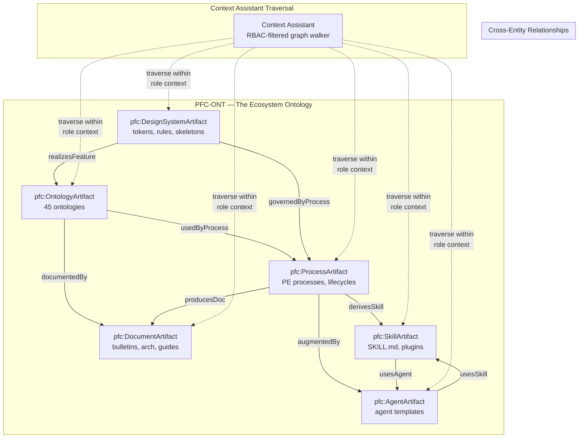
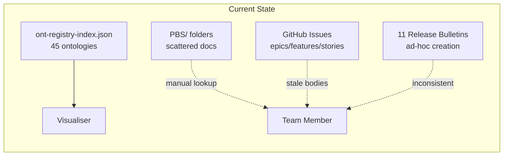
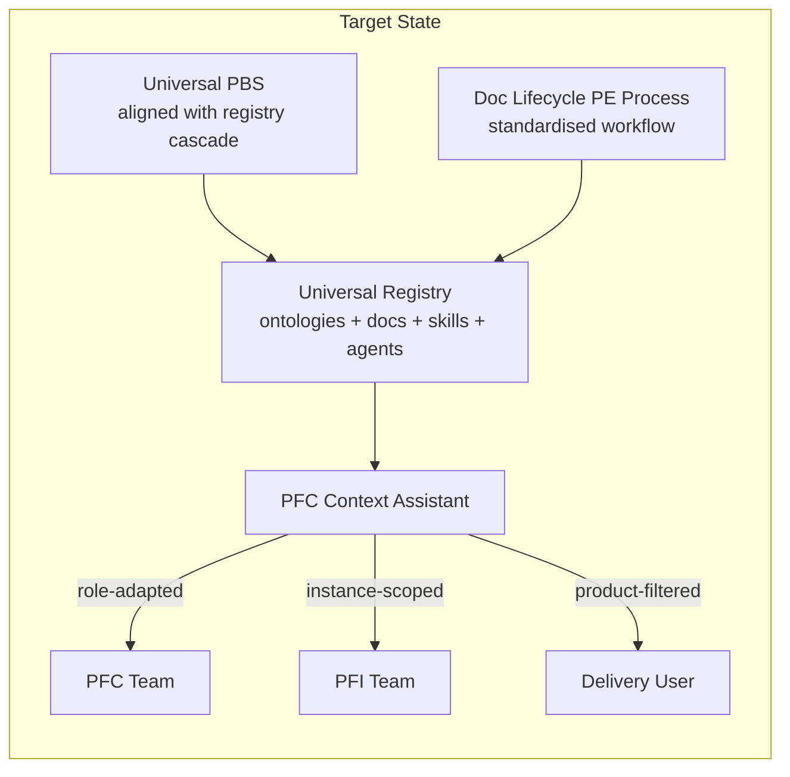
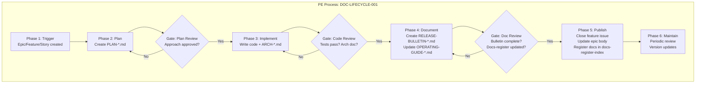
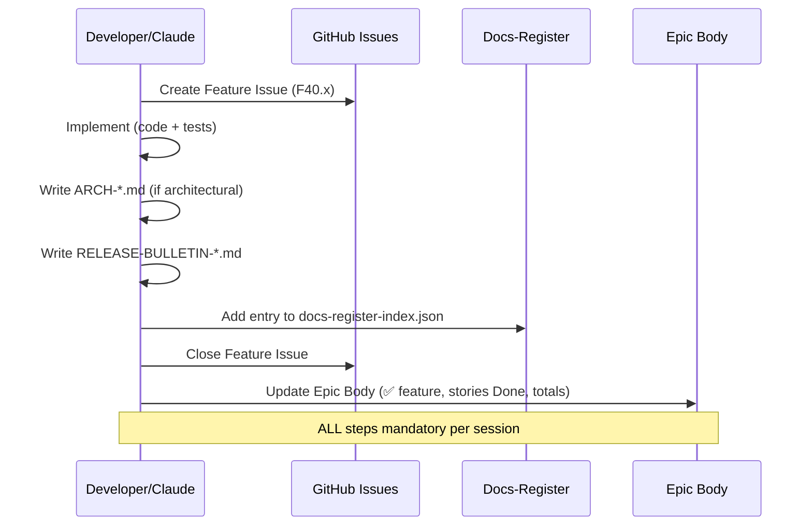
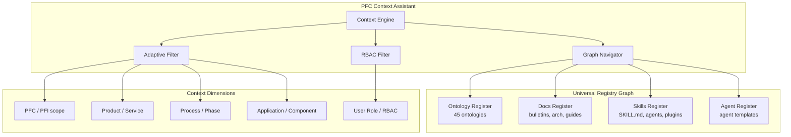
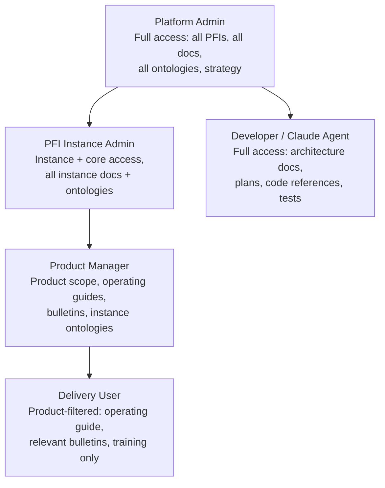
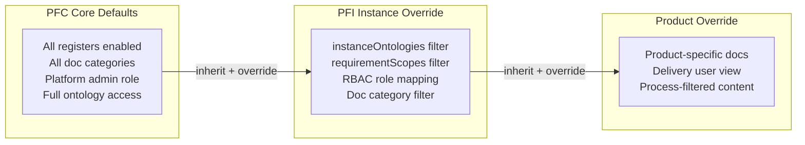
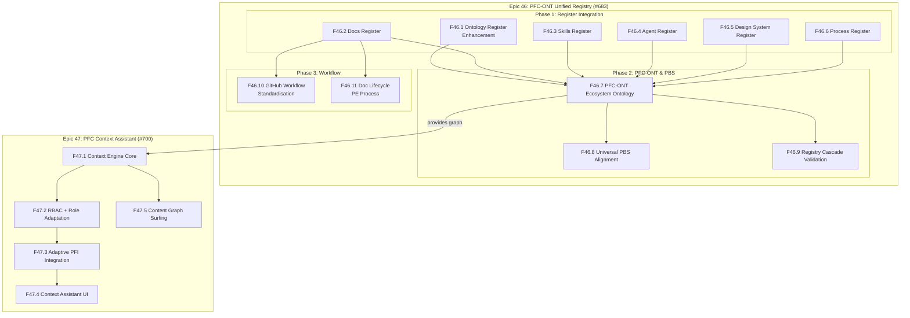
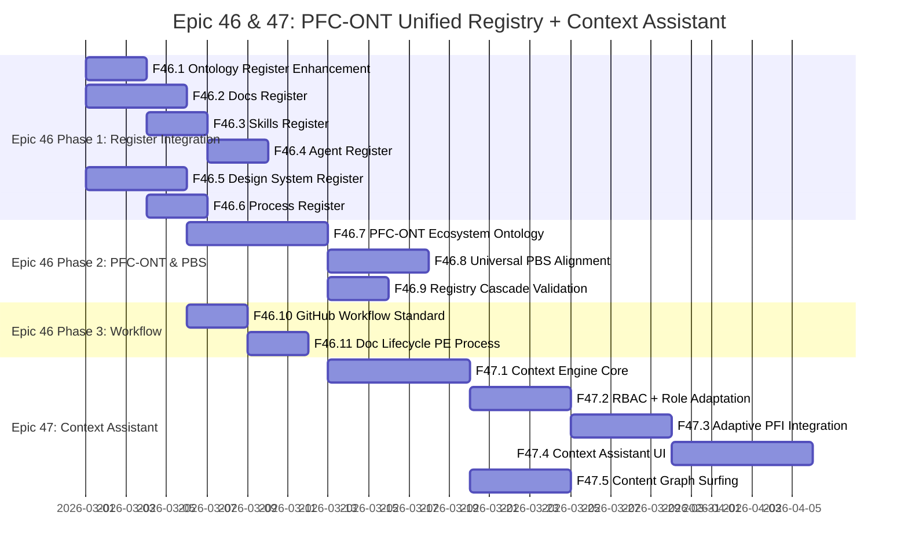

# PFC-ONT Unified Registry, Context Assistant & Universal PBS Strategy

**Version**: 1.2.0
**Date**: 2026-02-25
**Status**: DRAFT — Strategy Briefing
**Depends On**: Epic 34 (Platform Strategy), Epic 40 (Workbench), Unified Registry Architecture
**Epics**: Epic 46 (#683) PFC-ONT Unified Registry | Epic 47 (#700) PFC Context Assistant

---

## 1. Vision (VSOM)

> Every PFC/PFI team member and delivery user has instant, role-adapted access to the right documentation, architecture context, and process guidance — through an AI-driven context assistant that navigates the PFC-ONT unified registry graph within RBAC context, adapts to user role and PFI scope, and treats every platform asset as a first-class graph entity.

**One ontology. One graph. One design. Multiple instances. Adaptive context.**

---

## 1b. Core Insight: PFC-ONT — The Ecosystem Ontology

The unified registry is not 6 separate indexes merged together. It is **one ontology** — `PFC-ONT` — that defines the entire PF-Core ecosystem and all its assets as a single navigable graph.

Every asset type becomes an **entity type** within PFC-ONT:



**Key principles**:
- **Single graph**: All 6 asset types live in one PFC-ONT graph — no separate registers to merge
- **Cross-entity relationships**: Ontology→Doc→Skill→Process→Agent links are first-class relationships, not joins between separate systems
- **RBAC traversal**: The Context Assistant doesn't filter results *after* search — it traverses *within* RBAC context, so role scope governs what edges are walkable
- **Cascade inheritance**: PFC-ONT follows the same Core→Instance→Product→Client cascade as EMC — PFI instances inherit and override
- **One design, multiple instances**: The Context Assistant is a single module that adapts per PFI via EMC InstanceConfiguration, surfing the PFC-ONT subgraph visible to that instance

---

## 2. Problem Statement

### Current Pain Points

| Problem | Impact | Root Cause |
|---------|--------|------------|
| Docs scattered across PBS folders with no index | Team members can't find architecture docs, bulletins, or operating guides | No docs-register parallel to ont-registry-index |
| GitHub epic/feature/story bodies go stale | Confusion on project board; lost traceability | No standardised PE process for doc lifecycle |
| No role-based content filtering | PFI delivery users see platform-level complexity they don't need | No RBAC layer on content graph |
| Architecture docs not linked to ontologies/processes | Strategy briefings exist in isolation from the graph | PBS structure not aligned with unified registry cascade |
| Each PFI team navigates docs independently | Duplicated effort, inconsistent knowledge | No cross-PFI context assistant module |
| Bulletins created ad-hoc, sometimes skipped | Release knowledge lost; no audit trail | No mandatory doc workflow in PE process |

### What Exists Today



### What We Need



---

## 3. Strategies (6)

### S1: Universal PBS — Registry-Aligned Folder Structure

**Objective**: Restructure PBS to mirror the unified registry cascade (Core → Instance → Product → Client) so every folder maps to a registry scope.

**Current PBS Structure**:
```
PBS/
├── ONTOLOGIES/ontology-library/    ← Well-structured, has registry index
├── TOOLS/ontology-visualiser/      ← Has arch docs, bulletins, operating guides
├── STRATEGY/                       ← 20+ docs, no index, no catalogue
├── PFI-WWG/                        ← Instance-specific, one operating guide
├── PFI-BAIV/                       ← (planned)
└── PFI-AIRL/                       ← (planned)
```

**Target PBS Structure**:
```
PBS/
├── CORE/                           ← PFC-scope (Core layer)
│   ├── registry/                   ← Master unified registry index
│   │   ├── unified-registry-index.json  ← Extends ont-registry-index
│   │   ├── ontologies/             ← Symlink → ONTOLOGIES/ontology-library
│   │   ├── docs/                   ← Docs-register entries
│   │   ├── skills/                 ← Skill registry entries
│   │   └── agents/                 ← Agent registry entries
│   ├── strategy/                   ← Current PBS/STRATEGY content
│   ├── architecture/               ← Cross-cutting arch docs
│   └── design-system/              ← DS-ONT tokens, components
├── TOOLS/                          ← Tooling (visualiser, generators)
│   └── ontology-visualiser/
├── INSTANCES/                      ← PFI-scope (Instance layer)
│   ├── PFI-BAIV/
│   │   ├── overrides/              ← Instance registry overrides
│   │   ├── docs/                   ← Instance-specific docs
│   │   └── instance-data/          ← Ontology instance data
│   ├── PFI-WWG/
│   ├── PFI-EOMS/
│   ├── PFI-AIRL/
│   └── PFI-VHF/
└── ONTOLOGIES/                     ← Ontology library (unchanged)
    └── ontology-library/
```

**Key Principle**: Every artifact in PBS has a registry entry. If it's not in the registry, it doesn't exist to the platform.

---

### S2: Docs-Register — Documentation as First-Class Registry Artifacts

**Objective**: Extend the unified registry pattern to cover all documentation — strategy briefings, architecture docs, operating guides, release bulletins, plans, training materials.

**Docs-Register Entry Schema** (parallel to ont-registry-index entries):

```jsonld
{
  "@type": "pfc:DocumentArtifact",
  "@id": "pfc:doc-arch-decision-tree-v1.0.0",
  "pfc:artifactType": "architecture-doc",
  "pfc:title": "Dtree (Decision Tree) Architecture",
  "pfc:scope": "core",
  "pfc:series": "PE-Series",
  "pfc:relatedOntologies": ["pe:PE-ONT", "pe:DT-ONT"],
  "pfc:relatedEpics": ["#577"],
  "pfc:relatedFeatures": ["F40.1", "F40.24"],
  "pfc:url": "https://github.com/ajrmooreuk/Azlan-EA-AAA/blob/main/PBS/TOOLS/ontology-visualiser/ARCH-DECISION-TREE.md",
  "pfc:filePath": "PBS/TOOLS/ontology-visualiser/ARCH-DECISION-TREE.md",
  "pfc:version": "1.0.0",
  "pfc:status": "active",
  "pfc:audience": ["platform-team", "pfi-team"],
  "pfc:docCategory": "architecture",
  "pfc:created": "2026-02-25",
  "pfc:lastUpdated": "2026-02-25"
}
```

**Document Categories** (mapped to PE process outputs):

| Category | Pattern | Example | Mandatory? |
|----------|---------|---------|------------|
| `strategy-briefing` | `BRIEFING-*.md` | Epic 34 VSOM Platform Strategy | Per epic |
| `architecture-doc` | `ARCH-*.md` | ARCH-DECISION-TREE.md | Per feature (if architectural) |
| `release-bulletin` | `RELEASE-BULLETIN-*.md` | RELEASE-BULLETIN-Epic-5.md | **Per feature close** |
| `operating-guide` | `OPERATING-GUIDE-*.md` | OPERATING-GUIDE-Navigation.md | Per user-facing feature |
| `plan` | `PLAN-*.md` | PLAN-nav-layer-hybrid.md | Per feature (dev phase) |
| `training` | `TRAINING-*.md` | TRAINING-PFI-Release-Guide.md | Per PFI onboarding |
| `changelog` | `CHANGELOG*.md` | Ontology changelogs | Per ontology version |
| `validation-report` | `validation-report-*.md` | OAA compliance reports | Per ontology version |

**docs-register-index.json** (new file, parallel to ont-registry-index.json):
```json
{
  "@context": "https://schema.org",
  "@type": "ItemList",
  "name": "PFC Documentation Register",
  "version": "1.0.0",
  "totalDocuments": 0,
  "categories": {
    "strategy-briefing": { "count": 0, "scope": "core" },
    "architecture-doc": { "count": 0, "scope": "core|instance" },
    "release-bulletin": { "count": 0, "scope": "core|instance" },
    "operating-guide": { "count": 0, "scope": "core|instance|product" },
    "plan": { "count": 0, "scope": "core" },
    "training": { "count": 0, "scope": "instance|product" }
  },
  "documents": []
}
```

---

### S3: Documentation Lifecycle PE Process — Standardised Workflow

**Objective**: Define a PE-ONT process that governs how documentation is created, reviewed, published, and maintained — integrated with GitHub issue lifecycle.



**Mandatory Outputs per Issue Type**:

| Issue Type | Mandatory Docs | Register Entry? | Epic Body Update? |
|------------|---------------|-----------------|-------------------|
| **Epic** | Strategy Briefing (`BRIEFING-*.md`) | Yes | N/A |
| **Feature** | Release Bulletin (`RELEASE-BULLETIN-*.md`) | Yes | Yes — mark ✅ |
| **Feature (arch)** | + Architecture Doc (`ARCH-*.md`) | Yes | Yes |
| **Feature (UI)** | + Operating Guide update | Yes | Yes |
| **Story** | (covered by parent feature bulletin) | No | Mark as Done in epic |

**GitHub Workflow Integration**:



---

### S4: PFC Context Assistant — AI Module for Adaptive Context Surfacing

**Objective**: Build an AI-driven context assistant module that works across all PFIs, navigates the content-docs graph, and adapts to user role and scope.

**Architecture**:



**Context Cascade** (mirrors PFC→PFI→Product→Client):

| Level | What's Visible | Example |
|-------|---------------|---------|
| **PFC Platform** | All core docs, all ontologies, all strategy briefings | VSOM Platform Strategy, all ARCH-* docs |
| **PFI Instance** | Core + instance-scoped docs, declared ontologies | W4M-WWG operating guide, VP/RRR/LSC/OFM/KPI/BSC/EMC only |
| **Product/Service** | Instance + product-scoped docs, product processes | WWG fulfilment guides, corridor-specific LSC docs |
| **Application** | Product + app-component docs, zone/component guides | Visualiser nav editing guide, skeleton editor docs |
| **User Role** | Filtered by RBAC — platform admin sees all, delivery user sees product-level | Delivery user: operating guide + bulletins only |

**Content Graph Navigation**:

The assistant can "surf" the graph by following relationships:

```
User asks: "How does the W4M fulfilment process work?"
                                    ↓
Context Engine resolves:
  PFI = W4M-WWG
  Scope = FULFILMENT category
  Ontologies = LSC-ONT, OFM-ONT (from instanceOntologies)
                                    ↓
Graph Navigator follows:
  LSC-ONT → 4 corridors (AU/NZ/IS/IE→UK)
  OFM-ONT → 82 entities (orders, fulfilment, tracking)
  ARCH docs → ARCH-PE-SKILL-CATALOGUE.md (process scaffolding)
  Bulletins → RELEASE-BULLETIN relevant to LSC/OFM features
  Operating Guide → OPERATING-GUIDE-Visualiser.md (W4M section)
                                    ↓
Response: Assembled context from 5 sources, role-filtered
```

**One Design, Multiple Instances**:

The Context Assistant is a single module (`pfc-context-assistant.js`) that loads differently per PFI:

```jsonld
{
  "@type": "emc:InstanceConfiguration",
  "@id": "emc:W4M-WWG",
  "contextAssistant": {
    "enabledRegisters": ["ontologies", "docs", "skills"],
    "rbacRoles": ["platform-admin", "pfi-admin", "delivery-user"],
    "defaultScope": "product",
    "navFilters": ["PRODUCT", "FULFILMENT", "COMPETITIVE"],
    "contentGraph": {
      "rootOntologies": ["VP", "RRR", "LSC", "OFM", "KPI", "BSC", "EMC"],
      "docCategories": ["operating-guide", "release-bulletin", "training"],
      "excludeCategories": ["strategy-briefing", "plan"]
    }
  }
}
```

---

### S5: RBAC + Role Adaptation

**Objective**: Context assistant adapts content depth and visibility based on user role, mapped to PFC→PFI→Product cascade.

**Role Hierarchy**:



**RBAC Filter Matrix**:

| Doc Category | Platform Admin | PFI Admin | Product Manager | Delivery User | Developer |
|-------------|:-:|:-:|:-:|:-:|:-:|
| Strategy Briefing | R/W | R | - | - | R |
| Architecture Doc | R/W | R | - | - | R/W |
| Release Bulletin | R/W | R/W | R | R | R/W |
| Operating Guide | R/W | R/W | R | R | R |
| Plan | R/W | R | - | - | R/W |
| Training | R/W | R/W | R/W | R | R |
| Ontology Data | R/W | R/W | R | - | R/W |

---

### S6: One Design, Multiple Instances — Adaptive Graph & Filters

**Objective**: Single Context Assistant module design that adapts per PFI instance via EMC InstanceConfiguration, inheriting from PFC core defaults.

**Cascade Resolution**:



**Example — W4M-WWG vs BAIV**:

| Dimension | W4M-WWG | BAIV |
|-----------|---------|------|
| Ontologies | 7 (VP,RRR,LSC,OFM,KPI,BSC,EMC) | 7 (VP,RRR,LSC,OFM,KPI,BSC,EMC) + scope rules |
| Requirement Scopes | PRODUCT, FULFILMENT, COMPETITIVE | PRODUCT, COMPETITIVE, STRATEGIC, OPERATIONAL, AGENTIC |
| Doc Focus | Operating guides, fulfilment training | Strategy briefings, agent architecture |
| RBAC Roles | platform-admin, delivery-user | platform-admin, pfi-admin, agent-operator |
| Graph Depth | Product-level (corridors, orders) | Strategic + operational (agents, BSC) |

---

## 4. Epic Structure

### Two Epics — Data Layer + Application Layer

**Epic 46** (#683) defines the PFC-ONT graph data layer. **Epic 47** (#700) builds the Context Assistant application that traverses it.



---

#### Phase 1: Register Integration — One Feature per Register Type (6 features)

Each register follows the same `Entry-*` pattern established by ont-registry-index. Each gets its own index file that feeds into the unified registry.

##### F46.1: Ontology Register Enhancement
- **What exists**: `ont-registry-index.json` v10.3.0, 45 entries, `Entry-ONT-*.json` per ontology
- **What's needed**: Add `githubUrl` field to every entry, add `relatedDocs` cross-references, add `relatedProcesses` links
- **Entry pattern**: `Entry-ONT-*.json` (already established)
- **GitHub URL**: https://github.com/ajrmooreuk/Azlan-EA-AAA/blob/main/PBS/ONTOLOGIES/ontology-library/ont-registry-index.json

##### F46.2: Docs Register
- **What exists**: ~40 docs scattered across PBS (20 strategy, 11 bulletins, 4 operating guides, 5+ arch docs) — no index
- **What's needed**: `docs-register-index.json` + `Entry-DOC-*.json` per document
- **Entry pattern**: `Entry-DOC-{NNN}.json` with `@type: pfc:DocumentArtifact`
- **Categories**: strategy-briefing, architecture-doc, release-bulletin, operating-guide, plan, training, changelog
- **Scope**: core | instance | product (mirrors cascade)
- **Fields**: title, artifactType, scope, series, relatedOntologies, relatedEpics, relatedFeatures, url, filePath, version, status, audience, docCategory

##### F46.3: Skills Register
- **What exists**: F40.24 Skill Builder generates `pfc:RegistryArtifact` JSON-LD, but no persistent index
- **What's needed**: `skills-register-index.json` + `Entry-SKL-*.json` per scaffolded skill/plugin
- **Entry pattern**: `Entry-SKL-{NNN}.json` with `@type: pfc:SkillArtifact`
- **Links to**: PE process (via `derivedFromProcess`), Dtree recommendation (via `decisionRecord`), ontology dependencies
- **Scope**: core (platform skills) | instance (PFI-specific skills)

##### F46.4: Agent Register
- **What exists**: PE-ONT `AIAgent` entity type, BAIV has 16 agents defined in process templates
- **What's needed**: `agents-register-index.json` + `Entry-AGT-*.json` per agent template
- **Entry pattern**: `Entry-AGT-{NNN}.json` with `@type: pfc:AgentArtifact`
- **Links to**: PE process (via `augmentedBy`), skills (via `usesSkill`), ontology scope
- **Scope**: core (platform agents) | instance (PFI agents)

##### F46.5: Design System Register
- **What exists**: DS-ONT v3.0.0 (`Entry-ONT-DS-001.json`) — richest registry entry in the system with:
  - 6 brand instances (BAIV, WWG, VHF, RCS, PAND, PFC)
  - `instanceData[]` with per-brand Figma file keys, extraction logs, PE process refs
  - 2 PE extraction processes (PE-DS-EXTRACT-001, PE-DS-EXTRACT-002)
  - PFC app skeleton + design rules as instance data
  - 3-tier token cascade (Primitive → Semantic → Component)
  - 5 cross-ontology bridges (EFS, EMC, PE, ORG-CONTEXT)
- **What's needed**: `ds-register-index.json` + `Entry-DS-*.json` per design system artifact:
  - `Entry-DS-TOKEN-{BRAND}.json` — per-brand token set (BAIV, WWG, VHF, etc.)
  - `Entry-DS-RULE-{NNN}.json` — design rules (45 DR-* rules + 4 component rules)
  - `Entry-DS-SKELETON-{INSTANCE}.json` — per-PFI app skeleton
  - `Entry-DS-COMPONENT-{NNN}.json` — reusable component definitions
- **Entry pattern**: `Entry-DS-{TYPE}-{NNN}.json` with `@type: ds:{TokenSet|DesignRule|Application|DesignComponent}`
- **Links to**: Figma file keys, PE extraction processes, EMC InstanceConfiguration, brand variants
- **Scope**: core (PFC tokens, rules, skeleton) | instance (brand variants, PFI skeletons)
- **Existing GitHub URLs**:
  - DS-ONT registry: https://github.com/ajrmooreuk/Azlan-EA-AAA/blob/main/PBS/ONTOLOGIES/ontology-library/PE-Series/DS-ONT/Entry-ONT-DS-001.json
  - DS-ONT v3.0.0: https://github.com/ajrmooreuk/Azlan-EA-AAA/blob/main/PBS/ONTOLOGIES/ontology-library/PE-Series/DS-ONT/ds-v3.0.0-oaa-v6.json
  - PFC Design Rules: https://github.com/ajrmooreuk/Azlan-EA-AAA/blob/main/PBS/ONTOLOGIES/ontology-library/PE-Series/DS-ONT/instance-data/pfc-design-rules-v1.0.0.jsonld
  - PFC App Skeleton: https://github.com/ajrmooreuk/Azlan-EA-AAA/blob/main/PBS/ONTOLOGIES/ontology-library/PE-Series/DS-ONT/instance-data/pfc-app-skeleton-v1.0.0.jsonld
  - DS Overview: `PBS/DESIGN-SYSTEM/DESIGN-SYSTEM-OVERVIEW.md`
  - DS Spec: `PBS/DESIGN-SYSTEM/DESIGN-SYSTEM-SPEC.md`
  - Token Map: `PBS/DESIGN-SYSTEM/DESIGN-TOKEN-MAP.md`
  - App Skeleton Guide: `PBS/DESIGN-SYSTEM/APP-SKELETON-GUIDE.md`

##### F46.6: Process Register
- **What exists**: PE-ONT v4.0.0, 2 DS extraction processes (PE-DS-EXTRACT-001/002), Insurance EA Assessment template
- **What's needed**: `processes-register-index.json` + `Entry-PRC-*.json` per PE process definition
- **Entry pattern**: `Entry-PRC-{NNN}.json` with `@type: pe:Process`
- **Assumption**: All processes defined in PE-Series are candidates for registration
- **Links to**: skills (via `derivesSkill`), agents (via `augmentedBy`), docs (via `producesDoc`), ontologies (via `usesOntology`)
- **Scope**: core (platform processes like DS extraction) | instance (PFI delivery processes)

---

#### Phase 2: Unified Registry & PBS (3 features)

##### F46.7: PFC-ONT — The Ecosystem Ontology
- Define `PFC-ONT` as a single OAA-compliant ontology with 6 entity types: OntologyArtifact, DocumentArtifact, SkillArtifact, AgentArtifact, DesignSystemArtifact, ProcessArtifact
- Cross-entity relationships as first-class ontology relationships (documentedBy, derivesSkill, augmentedBy, governedByProcess, etc.)
- `pfc-ont-registry-index.json` replaces separate register indexes — one graph, one index
- Follows EMC cascade: Core→Instance→Product→Client inheritance for all asset types
- Single traversable graph for Context Assistant — no joins between separate systems

##### F46.8: Universal PBS Alignment
- Restructure PBS folders to mirror Core→Instance→Product cascade
- PBS/CORE/ (strategy, architecture, design-system), PBS/INSTANCES/ (per-PFI), PBS/TOOLS/
- Symlink phase first, then gradual migration — no breaking changes to GitHub Pages

##### F46.9: Registry Cascade Validation
- CI/GitHub Action: every artifact in PBS must have a registry entry
- Flag orphaned docs (exist in PBS but not in any register)
- Flag stale entries (register points to missing file)
- Validation report as part of OAA compliance pipeline

---

#### Phase 3: Workflow Standardisation (2 features)

##### F46.10: GitHub Workflow Standardisation
- Mandatory bulletin per feature close, epic body auto-update checklist
- PR template with register entry checkboxes
- Issue templates for Epic/Feature/Story with doc requirements
- Standing rules already in CLAUDE.md — formalise as PE process gates

##### F46.11: Doc Lifecycle PE Process
- DOC-LIFECYCLE-001 defined in PE-ONT instance data
- 6 phases (Trigger → Plan → Implement → Document → Publish → Maintain)
- 3 gates (Plan Review, Code Review, Doc Review)
- Mandatory outputs per issue type (see S3 in strategies section)
- Links to GitHub issue lifecycle events

---

---

#### Epic 47: PFC Context Assistant (#700) — 5 features

*Separate epic — the Context Assistant is a high-level PFC application component that consumes the PFC-ONT graph built in Epic 46.*

##### F47.1: Context Engine Core (#693)
- `pfc-context-assistant.js` — RBAC-filtered graph traversal across PFC-ONT
- Scope resolution: PFC → PFI → Product → Application → Component
- Content assembly: follow cross-register links to build context bundles
- Query API: "What docs/skills/processes relate to LSC-ONT for W4M-WWG?"

##### F47.2: RBAC + Role Adaptation (#694)
- 5 roles: Platform Admin, PFI Admin, Product Manager, Delivery User, Developer
- Role hierarchy with visibility matrix per register and doc category
- RBAC governs traversal — role scope determines walkable edges, not post-query filter
- Role stored in EMC InstanceConfiguration per PFI

##### F47.3: Adaptive PFI Integration (#695)
- EMC InstanceConfiguration extension: `contextAssistant` config block
- `enabledRegisters`, `rbacRoles`, `defaultScope`, `navFilters`, `contentGraph`
- Cascade resolution: PFC defaults → PFI override → Product override
- Reuse `constrainToInstanceOntologies` pattern for all artifact types

##### F47.4: Context Assistant UI (#696)
- Sidebar/panel in visualiser workbench
- Search across all registers, filter by scope/category/PFI
- Context-aware suggestions based on current view/loaded ontologies
- Doc preview (Markdown rendered inline), skill template preview, process diagram

##### F47.5: Content Graph Surfing (#697)
- Follow relationships across register boundaries: ontology → doc → skill → process → agent
- Visual breadcrumb trail showing navigation path
- "Related content" panel — what else links to this artifact?
- Multi-instance comparison: what's visible in W4M-WWG vs BAIV for the same ontology

---

### Feature Summary

| # | Feature | Epic | Type | Phase |
|---|---------|------|------|-------|
| F46.1 | Ontology Register Enhancement | 46 | Register | 1 |
| F46.2 | Docs Register | 46 | Register | 1 |
| F46.3 | Skills Register | 46 | Register | 1 |
| F46.4 | Agent Register | 46 | Register | 1 |
| F46.5 | Design System Register | 46 | Register | 1 |
| F46.6 | Process Register | 46 | Register | 1 |
| F46.7 | PFC-ONT Ecosystem Ontology | 46 | Unified Graph | 2 |
| F46.8 | Universal PBS Alignment | 46 | Infrastructure | 2 |
| F46.9 | Registry Cascade Validation | 46 | CI/CD | 2 |
| F46.10 | GitHub Workflow Standardisation | 46 | Workflow | 3 |
| F46.11 | Doc Lifecycle PE Process | 46 | Workflow | 3 |
| F47.1 | Context Engine Core | 47 | Context Assistant | — |
| F47.2 | RBAC + Role Adaptation | 47 | Context Assistant | — |
| F47.3 | Adaptive PFI Integration | 47 | Context Assistant | — |
| F47.4 | Context Assistant UI | 47 | Context Assistant | — |
| F47.5 | Content Graph Surfing | 47 | Context Assistant | — |
| **Total** | **16 features across 2 epics** | | **6 register types + graph + workflow + assistant** | |

---

## 5. BSC Objectives & Metrics

| Perspective | Objective | Metric | Target |
|-------------|-----------|--------|--------|
| **Financial** | Reduce onboarding time per PFI | Time to first productive session | < 2 hours (from ~8 hours) |
| **Customer** | Every team member finds docs in < 30s | Context assistant query response | < 5 seconds |
| **Customer** | Zero stale epic bodies | Epic body accuracy audit | 100% current |
| **Internal** | Every feature has bulletin + register entry | Doc coverage ratio | 100% |
| **Internal** | PBS structure mirrors registry cascade | Orphaned artifact count | 0 |
| **Learning** | Role-adapted content reduces noise | Irrelevant content shown to delivery users | < 10% |

---

## 6. Implementation Roadmap



---

## 7. Quick Wins — Start Now

These can be done immediately, before the epic is formally created:

### 7.1 Register Existing Docs

Catalogue the ~40 existing docs (20 strategy, 11 bulletins, 4 operating guides, 5+ arch docs) into a `docs-register-index.json`.

### 7.2 VSOM from This Chat

This briefing document itself is the first entry in the docs-register:

```json
{
  "@id": "pfc:doc-briefing-context-assistant-v1.0.0",
  "pfc:artifactType": "strategy-briefing",
  "pfc:title": "PFC Context Assistant, Universal PBS & Docs-Register Strategy",
  "pfc:scope": "core",
  "pfc:relatedEpics": ["#TBD (Epic 46)"],
  "pfc:url": "PBS/STRATEGY/BRIEFING-PFC-Context-Assistant-Universal-PBS-Strategy.md",
  "pfc:version": "1.0.0",
  "pfc:status": "draft"
}
```

### 7.3 Standardise Current Session Workflow

From this point forward, every feature close in any epic follows:
1. Write `RELEASE-BULLETIN-*.md`
2. Add docs-register entry
3. Update epic body (✅ feature, stories Done, totals)
4. Commit all together

---

## 8. Relationship to Existing Epics

| Epic | Relationship | Impact |
|------|-------------|--------|
| **Epic 34** (Platform Strategy) | Parent strategy — Context Assistant implements S2 (VE-Driven Everything) + S4 (Instance Customisation) | Extends platform architecture |
| **Epic 40** (Workbench) | F40.3 Registry Browser becomes docs-register UI host | Phase 1 F46.4 depends on F40.3 |
| **Epic 40** F40.24 (Skill Builder) | Skills in registry → Context Assistant navigates skill graph | Phase 4 content graph |
| **Epic 41** (OFM/LSC Bridge) | Fulfilment docs for W4M-WWG → instance-scoped content | Phase 3 PFI integration |
| **Epic 45** (W4M-WWG) | First PFI instance to test Context Assistant | Phase 3 pilot |
| **Epic 19** (EMC Evolution) | InstanceConfiguration extends with context assistant config | Phase 3 F46.10 |

---

## 9. Existing GitHub Doc URLs (Reference)

| Document | GitHub URL |
|----------|-----------|
| ARCH-DECISION-TREE.md | https://github.com/ajrmooreuk/Azlan-EA-AAA/blob/main/PBS/TOOLS/ontology-visualiser/ARCH-DECISION-TREE.md |
| ARCH-PE-SKILL-CATALOGUE.md | https://github.com/ajrmooreuk/Azlan-EA-AAA/blob/main/PBS/TOOLS/ontology-visualiser/ARCH-PE-SKILL-CATALOGUE.md |
| ARCH-NAVIGATION.md | https://github.com/ajrmooreuk/Azlan-EA-AAA/blob/main/PBS/TOOLS/ontology-visualiser/ARCH-NAVIGATION.md |
| OPERATING-GUIDE.md | https://github.com/ajrmooreuk/Azlan-EA-AAA/blob/main/PBS/TOOLS/ontology-visualiser/OPERATING-GUIDE.md |
| OPERATING-GUIDE-Navigation.md | https://github.com/ajrmooreuk/Azlan-EA-AAA/blob/main/PBS/TOOLS/ontology-visualiser/OPERATING-GUIDE-Navigation.md |
| W4M-WWG Operating Guide | https://github.com/ajrmooreuk/Azlan-EA-AAA/blob/main/PBS/PFI-WWG/OPERATING-GUIDE-Visualiser.md |
| ont-registry-index.json | https://github.com/ajrmooreuk/Azlan-EA-AAA/blob/main/PBS/ONTOLOGIES/ontology-library/ont-registry-index.json |
| Epic 34 VSOM Strategy | https://github.com/ajrmooreuk/Azlan-EA-AAA/blob/main/PBS/STRATEGY/BRIEFING-Epic34-PF-Core-VSOM-Platform-Strategy.md |
| Epic 34 Unified Registry | https://github.com/ajrmooreuk/Azlan-EA-AAA/blob/main/PBS/STRATEGY/BRIEFING-Epic34-Unified-Registry-Skills-Architecture.md |
| PFC-PFI Graph Cascade | https://github.com/ajrmooreuk/Azlan-EA-AAA/blob/main/PBS/STRATEGY/ARCH-PFC-PFI-Product-Client-Graph-Cascade.md |

---

## 10. Key Design Decisions

| Decision | Choice | Rationale |
|----------|--------|-----------|
| Docs-register format | JSON-LD (same as ont-registry) | Consistency with unified registry; graph-navigable |
| PBS restructure approach | Phased migration (symlinks first, then move) | Avoid breaking GitHub Pages, existing references |
| Context Assistant host | Visualiser module (not standalone app) | Reuse vis-network graph, EMC composition, existing PFI infrastructure |
| RBAC implementation | EMC InstanceConfiguration extension | Cascade resolution already works; add role filter dimension |
| One design / multi-instance | `constrainToInstanceOntologies` pattern extended to docs | Proven in F40.19; same two-layer filter applies to all artifact types |
| Process model | PE-ONT instance data (not new ontology) | DOC-LIFECYCLE is a process like any other PE process |
