# PLAN: Supabase JSONB MVP Platform Phase

**Version:** 2.0.0
**Date:** 2026-03-02
**Status:** PROPOSAL
**Scope:** Strategic platform phase — Supabase-hosted graph library, workbench security, RBAC, APIs, CI/CD database topology
**Excludes:** Neo4j, sovereign self-hosting (Epic 53), Next.js migration, real-time subscriptions

---

## 1. Strategic Vision

### The Trigger Chain

Securing the workbench is not a standalone task — it pulls an entire platform layer into existence:

```
Workbench Login Required
  → Need Authentication (Supabase Auth)
    → Need User Identity (profiles table)
      → Need PFI Scoping (pfi_instances + user_pfi_access)
        → Need RBAC (RRR-ONT role → AccessPolicy → Permission)
          → Need Ontology Storage (JSONB in Supabase)
            → Need Graph Access Control (RLS per PFI tier)
              → Need CI/CD Database Distribution (PFC hub → PFI spoke DBs)
```

Every link in this chain is a dependency — you cannot secure the workbench without building the platform beneath it. This plan treats that chain as the delivery backbone.

### VE Skills Chain Alignment

This plan follows the VE lineage as its strategic spine:

| VE Stage | Platform Equivalent | This Plan |
|----------|-------------------|-----------|
| **VSOM** — Vision, Strategy | Platform vision: graph-first, multi-PFI | Section 1 (this) |
| **RRR** — Roles, RBAC, RACI | Who accesses what, at which tier | Section 3 (RBAC layers) |
| **OKR/KPI** — Objectives, Metrics | Success metrics and phase gates | Section 8 (gates) |
| **VP** — Value Proposition | What each PFI instance gains | Section 5 (cascade) |
| **EFS** — Epics, Features, Stories | Delivery units organised by cascade tier | Section 6 (phased delivery) |
| **PPM** — Portfolio, Programme, Project | Scheduling, dependencies, cost | Section 7 (database topology) |

### What Already Exists (Artefacts in Hand)

| Artefact | Status | Location |
|----------|--------|----------|
| Migration 001 — 5-table schema | SQL written | `supabase/migrations/001_create_schema.sql` |
| Migration 002 — RLS policies | SQL written | `supabase/migrations/002_rls_policies.sql` |
| Migration 005 — pg_graphql + JSONB views + composition functions | SQL written | `supabase/migrations/005_graphql_layer.sql` |
| Seed data — 3 PFI instances | SQL written | `supabase/seed.sql` |
| GraphQL architecture briefing | Complete | `BRIEFING-GraphQL-Supabase-JSONB-MVP.md` |
| Secure Connections proposal (3-layer, 5-tool MCP) | Complete | `PROPOSAL-Supabase-Secure-Connections-API-MCP-v1.0.0.md` |
| RRR-ONT v4.0.0 — RBAC entities | Live | `VE-Series/RRR-ONT/` |
| App Skeleton v2.0.0 — 22 zones, 7 nav layers, 62 actions | Live | `pfc-app-skeleton-v1.0.0.jsonld` |
| Hub-and-spoke CI/CD architecture | Documented, partially implemented | `PBS/ARCHITECTURE/arch-cicd/` |
| EMC-ONT v5.1.0 — 4-tier cascade | Live | `Orchestration/EMC-ONT/` |
| Ontology library — 52 ontologies, registry v10.9.1 | Live on GitHub Pages | `ontology-library/` |

---

## 2. Architecture Overview

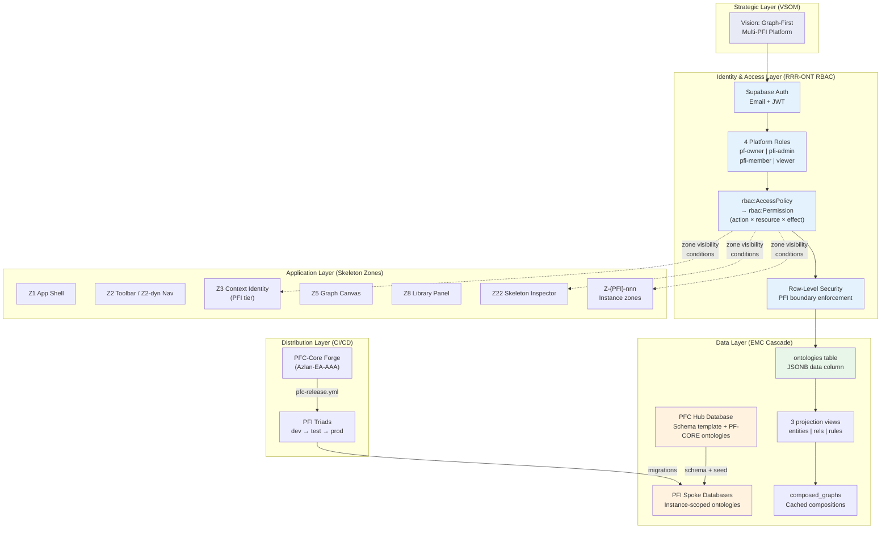

---

## 3. RBAC & Graph Access Control Layers

### 3.1 RRR-ONT RBAC Resolution Chain

The existing RRR-ONT v4.0.0 defines the complete RBAC resolution path:

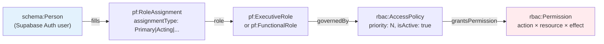

### 3.2 Four-Layer Graph Access Control

Graph access is controlled at four nested layers, from coarsest to finest:

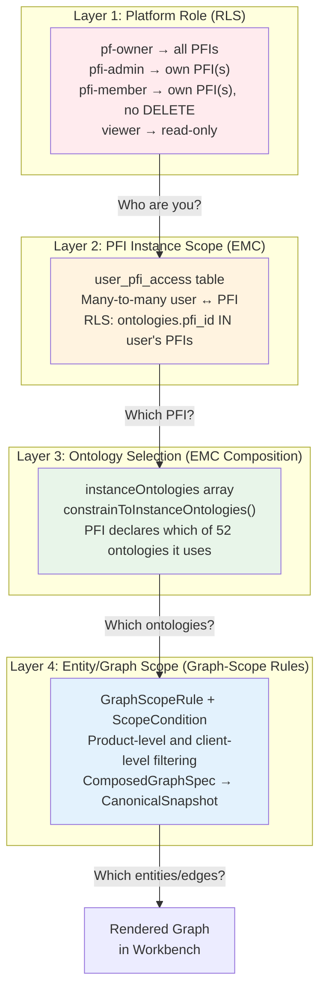

### 3.3 RBAC Matrix — Actions × Resources × Roles

| Resource | Action | pf-owner | pfi-admin | pfi-member | viewer |
|----------|--------|:--------:|:---------:|:----------:|:------:|
| **ontologies** | read (own PFI) | Yes | Yes | Yes | Yes |
| **ontologies** | read (PF-CORE shared) | Yes | Yes | Yes | Yes |
| **ontologies** | read (other PFI) | Yes | No | No | No |
| **ontologies** | create / update | Yes | Yes | Yes | No |
| **ontologies** | delete | Yes | Yes | No | No |
| **composed_graphs** | read | Yes | Yes | Yes | Yes |
| **composed_graphs** | create | Yes | Yes | Yes | No |
| **composed_graphs** | delete | Yes | Yes | No | No |
| **audit_log** | read | Yes | Own PFI | No | No |
| **user_pfi_access** | manage | Yes | Own PFI | No | No |
| **pfi_instances** | create / update | Yes | No | No | No |
| **Skeleton zones** | configure PFI zones | Yes | Yes | No | No |
| **Nav items** | add L4+ PFI items | Yes | Yes | No | No |

### 3.4 Skeleton Zone Visibility by Role & Tier

The Application Skeleton's 22 zones have cascade tiers and visibility conditions that map directly to RBAC:

| Zone | Name | Cascade Tier | Visibility by Role |
|------|------|-----------:|-------------------|
| Z1 | App Shell | PFC | All roles |
| Z2 | Toolbar (static) | PFC | All roles |
| Z2-dyn | Dynamic Nav Bar | PFC | All roles (replaces Z2) |
| Z3 | Context Identity Bar | **PFI** | All authenticated (shows current PFI) |
| Z4 | Left Sidebar | PFC | All roles |
| Z5 | Graph Canvas | PFC | All roles |
| Z6 | Right Detail Panel | PFC | All roles |
| Z7 | Footer Status Bar | PFC | All roles |
| Z8 | Library Panel | PFC | member+ (contains edit actions) |
| Z9 | Diff/Changelog | PFC | All roles |
| Z10 | Export Panel | PFC | member+ |
| Z11 | Minimap | PFC | All roles |
| Z14 | Toast Notifications | PFC | All roles |
| Z16 | Context Drawer | **PFI** | admin+ (PFI config) |
| Z17 | Audit Panel | PFC | admin+ |
| Z18 | Search Overlay | PFC | All roles |
| Z19 | Command Palette | PFC | All roles |
| Z20 | Settings Drawer | PFC | All roles (scoped per role) |
| Z22 | Skeleton Inspector | PFC | pf-owner only |
| Z-{PFI}-nnn | Instance zones | **PFI** | Per PFI config |

**Key principle:** PFC zones are immutable — PFI instances cannot modify them. PFI instances extend via Z3 (identity bar), Z16 (context drawer), and custom Z-{PFI}-nnn zones. Zone visibility conditions reference `state.userRole` and `state.activePFI`.

---

## 4. EMC Cascade: PFC → PFI → Product → Client

### 4.1 Four-Tier Data Architecture

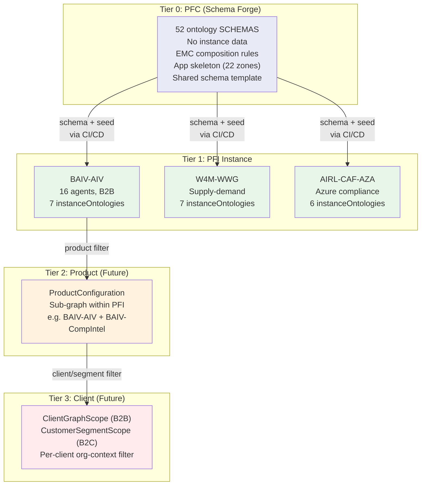

### 4.2 How RBAC Maps to Cascade Tiers

| Cascade Tier | RBAC Enforcement | Mechanism |
|-------------|-----------------|-----------|
| Tier 0 (PFC) | pf-owner only for schema changes | GitHub repo permissions + guard-core.yml |
| Tier 1 (PFI) | pfi-admin manages instance config, member reads/writes ontologies | Supabase RLS on pfi_id |
| Tier 2 (Product) | Future: product-scoped AccessPolicy | Graph-Scope Rules (EMC v6.0.0) |
| Tier 3 (Client) | Future: client org-context filter | ClientGraphScope entity (Gap 2) |

### 4.3 Org-Context Integration

Org-context flows through the cascade at every tier:

```
PFC: org:Organisation (abstract schema)
  → PFI: org:Organisation (instance data — e.g. "Acme Insurance")
    → Product: org:BusinessUnit (filtered to product scope)
      → Client: org:ClientOrganisation (B2B) or org:CustomerSegment (B2C)
```

Zone Z3 (Context Identity Bar) displays the active org-context. Zone Z16 (Context Drawer) allows admin to configure PFI-specific org-context settings. Both are at PFI cascade tier.

---

## 5. Database Topology: PFC Hub + PFI Spoke Pattern

### 5.1 The Core Decision

Databases follow the same hub-and-spoke model as CI/CD:

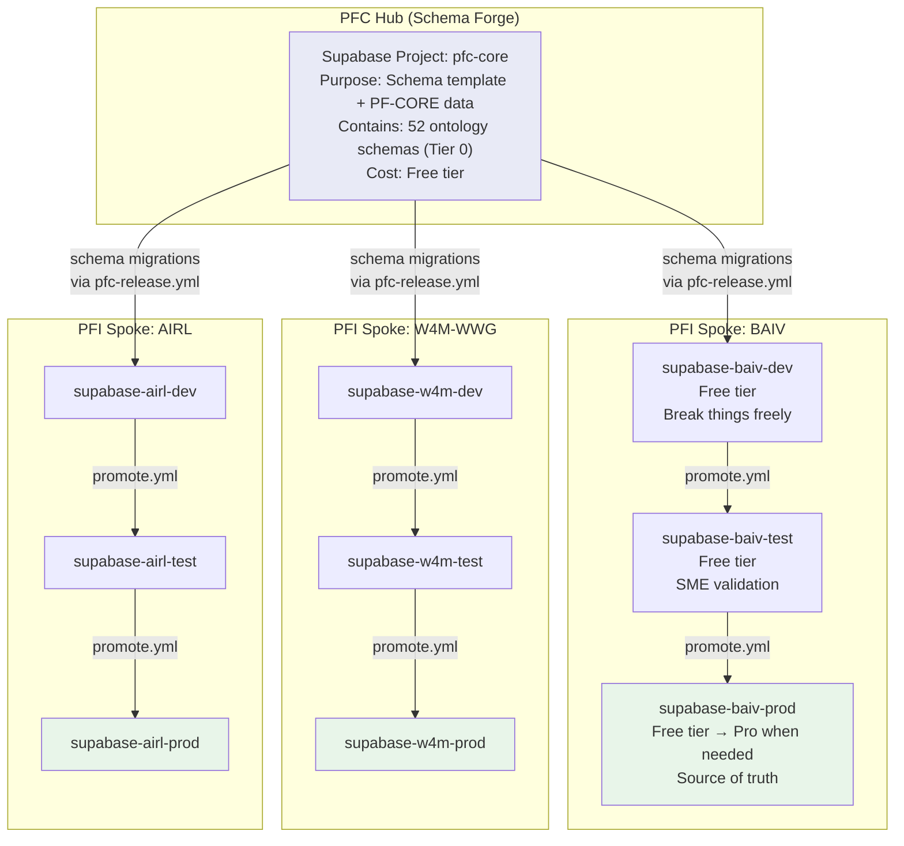

### 5.2 Cost-Effective Phasing

**Phase A (MVP — now):** Minimal cost, maximum learning

| Database | Tier | Purpose | Cost |
|----------|------|---------|------|
| pfc-core | Hub | Schema forge + PF-CORE ontologies + dev workbench | Free ($0/mo) |
| pfc-core doubles as BAIV-dev | Spoke | BAIV dev/test via PFI scoping within single project | Free ($0/mo) |
| **Total Phase A** | | | **$0/mo** |

> **Key insight:** In Phase A, a single Supabase project hosts both PFC-CORE and BAIV-AIV data, separated by `pfi_id` and RLS policies. This is sufficient for MVP because RLS already enforces PFI isolation at the database layer. No need for separate Supabase projects until PFI instances need independent auth domains or different regions.

**Phase B (Multi-PFI — when second PFI goes live):**

| Database | Tier | Purpose | Cost |
|----------|------|---------|------|
| pfc-core | Hub | Schema forge + PF-CORE shared | Free |
| supabase-baiv | Spoke | BAIV all tiers (dev/test/prod via RLS) | Free |
| supabase-w4m | Spoke | W4M-WWG all tiers | Free |
| **Total Phase B** | | | **$0/mo** |

> Within each PFI spoke, dev/test/prod can initially share one Supabase project with environment-tagged data. RLS + `pfi_instances.code` distinguishes context. Separate projects per tier only needed when auth domains must diverge (e.g. prod users must not see dev data at all).

**Phase C (Production scale — when clients go live):**

| Database | Tier | Purpose | Cost |
|----------|------|---------|------|
| pfc-core | Hub | Schema forge | Free |
| supabase-baiv-prod | Spoke | BAIV production | Pro ($25/mo) |
| supabase-baiv-dev | Spoke | BAIV dev/test | Free |
| supabase-w4m-prod | Spoke | W4M production | Pro ($25/mo) |
| supabase-w4m-dev | Spoke | W4M dev/test | Free |
| **Total Phase C** | | Per active PFI pair | **$50/mo per PFI** |

### 5.3 What Flows from Hub to Spoke

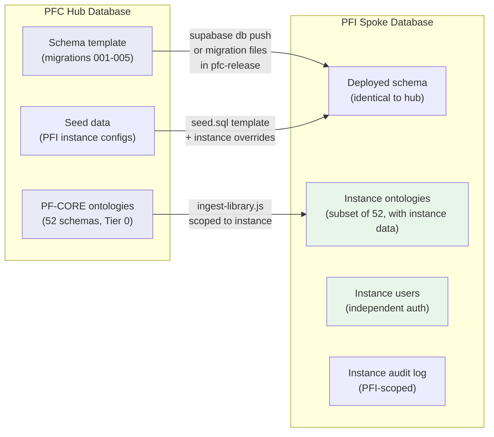

### 5.4 Supabase Table Topology (All Environments)

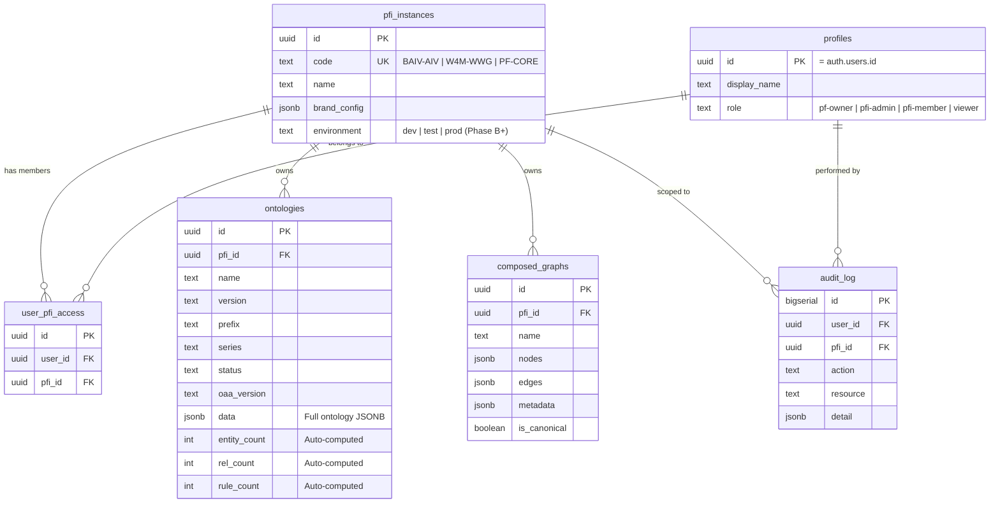

---

## 6. Phased Delivery Plan

### 6.1 Delivery Model: PPM/EFS Structure

Following the VE → PPM/EFS chain, this plan is one **Programme** containing **4 Projects** (phases), each delivering **Features** composed of **Stories**:

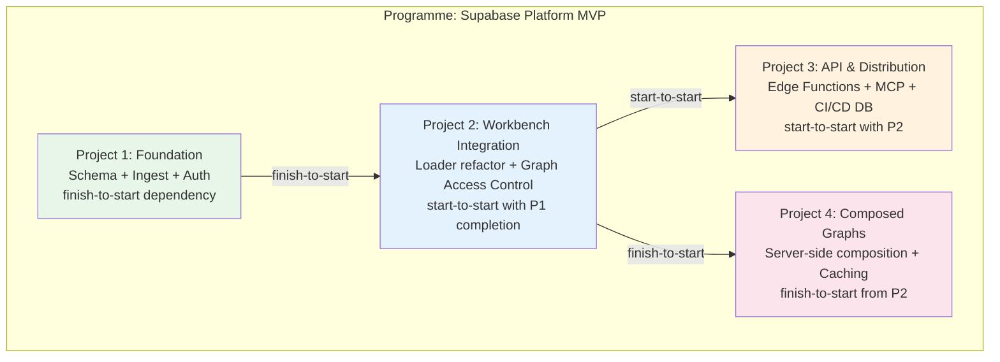

### 6.2 Project 1: Foundation (Schema + Ingest + Auth)

**Why first:** You cannot secure the workbench without a database, and you cannot have a database without a schema. Auth is bundled here because it is the minimum viable "login works" — the trigger for the entire chain.

**Maps to:** Epic 10A F10A.1 + F10A.2 (partial) + F5.1 sub-phase 5a/5c

| Feature | Stories | Description |
|---------|---------|-------------|
| **F-MVP-1.1: Supabase Project & Schema** | 4 | Create project (EU-West), deploy migrations 001+002+005, run seed, verify RLS |
| **F-MVP-1.2: Ontology Ingest Pipeline** | 4 | Write ingest script, map ontologies→PFI scopes, run ingest, verify JSONB views + search |
| **F-MVP-1.3: Authentication Foundation** | 3 | Enable Supabase Auth (email), wire `onAuthStateChange`, create login/logout modal |

**Gate 1:** User signs up → gets viewer role → sees PF-CORE ontologies. RLS blocks cross-PFI reads. 52+ ontologies queryable via JSONB views.

**Graph Access Control at this phase:**
- Layer 1 (Platform Role): Enforced via RLS — 4 roles active
- Layer 2 (PFI Scope): Enforced via `user_pfi_access` + RLS on `pfi_id`
- Layer 3 (Ontology Selection): `instanceOntologies` constraint applied client-side (existing EMC)
- Layer 4 (Entity Scope): Deferred to Project 4

### 6.3 Project 2: Workbench Integration

**Why second:** With auth and data in place, the workbench can switch from static file loading to Supabase-backed graph access with role-aware zone visibility.

**Maps to:** Epic 10A F10A.3 + F10A.4 + F5.1 sub-phase 5b

| Feature | Stories | Description |
|---------|---------|-------------|
| **F-MVP-2.1: Data Source Router** | 3 | Create `supabase-provider.js` + `data-source-router.js`, add supabase-js ESM import |
| **F-MVP-2.2: Loader Refactoring** | 4 | Refactor github-loader, multi-loader, library-manager, pfi-loader to use router |
| **F-MVP-2.3: Role-Aware Zone Visibility** | 3 | Wire `state.userRole` to skeleton zone visibility conditions, PFI context switcher (Z3), protected write actions |
| **F-MVP-2.4: Audit & Security UI** | 3 | Audit log writes on all mutations, audit viewer panel (Z17), connection status indicator |

**Gate 2:** Visualiser loads from Supabase when online, falls back to static files offline. Zone visibility reflects user role. PFI context switcher works. Mutations logged. All 1527 tests pass.

**Skeleton zone mapping at this phase:**

| Zone | Auth Requirement | New Behaviour |
|------|-----------------|---------------|
| Z3 Context Identity | Authenticated | Shows active PFI + user role |
| Z8 Library Panel | member+ for writes | Read-only for viewer |
| Z10 Export Panel | member+ | Hidden for viewer |
| Z16 Context Drawer | admin+ | PFI config (hidden for member/viewer) |
| Z17 Audit Panel | admin+ | Shows PFI-scoped audit log |
| Z22 Skeleton Inspector | pf-owner | Unchanged |

### 6.4 Project 3: API & Distribution

**Why third:** With the workbench secured and data flowing, extend access to Claude agents (MCP) and third-party tools (REST API), and establish the CI/CD pipeline for database schema distribution to PFI spokes.

**Maps to:** Secure Connections Proposal + Epic 31 (partial)

| Feature | Stories | Description |
|---------|---------|-------------|
| **F-MVP-3.1: Edge Functions** | 5 | Deploy 5 Edge Functions with 3-path auth (JWT / service key / API key) |
| **F-MVP-3.2: Thin MCP Server** | 3 | 5-tool MCP server wrapping Edge Functions (~3K tokens) |
| **F-MVP-3.3: API Key Management** | 3 | API keys table, bcrypt hashing, permission arrays, rate limiting |
| **F-MVP-3.4: Schema Distribution Pipeline** | 3 | Package migrations in pfc-release, deploy to PFI spoke repos, verify schema parity |

**Gate 3:** MCP connects and queries ontologies. REST API authenticates with API key. Schema migrations flow from PFC hub to at least one PFI spoke repo.

### 6.5 Project 4: Composed Graphs & Workbench Persistence

**Why last:** Composed graphs build on all previous layers — they need auth (who composes), PFI scope (which ontologies), and the data layer (where to cache).

**Maps to:** F36.11 completion + Epic 19 F19.6/F19.7

| Feature | Stories | Description |
|---------|---------|-------------|
| **F-MVP-4.1: Server-Side Composition** | 3 | Verify `resolve_composed_graph()` with ingested data, wire EMC composer to use RPC when online |
| **F-MVP-4.2: Composed Graph Persistence** | 3 | Save/load composed graphs to `composed_graphs` table, canonical snapshot management |
| **F-MVP-4.3: Workbench Session Persistence** | 2 | Workbench session state (view, filters, selections) persisted to Supabase per user per PFI |

**Gate 4:** Multi-category graph composed server-side, cached in DB, reloadable. Workbench session persists across browser reloads. Canonical snapshot retrievable via MCP.

---

## 7. Delivery Sequence & Dependencies

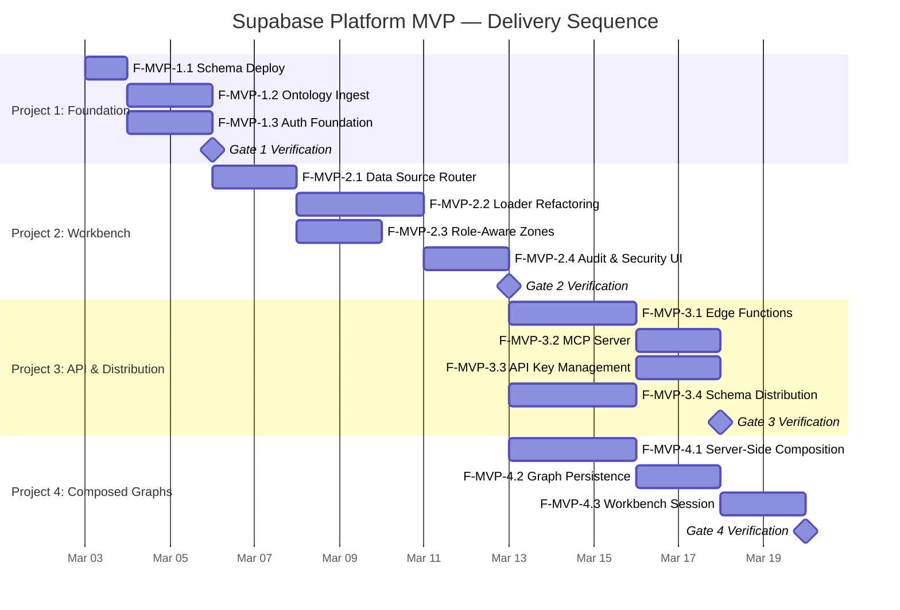

---

## 8. CI/CD Database Distribution Model

### 8.1 Schema as Artefact

Database migrations are treated as **first-class CI/CD artefacts**, flowing through the same hub-and-spoke pipeline as ontologies and visualiser code:

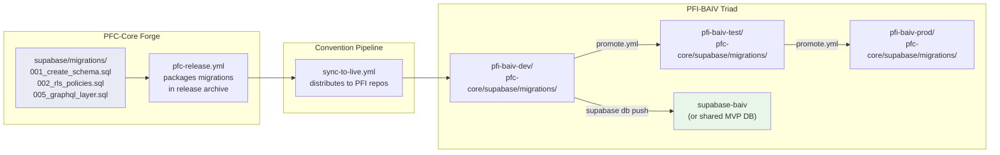

### 8.2 Instance-Specific Migrations

PFI spokes can add their own migrations **after** the PFC-shared ones:

```
pfi-baiv-dev/
  pfc-core/
    supabase/
      migrations/
        001_create_schema.sql       ← from PFC (read-only, guard-core.yml)
        002_rls_policies.sql        ← from PFC
        005_graphql_layer.sql       ← from PFC
  supabase/
    migrations/
      100_baiv_instance_config.sql  ← BAIV-specific (instance-owned)
      101_baiv_seed_ontologies.sql  ← BAIV-specific
    seed.sql                        ← BAIV instance seed data
```

PFC migrations use numbers 001–099. PFI instance migrations use 100+. The `guard-core.yml` gate ensures PFI devs cannot modify PFC migrations.

---

## 9. Cross-Epic Consolidation

### 9.1 Epic/Feature Mapping

This plan draws from and consolidates:

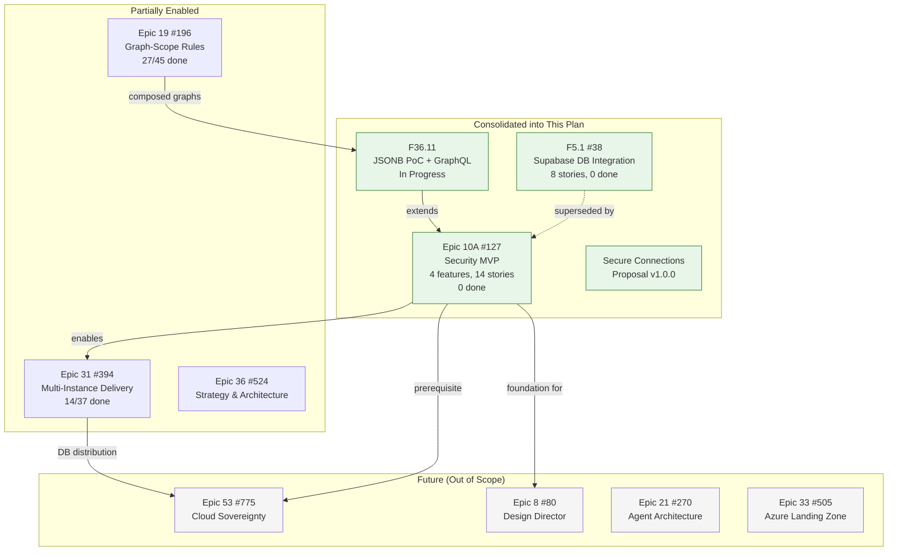

### 9.2 Recommended Actions

| Action | Rationale |
|--------|-----------|
| **Close F5.1 (#38)** as superseded | Scope fully absorbed by Epic 10A + F36.11 |
| **Update Epic 10A (#127)** body | Reference this plan as implementation sequence |
| **Mark F36.11 as dependent** on this plan's Project 1 | Schema deploy is the prerequisite |
| **Update Epic 31 (#394)** | Add F-MVP-3.4 (Schema Distribution) as dependency for PFI triad provisioning |

---

## 10. Module Impact Summary

### New Files (12)

| Project | File | Purpose |
|---------|------|---------|
| 1 | `supabase/scripts/ingest-library.js` | Bulk ontology ingestion |
| 2 | `js/supabase-provider.js` | All Supabase CRUD operations |
| 2 | `js/data-source-router.js` | Online/offline data source routing |
| 2 | `js/auth-ui.js` | Login/logout modal |
| 2 | `js/audit-viewer.js` | Audit log viewer (Z17) |
| 3 | `supabase/functions/pfc-query-ontologies/index.ts` | Edge Function |
| 3 | `supabase/functions/pfc-write-artifact/index.ts` | Edge Function |
| 3 | `supabase/functions/pfc-resolve-config/index.ts` | Edge Function |
| 3 | `supabase/functions/pfc-export-graph/index.ts` | Edge Function |
| 3 | `supabase/functions/pfc-audit-query/index.ts` | Edge Function |
| 3 | `mcp-server/index.ts` | Thin 5-tool MCP server |
| 3 | `supabase/migrations/004_registry.sql` | Config cascade table |

### Modified Files (7)

| Project | File | Change |
|---------|------|--------|
| 2 | `browser-viewer.html` | supabase-js ESM import |
| 2 | `js/github-loader.js` | Route through DataSourceRouter |
| 2 | `js/multi-loader.js` | Route through DataSourceRouter |
| 2 | `js/library-manager.js` | Replace IndexedDB with SupabaseProvider |
| 2 | `js/app.js` | Auth state hooks, zone visibility |
| 4 | `js/emc-composer.js` | Optional server-side composition |
| 4 | `js/supabase-provider.js` | Composed graph CRUD |

### Untouched (30+ modules)

All graph rendering, parsing, EMC category definitions, audit engine, diff engine, mermaid panel, skeleton loader/editor, and UI panel modules remain unchanged. They consume parsed `{nodes, edges}` data — the source is invisible to them.

---

## 11. Risks & Mitigations

| Risk | Impact | Likelihood | Mitigation |
|------|--------|------------|------------|
| Free tier limits (500MB, 50K MAU) | Medium | Low | 52 ontologies ≈ 1MB. Monitor composed_graphs growth. |
| supabase-js breaks zero-build-step | High | Low | ESM import from esm.sh — no bundler needed |
| RLS perf on JSONB GIN queries | Medium | Medium | GIN index in migration 005. Benchmark at Gate 1. |
| Schema drift between hub and spokes | High | Medium | guard-core.yml prevents spoke modification. Drift detection (Epic 31 F31.5). |
| Multi-Supabase-project cost at scale | Medium | Low | Phase A uses 1 project with RLS isolation. Split only when needed. |
| Auth flow disrupts existing static-file users | Low | Low | Phase 2 works without auth. Anonymous read-only mode preserved. |

---

## 12. Explicit Exclusions

| Excluded | Reason | Future Epic |
|----------|--------|-------------|
| Neo4j | Out of scope per directive | Future S1 |
| Sovereign self-hosting (Keycloak, Gitea) | Epic 53 — needs this MVP first | #775 |
| Design Director integration | S2 strategy — needs S1 foundation | #80 |
| Agentic expansion (Agent Manager) | S3 strategy — needs auth + API | #270 |
| Azure Landing Zone | Enterprise deployment | #505 |
| Next.js / shadcn/ui migration | S5 strategy — visualiser stays zero-build-step | Future |
| Real-time subscriptions | GraphQL briefing Phase 3 | Post-MVP |
| Tier 2 (Product) and Tier 3 (Client) scoping | EMC v6.0.0 gaps — needs ProductConfiguration entity | Future |

---

## 13. Decision Points

| # | Decision | Options | Recommendation |
|---|----------|---------|----------------|
| D1 | Supabase region | EU-West-1 (Ireland) vs US-East-1 | **EU-West-1** (UK data, GDPR) |
| D2 | supabase-js loading | CDN `<script>` vs ESM import | **ESM import** (aligns with module pattern) |
| D3 | Phase A: single vs multiple Supabase projects | 1 project (RLS isolation) vs 1 per PFI | **1 project** (cost-effective MVP, split later) |
| D4 | Offline writes | Block vs queue in IndexedDB | **Queue locally**, sync on reconnect |
| D5 | GraphQL vs direct queries | pg_graphql for all vs supabase-js `.from()` | **Direct queries** for MVP; GraphQL for composed graphs |
| D6 | MCP server runtime | Deno vs Node.js | **Deno** (consistent with Edge Functions) |
| D7 | PFI triad DB: shared vs separate per tier | 1 DB per PFI vs 1 per tier | **1 per PFI** initially, split prod when clients go live |
| D8 | Close F5.1 (#38) | Keep open vs close | **Close** — scope fully absorbed |

---

## 14. Success Metrics

| Metric | Target | Gate |
|--------|--------|------|
| Ontologies in Supabase | 52+ | G1 |
| Query latency p95 | < 200ms | G1 |
| Auth round-trip (signup → login → PFI switch) | End-to-end functional | G1 |
| RLS cross-PFI isolation | Verified | G1 |
| Visualiser loads from Supabase | Yes, with fallback | G2 |
| Zone visibility reflects role | Verified | G2 |
| Test suite pass rate | 1527/1527 (100%) | G2 |
| Audit log captures mutations | All writes logged | G2 |
| MCP tool round-trip | < 500ms | G3 |
| MCP token overhead | < 4,000 tokens | G3 |
| Schema parity hub→spoke | Migration checksums match | G3 |
| Server-side graph composition | Functional | G4 |
| Workbench session persists | Across browser reload | G4 |
