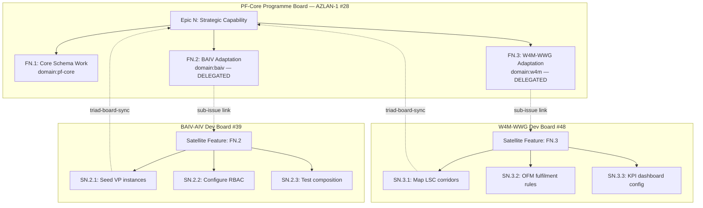
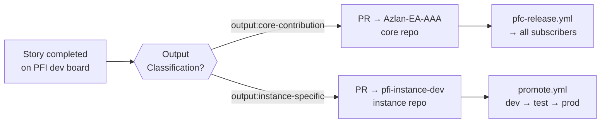
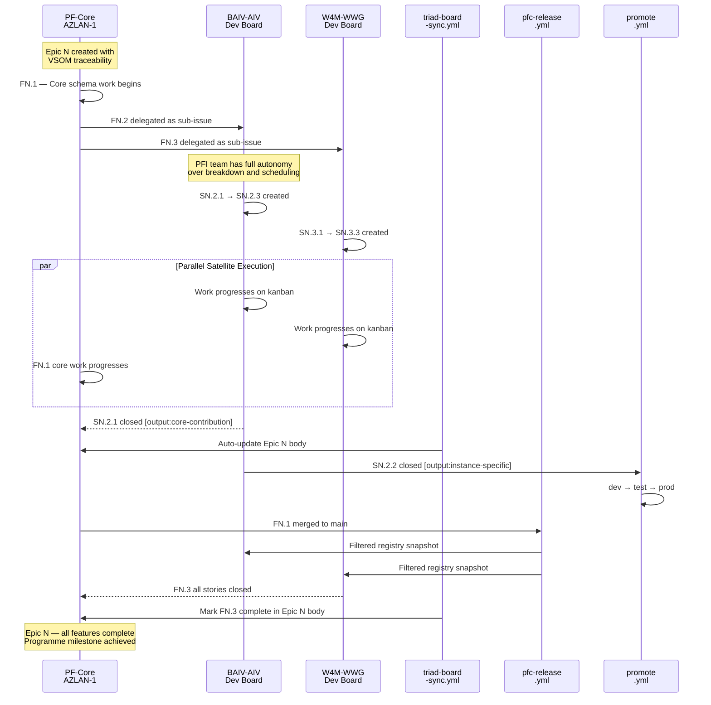
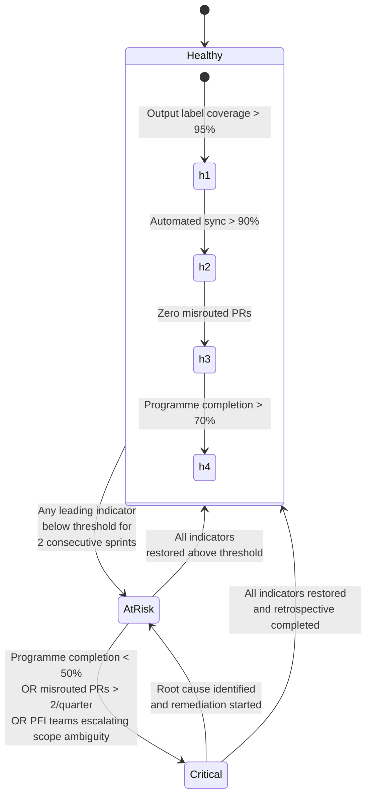
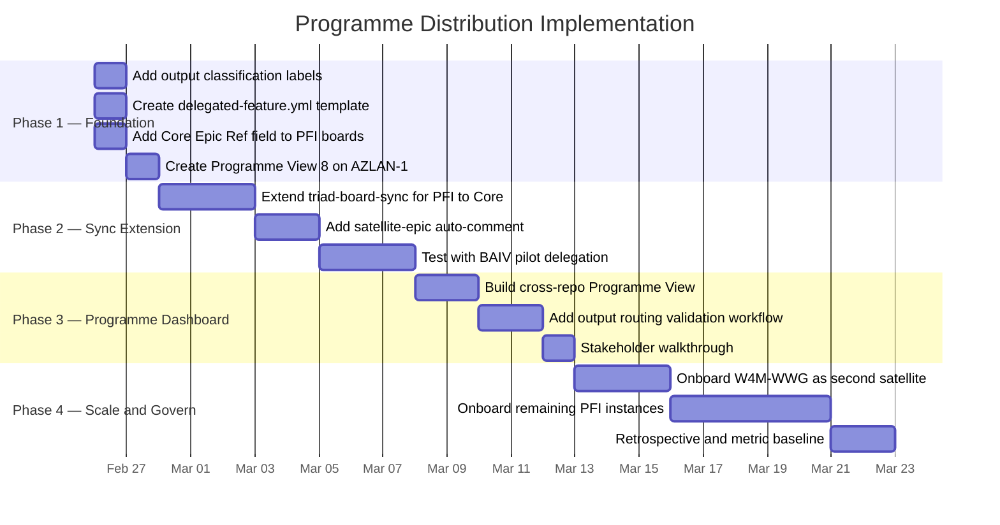
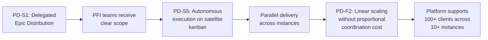
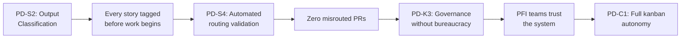
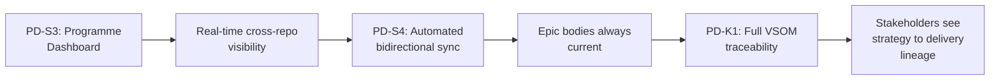
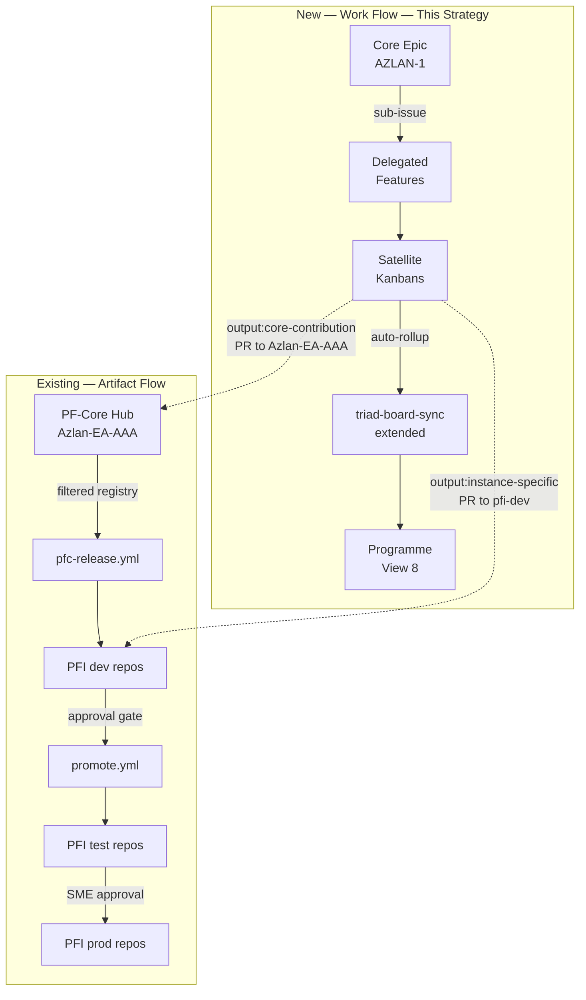
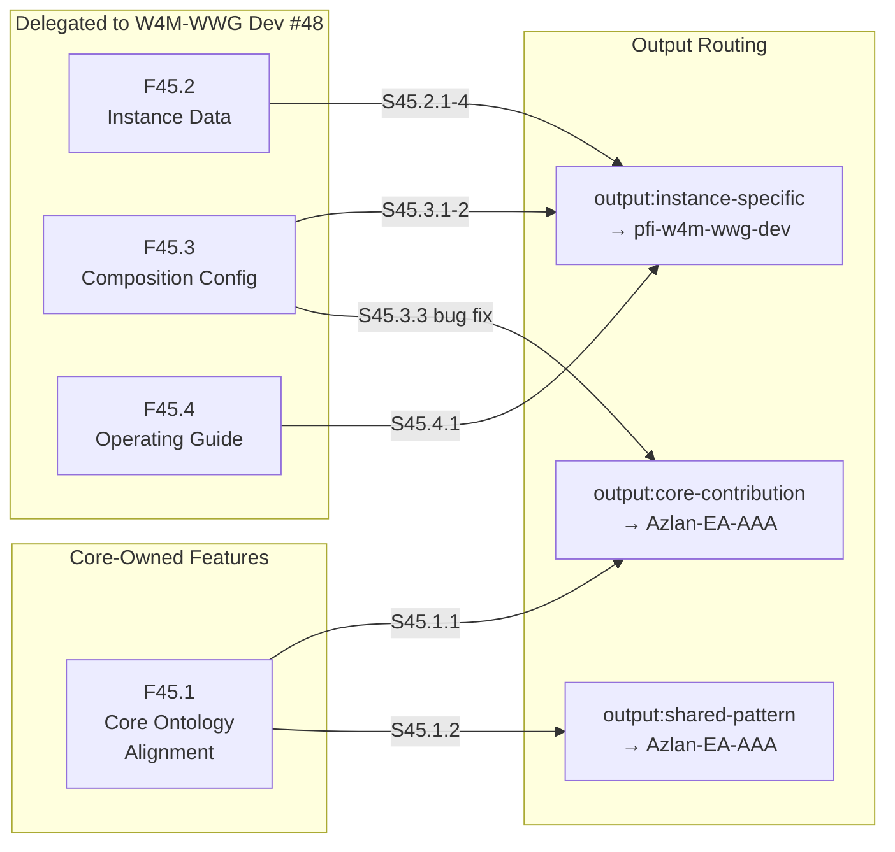

# PF-Core Programme Distribution Strategy

## VSOM Briefing -- Federated Work Orchestration Across PFI Triads

| Field | Value |
|---|---|
| **Date** | 2026-02-25 |
| **Status** | DRAFT -- Strategy for Analysis & Planning |
| **Classification** | CONFIDENTIAL -- Strategic Planning Asset |
| **Parent Epic** | Epic 34: PF-Core Graph-Based Agentic Platform Strategy (#518) |
| **Governs** | All PFI instance triads (#36-#56), AZLAN-1 programme board (#28) |
| **Dependencies** | `pfc-release.yml`, `promote.yml`, `triad-board-sync.yml` |
| **VSOM Alignment** | S4 (Platform Instance & Client Customisation) |

---

## Executive Summary

As the PF-Core platform scales from 5 PFI instances toward 100+ client deployments, **programme-level work orchestration** becomes the binding constraint. Today the hub-and-spoke architecture distributes **artifacts** (ontology registry snapshots, core schemas) flawlessly via `pfc-release.yml` and `promote.yml`. What it does not yet distribute is **work** -- the epics, features, and stories that produce those artifacts.

**The core thesis:** Apply the same hub-and-spoke pattern that governs artifact flow to **programme flow** -- core orchestrates the strategic intent, PFI satellites hold decision-making authority over their value proposition cluster, and all output is automatically classified as either **core-contribution** (flows back to PF-Core) or **instance-specific** (flows through the PFI triad promotion pipeline).

**Three operating principles:**
- **Orchestrate from centre, execute at edge** -- Core defines *what* and *why*; PFI teams decide *how* and *when*
- **Classify all output** -- Every deliverable is tagged for routing before work begins
- **Automate the rollup** -- No manual status updates; `triad-board-sync.yml` propagates completion signals

---

## 1. Current State Assessment

### 1.1 What We Have

| Capability | Mechanism | Status |
|---|---|---|
| Artifact distribution (Hub → Spoke) | `pfc-release.yml` filtered by series subscription | Operational |
| Promotion pipeline (dev → test → prod) | `promote.yml` with approval gates | Operational |
| Board sync (story → epic rollup) | `triad-board-sync.yml` auto-updates epic bodies | Operational |
| Convention enforcement | `validate-issue-naming.yml`, `validate-labels.yml`, `enforce-registry-link.yml` | Operational |
| Programme board | AZLAN-1 (#28), 724 items, 7 views incl. Epic View 6 | Operational |
| PFI dev boards | #36 (VHF), #39 (BAIV), #42 (AIRL), #45 (W4M), #48 (W4M-WWG), #51 (W4M-EOMS) | Operational |
| Custom fields on PFI boards | `Registry ID`, `PBS ID`, `WBS Code`, `Type`, `Priority`, `Estimate` | Operational |
| Domain labels | `domain:pf-core`, `domain:baiv`, `domain:w4m`, `domain:air` | Defined |
| Tier labels | `tier:t1`, `tier:t2`, `tier:t3` | Defined |
| Phase labels | `phase:0` through `phase:5` | Defined |

### 1.2 What's Missing

| Gap | Description | Impact |
|---|---|---|
| **Work item distribution** | No formal mechanism to delegate features from core epics to PFI boards | Programme bottleneck -- core team becomes single point of failure |
| **Output classification** | No labelling to distinguish core-contribution from instance-specific output | Merge conflicts, unclear PR routing, duplicated effort |
| **Programme dashboard** | AZLAN-1 lacks a cross-repo programme view grouped by PFI instance | No visibility of satellite progress from core |
| **Delegated feature template** | PFI repos have no issue template linking back to parent core epics | Traceability breaks at the core/instance boundary |
| **Bidirectional sync** | `triad-board-sync.yml` only syncs within a triad; no rollup from PFI → core epic | Core epic body goes stale on delegated features |

---

## 2. VSOM Framework -- Programme Distribution

### 2.1 Vision

> **Operate a federated programme of work where PF-Core orchestrates strategic intent, PFI satellites exercise autonomous decision-making over their value proposition cluster, and all output is automatically classified, tracked, and consolidated -- enabling sustainable scaling from 5 instances and 15 repos to 100+ client deployments without programme management bottleneck.**

**Three-level programme hierarchy:**

```
Programme Level        Governed By           Board
────────────────────   ────────────────────   ────────────────────
PF-Core (Orchestrator) AZLAN-1 (#28)         Epic View 6 + Programme View 8
  ├── PFI-BAIV         BAIV-AIV Dev (#39)    Instance Kanban
  ├── PFI-AIRL         AIRL-CAF-AZA Dev (#42) Instance Kanban
  ├── PFI-W4M          W4M Dev (#45)         Instance Kanban
  ├── PFI-W4M-WWG      W4M-WWG Dev (#48)     Instance Kanban
  ├── PFI-W4M-EOMS     W4M-EOMS Dev (#51)    Instance Kanban
  └── PFI-VHF          VHF Dev (#36)         Instance Kanban
```

### 2.2 Five Strategies

| # | Strategy | Priority | Focus |
|---|---|---|---|
| **PD-S1** | Delegated Epic Distribution | 1 -- Structure | Cross-repo sub-issues link core epics to PFI satellite features |
| **PD-S2** | Output Classification & Routing | 2 -- Governance | Every deliverable tagged `output:core-contribution` or `output:instance-specific` before work begins |
| **PD-S3** | Programme Dashboard | 3 -- Visibility | Unified cross-repo view on AZLAN-1 grouped by PFI domain |
| **PD-S4** | Automated Bidirectional Sync | 4 -- Efficiency | Extend `triad-board-sync.yml` to propagate PFI completions back to core epic bodies |
| **PD-S5** | PFI Decision Autonomy | 5 -- Scalability | Satellite teams own their kanban, breakdown, and scheduling within delegated scope |

---

## 3. Programme Distribution Architecture

### 3.1 Delegated Epic Flow

The programme operates on a **distribute-execute-consolidate** cycle. Core epics decompose into features, each classified as core-owned or PFI-delegated. Delegated features become satellite issues on PFI dev boards, linked back via GitHub sub-issues.



### 3.2 Output Classification & Routing

Every story within a delegated feature carries an output classification that determines its routing path. This is the critical governance mechanism that prevents merge conflicts and ensures artefacts reach the correct destination.



**Classification rules:**

| Output Type | Label | Routing | Examples |
|---|---|---|---|
| **Core Contribution** | `output:core-contribution` | PR to `Azlan-EA-AAA`, then `pfc-release.yml` distributes to all subscribers | New ontology entity, schema fix, visualiser feature, EMC composition rule |
| **Instance Specific** | `output:instance-specific` | PR to `pfi-{instance}-dev`, then `promote.yml` through triad | VP instance data, RBAC config, instance-specific KPI targets, Supabase seeds |
| **Shared Pattern** | `output:shared-pattern` | PR to `Azlan-EA-AAA` as a reusable pattern, then selectively adopted by PFIs | Join pattern template, dashboard layout, agent skill template |

### 3.3 Full Programme Lifecycle

The complete lifecycle from strategic intent to deployed capability, showing how work flows through the federated programme model:



---

## 4. Balanced Scorecard Objectives

### 4.1 Financial Perspective

| ID | Objective | Target | Leading Indicator |
|---|---|---|---|
| **PD-F1** | Reduce programme management overhead per PFI instance | < 2 hrs/week core coordination per instance | Automated sync coverage (% of status updates requiring no manual intervention) |
| **PD-F2** | Enable linear scaling of instances without proportional coordination cost | Support 10 PFI instances with same core team | Ratio of delegated features to core-managed features |
| **PD-F3** | Accelerate time-to-delivery for instance-specific capabilities | 40% faster than core-managed equivalent | Mean cycle time: delegation → PFI delivery → promotion |

### 4.2 Customer Perspective (PFI Teams as Internal Customers)

| ID | Objective | Target | Leading Indicator |
|---|---|---|---|
| **PD-C1** | PFI teams have full kanban autonomy within delegated scope | Zero core-imposed scheduling constraints on satellite stories | % of satellite stories where PFI team set their own priority |
| **PD-C2** | Clear scope boundaries eliminate ambiguity | 100% of delegated features have explicit output classification | Output label coverage at story creation time |
| **PD-C3** | PFI teams receive timely core updates without disruption | < 24 hrs from core merge to PFI dev repo PR | Release pipeline latency (merge → PR creation) |

### 4.3 Internal Process Perspective

| ID | Objective | Target | Leading Indicator |
|---|---|---|---|
| **PD-P1** | Zero manual epic body updates for delegated features | 100% automated via `triad-board-sync.yml` extension | Manual edit count on epic bodies per sprint |
| **PD-P2** | All output correctly routed (core vs instance) | Zero misrouted PRs per quarter | PR target repo matches output classification label |
| **PD-P3** | Programme dashboard reflects real-time satellite status | < 5 min staleness on AZLAN-1 Programme View | Time delta between PFI board change and AZLAN-1 reflection |
| **PD-P4** | New PFI instance onboarding follows template | < 1 day from decision to first delegated feature | Steps required to create triad + board + first delegation |

### 4.4 Learning & Growth Perspective

| ID | Objective | Target | Leading Indicator |
|---|---|---|---|
| **PD-L1** | Codify programme patterns as reusable templates | Delegated feature template, satellite epic template, output routing guide | Template artifact count in `azlan-github-workflow` repo |
| **PD-L2** | PFI teams self-sufficient in delegation workflow | Zero support requests after first guided delegation cycle | Support ticket count per PFI team per month |
| **PD-L3** | Continuous improvement of sync automation | Quarterly review of sync gap analysis | New automation rules added per quarter |

### 4.5 Stakeholder Perspective

| ID | Objective | Target | Leading Indicator |
|---|---|---|---|
| **PD-K1** | Full VSOM traceability from vision to delivered instance capability | Every delegated feature traces to a core strategy (S1-S6) | Traceability coverage in programme view |
| **PD-K2** | Transparent programme status for all stakeholders | Single-URL programme dashboard on AZLAN-1 | View access count, stakeholder satisfaction |
| **PD-K3** | Governance without bureaucracy | Automated classification + routing replaces manual approvals for output routing | Ratio of automated decisions to manual escalations |

---

## 5. Metrics Framework

### 5.1 Key Leading Indicators

| Metric | Measurement | Threshold | Source |
|---|---|---|---|
| **Output label coverage** | % of satellite stories with `output:*` label at creation | > 95% | GitHub label audit |
| **Delegation cycle time** | Hours from core epic creation to first PFI satellite story | < 4 hrs | Issue timestamp delta |
| **Automated sync coverage** | % of epic body updates performed by `triad-board-sync.yml` | > 90% | Workflow run logs |
| **PFI board activity** | Stories moved per week per PFI board | > 3 per active instance | GitHub Project API |
| **Core-contribution PR rate** | PRs from PFI repos targeting `Azlan-EA-AAA` per month | Trending upward | `gh pr list` |

### 5.2 Key Lagging Indicators

| Metric | Measurement | Threshold | Source |
|---|---|---|---|
| **Programme completion rate** | % of delegated features marked complete in epic body per quarter | > 70% | Epic body audit |
| **Promotion velocity** | Mean days from PFI dev merge to prod deployment | < 14 days | `promote.yml` logs |
| **Misrouted PRs** | PRs opened against wrong target repo | 0 per quarter | PR audit |
| **Instance scaling factor** | Number of active PFI instances / core coordination FTE | > 5:1 | Operational tracking |
| **Satellite autonomy score** | % of satellite stories completed without core intervention | > 80% | Story audit (no core-team comments) |

### 5.3 Health Thresholds



---

## 6. Implementation Phases

### 6.1 Phase Overview



### 6.2 Phase 1 -- Foundation (Day 1-2)

**Goal:** Establish the structural mechanisms for work distribution.

| Deliverable | Effort | Mechanism |
|---|---|---|
| Labels: `output:core-contribution`, `output:instance-specific`, `output:shared-pattern` | 10 min | Add to `azlan-github-workflow/labels.yml`, sync to all repos |
| Issue template: `delegated-feature.yml` for PFI repos | 15 min | Template with parent epic ref, output classification dropdown, PFI scope fields |
| Custom field: `Core Epic Ref` (text) on all PFI dev boards | 10 min | `gh project field-create` on #36, #39, #42, #45, #48, #51 |
| Programme View 8 on AZLAN-1 | 15 min | Table view, grouped by domain label, filtered to `type:epic` + `type:feature`, showing sub-issues progress |

### 6.3 Phase 2 -- Sync Extension (Day 3-7)

**Goal:** Close the bidirectional sync gap so core epics auto-update when satellite work completes.

| Deliverable | Effort | Mechanism |
|---|---|---|
| Extend `triad-board-sync.yml` | ~2 hrs | On satellite story close: find `Core Epic Ref` field, update parent epic body on `Azlan-EA-AAA` via `gh issue edit --body-file` |
| Auto-comment on core epic | ~1 hr | When satellite feature closes: post comment with summary, output classification, and link to PFI board |
| BAIV pilot | ~2 hrs | Create test epic with delegated feature to BAIV-AIV Dev, run full cycle, validate sync |

### 6.4 Phase 3 -- Programme Dashboard (Day 8-12)

**Goal:** Single-URL visibility of all programme activity across satellites.

| Deliverable | Effort | Mechanism |
|---|---|---|
| Cross-repo Programme View on AZLAN-1 | ~1 hr | GitHub Projects v2 supports cross-repo items; group by `domain:*`, columns: Title, Status, Repository, Sub-issues Progress, Priority |
| Output routing validation | ~2 hrs | New workflow: on PR open, check if story has `output:*` label, validate PR target matches label (core-contribution → Azlan-EA-AAA, instance-specific → pfi-*-dev) |
| Stakeholder walkthrough | ~1 hr | Guided tour of programme view with live data from BAIV pilot |

### 6.5 Phase 4 -- Scale & Govern (Day 13-25)

**Goal:** Prove the model at scale across all PFI instances.

| Deliverable | Effort | Mechanism |
|---|---|---|
| Onboard W4M-WWG | ~2 hrs | Second satellite, validate with Epic 45 stories |
| Onboard remaining instances | ~4 hrs | AIRL, W4M, W4M-EOMS, VHF -- template-driven |
| Metric baseline | ~1 hr | Capture first readings for all leading/lagging indicators |
| Retrospective | ~1 hr | Document lessons learned, update this strategy |

---

## 7. Cause-Effect Chains

### 7.1 Programme Scalability Chain



### 7.2 Governance Without Bureaucracy Chain



### 7.3 Visibility & Traceability Chain



---

## 8. Traceability Matrix

| Strategy | Objective | Leading Metric | Lagging Metric | Owner |
|---|---|---|---|---|
| **PD-S1** Delegated Epic Distribution | PD-C1 (PFI autonomy), PD-F2 (linear scaling) | Delegation cycle time < 4 hrs | Programme completion > 70% | Core Programme Lead |
| **PD-S2** Output Classification & Routing | PD-P2 (correct routing), PD-K3 (governance) | Output label coverage > 95% | Misrouted PRs = 0 | Core Programme Lead |
| **PD-S3** Programme Dashboard | PD-K1 (traceability), PD-K2 (transparency) | PFI board activity > 3/week | Stakeholder satisfaction | Core Programme Lead |
| **PD-S4** Automated Bidirectional Sync | PD-P1 (zero manual updates), PD-P3 (real-time) | Automated sync coverage > 90% | Epic body staleness < 5 min | DevOps / Workflow |
| **PD-S5** PFI Decision Autonomy | PD-C1 (kanban autonomy), PD-L2 (self-sufficiency) | PFI priority self-set > 95% | Satellite autonomy score > 80% | PFI Instance Leads |

---

## 9. Integration with Existing Architecture

### 9.1 Relationship to Existing Workflows

This programme distribution model layers **on top of** the existing hub-and-spoke CI/CD architecture. It does not replace any existing workflow -- it extends the pattern from artifact distribution to work distribution.



### 9.2 Alignment to Platform Strategy (S1-S6)

| Platform Strategy | Programme Distribution Alignment |
|---|---|
| **S1** Graph-First Architecture | Core schema epics distributed to PFI satellites for instance-specific graph work |
| **S2** VE-Driven Everything | Every delegated feature traces to VSOM objective via programme traceability matrix |
| **S3** Agentic Orchestration | Agent skill development delegated to PFI teams closest to domain knowledge |
| **S4** Instance & Client Customisation | **Direct alignment** -- PD-S1 through PD-S5 operationalise S4 at programme level |
| **S5** UI/UX Design-to-Production | Design system tokens distributed as core; screen implementations delegated to instances |
| **S6** Integration & Enterprise Architecture | API/MCP integration work delegated to PFI teams who own the integration context |

### 9.3 PFI Instance Readiness for Programme Distribution

| Instance | Readiness | Priority for Delegation | Rationale |
|---|---|---|---|
| **PFI-BAIV** | 80% | Phase 2 pilot | Most mature instance, 16 agents, full ontology coverage |
| **PFI-W4M-WWG** | 40% | Phase 4 first | Active epic (#634), 7 ontologies declared, operating guide exists |
| **PFI-AIRL** | 60% | Phase 4 second | Strong RCSG alignment, but missing RBAC and competitive |
| **PFI-W4M-EOMS** | 40% | Phase 4 third | Shares W4M foundation, can leverage W4M-WWG learnings |
| **PFI-VHF** | 30% | Phase 4 last | PoC instance, lowest priority for programme distribution |

---

## 10. Delegated Feature Template

The following template would be added to all PFI dev repos as `.github/ISSUE_TEMPLATE/delegated-feature.yml`:

```yaml
name: Delegated Feature
description: Feature delegated from a PF-Core epic to this PFI instance
title: "FN.x: "
labels: ["type:feature"]
body:
  - type: markdown
    attributes:
      value: |
        ## Delegated Feature
        This feature has been delegated from a PF-Core epic.
        The PFI team has full autonomy over story breakdown,
        prioritisation, and scheduling within the delegated scope.

  - type: input
    id: core-epic
    attributes:
      label: Parent Core Epic
      description: "Link to the parent epic on Azlan-EA-AAA"
      placeholder: "ajrmooreuk/Azlan-EA-AAA#"
    validations:
      required: true

  - type: input
    id: core-feature
    attributes:
      label: Parent Core Feature
      description: "Feature ID within the parent epic"
      placeholder: "FN.x"
    validations:
      required: true

  - type: dropdown
    id: output-type
    attributes:
      label: Primary Output Classification
      description: "Where will most deliverables from this feature be routed?"
      options:
        - "instance-specific — stays in this PFI triad"
        - "core-contribution — PR back to Azlan-EA-AAA"
        - "shared-pattern — reusable template for other PFIs"
    validations:
      required: true

  - type: textarea
    id: scope
    attributes:
      label: Delegated Scope
      description: "What has been delegated to this PFI team?"
      placeholder: |
        - Seed VP instances for [domain]
        - Configure RBAC roles
        - Test EMC composition with instance ontologies
    validations:
      required: true

  - type: textarea
    id: acceptance
    attributes:
      label: Acceptance Criteria
      description: "How will the core team know this delegation is complete?"
      placeholder: |
        - [ ] All stories closed and output correctly routed
        - [ ] Core epic body updated via triad-board-sync
        - [ ] Promotion to test initiated if instance-specific
```

---

## 11. Worked Example -- Epic 45 (W4M-WWG)

Applying the programme distribution model to the active W4M-WWG epic:

```
Epic 45: W4M-WWG PFI Instance (#634)                     AZLAN-1
│
├── F45.1: Core ontology alignment (LSC, OFM)             domain:pf-core
│   ├── S45.1.1: LSC corridor entity modelling            output:core-contribution
│   └── S45.1.2: OFM fulfilment pattern                   output:shared-pattern
│
├── F45.2: W4M-WWG instance data [DELEGATED]              domain:w4m
│   │                                                      Satellite on W4M-WWG Dev (#48)
│   ├── S45.2.1: 4 VP instances (AU/NZ/IS/IE)            output:instance-specific
│   ├── S45.2.2: 7 RRR roles                              output:instance-specific
│   ├── S45.2.3: 4 LSC corridors                          output:instance-specific
│   └── S45.2.4: 82 OFM entities                          output:instance-specific
│
├── F45.3: W4M-WWG composition config [DELEGATED]         domain:w4m
│   │                                                      Satellite on W4M-WWG Dev (#48)
│   ├── S45.3.1: EMC instance configuration               output:instance-specific
│   ├── S45.3.2: 3 requirement scopes                     output:instance-specific
│   └── S45.3.3: EMC constrainToInstanceOntologies fix    output:core-contribution
│
└── F45.4: W4M-WWG operating guide                        domain:w4m
    └── S45.4.1: Visualiser operating guide               output:instance-specific
```

**Key insight:** S45.3.3 demonstrates the critical pattern -- a bug discovered during instance work that must flow back to core. The `output:core-contribution` label ensures it becomes a PR against `Azlan-EA-AAA` rather than staying trapped in the W4M-WWG triad.



---

## 12. Competitive Moat

This programme distribution model creates structural advantages that compound over time:

| Moat Dimension | Mechanism |
|---|---|
| **Speed** | Parallel satellite execution -- N instances deliver simultaneously, not sequentially |
| **Quality** | Instance teams are domain experts; they make better decisions about their value proposition than core ever could |
| **Feedback density** | Core-contribution output from 5+ instances surfaces patterns, edge cases, and improvements no single team would find |
| **Onboarding velocity** | Template-driven delegation means new PFI instances are productive in days, not weeks |
| **Governance scalability** | Automated classification + routing replaces manual coordination that would collapse at scale |

---

## Appendix A: Glossary

| Term | Definition |
|---|---|
| **AZLAN-1** | Main GitHub Project (#28) -- programme board for all Azlan-EA-AAA work |
| **Core-contribution** | Output from PFI satellite work that flows back to the PF-Core hub repo |
| **Delegated feature** | A feature within a core epic that is assigned to a PFI satellite team for autonomous execution |
| **Hub-and-spoke** | Architecture pattern where PF-Core is the hub and PFI instance triads are spokes |
| **Instance-specific** | Output from PFI work that stays within the PFI triad promotion pipeline |
| **Output classification** | Mandatory label on every satellite story determining its routing path |
| **PFI** | PF-Instance -- a domain-specific deployment of the PF-Core platform (e.g., BAIV, W4M-WWG) |
| **Programme View** | Cross-repo view on AZLAN-1 showing aggregated status of all delegated features |
| **Satellite epic/feature** | The PFI-side issue that mirrors a delegated feature from a core epic |
| **Shared pattern** | Output that becomes a reusable template adopted by other PFI instances |
| **Triad** | The three-repo structure (dev/test/prod) for each PFI instance |
| **VSOM** | Vision, Strategy, Objectives, Metrics -- the governing strategic framework |
| **BSC** | Balanced Scorecard -- five-perspective objective framework (Financial, Customer, Internal Process, Learning & Growth, Stakeholder) |

---

## Appendix B: GitHub Infrastructure Reference

| Resource | ID | Purpose |
|---|---|---|
| AZLAN-1 Programme Board | Project #28 | Core programme orchestration |
| BAIV-AIV Dev Board | Project #39 | BAIV satellite kanban |
| AIRL-CAF-AZA Dev Board | Project #42 | AIRL satellite kanban |
| W4M Dev Board | Project #45 | W4M satellite kanban |
| W4M-WWG Dev Board | Project #48 | W4M-WWG satellite kanban |
| W4M-EOMS Dev Board | Project #51 | W4M-EOMS satellite kanban |
| VHF Dev Board | Project #36 | VHF satellite kanban |
| `pfc-release.yml` | `.github/workflows/` | Artifact distribution (hub → spoke) |
| `promote.yml` | `AZLAN-CI-CD` repo | Triad promotion (dev → test → prod) |
| `triad-board-sync.yml` | `AZLAN-CI-CD` repo | Board sync automation |
| `azlan-github-workflow` | Template repo | Convention templates and label definitions |

---

*Document Status: DRAFT -- Strategy for Analysis & Planning*
*VSOM Alignment: S4 (Platform Instance & Client Customisation)*
*Next Action: Review and approve for Phase 1 implementation*
