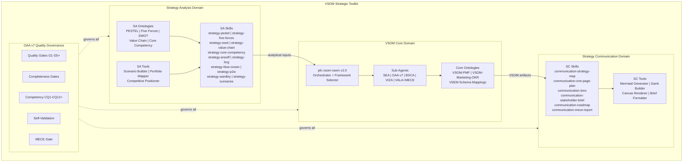
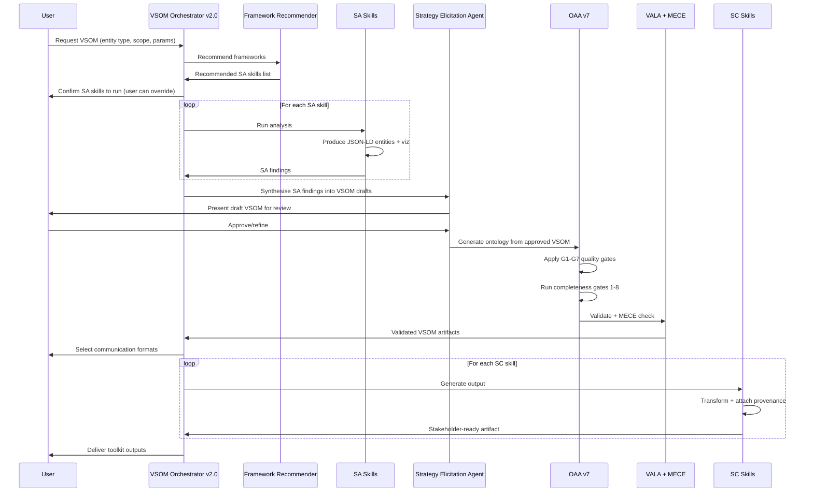
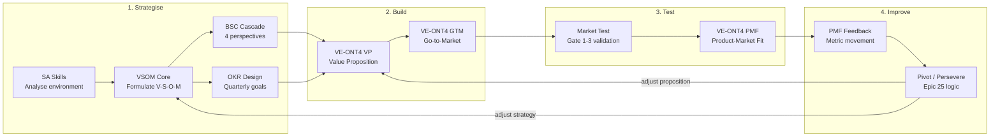
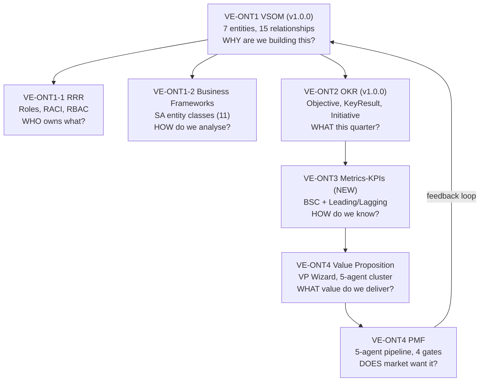
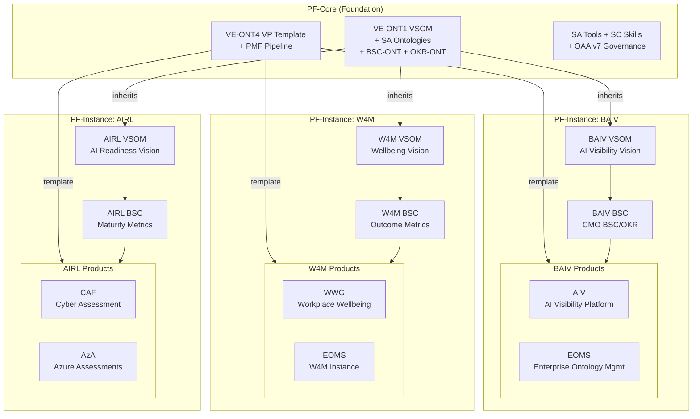
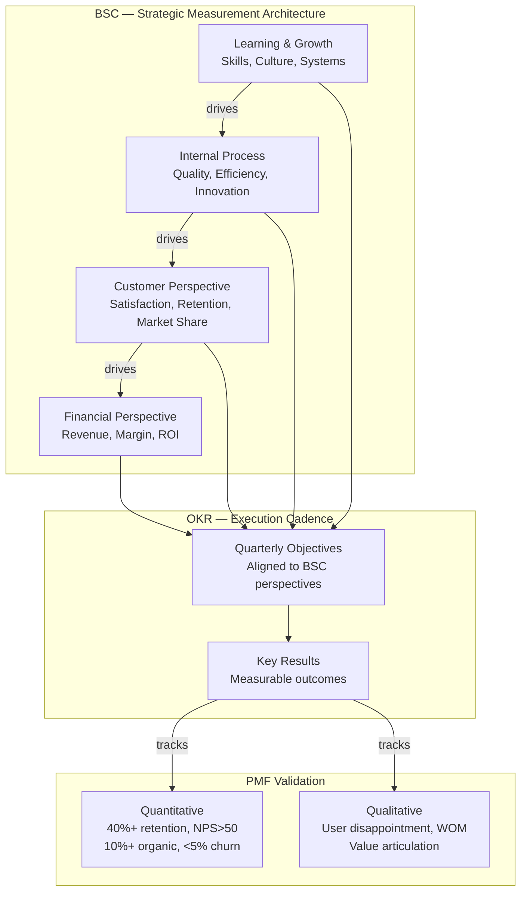
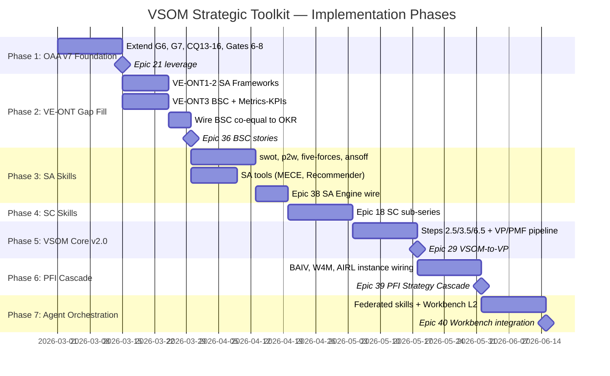

# VSOM Strategic Toolkit — Unified Plan v1.0.1

> **Governed by:** OAA v7 Expanded Quality Management
> **Registry:** Change-controlled artifact
> **Date:** 2026-02-22

---

## Vision

Build a comprehensive, ontology-driven **VSOM Strategic Toolkit** — a unified system of ontologies, skills, and tools that enables an LLM-augmented agent to analyse strategic environments, formulate VSOM content, and communicate strategy effectively. Governed by OAA v7 expanded quality management.

## Strategy

Position VSOM not as a single skill but as a **complete strategic capability platform** comprising three integrated domains:

- **Strategy Analysis (SA)** — ontologies, tools, and skills that determine what the VSOM *should* contain
- **VSOM Core** — the existing pfc-vsom-vsem skill enhanced as the central orchestration hub
- **Strategy Communication (SC)** — skills and tools that translate VSOM outputs for stakeholder consumption

All three domains are governed by OAA v7's expanded quality management (G1-G5 quality gates, CQ1-CQ12 competency questions, completeness gates, self-validation) and registered as change-controlled artifacts in the unified registry.

---

## Toolkit Architecture

The three domains operate under a unified OAA v7 quality governance layer. SA feeds analytical inputs into VSOM Core, which produces ontology-aligned artifacts consumed by SC for stakeholder outputs.



---

## Current State

### VE Ontology Series (Building Blocks)

The Value Engineering ontology series provides the strategic-to-execution cascade:

| Ontology | Status | Purpose |
|----------|--------|---------|
| **VE-ONT1 VSOM** (v1.0.0) | Production | 7 entities, 15 relationships, 96/100 quality — WHY are we building this? |
| **VE-ONT1-1 RRR** | Production | Roles, RACI, RBAC with C-Suite specialisations — WHO owns what? |
| **VE-ONT1-2 Business Frameworks** | Placeholder | SA frameworks not yet codified — HOW do we analyse? |
| **VE-ONT2 OKR** (v1.0.0) | Production | Objective, KeyResult, Initiative, Metric — WHAT this quarter? |
| **VE-ONT3 Metrics-KPIs** | Placeholder | BSC + Leading/Lagging design — HOW do we know? |
| **VE-ONT4 Value Proposition** | Production | VP Wizard, 5-agent cluster, VP-ONT v1.1.0 — WHAT value do we deliver? |
| **VE-ONT4 PMF** | Production | 5-agent pipeline, 4 decision gates — DOES market want it? |
| **VE-PFI-BAIV Instances** | Active | BAIV-specific CMO BSC/OKR, RRR C-Suite, BAIV VSOM |

### VE Agent SDK Architecture

Three operational clusters per PF-Core_VE_AgentSDK_Scope_v1.0.0:

- **Strategic cluster** (REASON mode) — VSOM Architect, Strategy Validator
- **Generation cluster** (OPERATE mode) — VP Wizard, GTM Strategist, PMF Validator
- **Intelligence cluster** (ANALYZE mode) — Gap Analyst, Hypothesis Validator, Trend Forecaster

Value cascade traceability: VSOM → Value Prop → GTM → PMF

### Existing Skills & Agents

- `pfc-vsom-vsem` skill — 6-step workflow with 5 sub-agents (OAA, SEA, BSCA, VIZA, VALA)
- VSOM-Marketing-OKR ontology — AI agent usage patterns, SPARQL queries, 10 entity types
- Schema.org JSON-LD mappings for all VSEM classes
- OAA v7 — quality gates G1-G5+, completeness gates, CQ1-CQ12+, self-validation, Python validators (Phase 1.5 delivered per Epic 21 #270)

### Gaps

- **VE-ONT1-2** Business Frameworks empty — SA frameworks not yet codified as ontology entities
- **VE-ONT3** Metrics-KPIs empty — BSC + Leading/Lagging metric design not yet built
- No unified skill orchestrating the full SA → VSOM → VP → GTM → PMF pipeline
- No continuous improvement feedback loop from PMF back to VSOM (ontology-level)
- Epic 38 SA Engine not yet started — patterns exist (Epics 22b-28) but not wired into pipeline
- SC skills from Epic 18 not yet implemented as sub-skills of the toolkit
- BSC not yet a first-class measurement framework alongside OKR in the orchestrator

---

## Domain 1: Strategy Analysis (SA)

### SA Ontologies

A `strategy-analysis` ontology registered in the unified registry, extending Schema.org with 11 entity classes:

- `sa:EnvironmentFactor` (extends `schema:DefinedTerm`) — PESTEL factors with impact/probability scores
- `sa:IndustryForce` (extends `schema:Intangible`) — Five Forces entities with intensity ratings
- `sa:SWOTItem` (extends `schema:DefinedTerm`) — Strength/Weakness/Opportunity/Threat with strategic implications
- `sa:ValueActivity` (extends `schema:Action`) — Primary and support activities with margin contribution
- `sa:CoreCompetency` (extends `schema:DefinedTerm`) — Prahalad & Hamel capabilities with defensibility score
- `sa:GrowthVector` (extends `schema:Plan`) — Ansoff matrix position with risk/return profile
- `sa:PortfolioPosition` (extends `schema:QuantitativeValue`) — BCG quadrant with relative market share and growth rate
- `sa:ERRCAction` (extends `schema:Action`) — Blue Ocean Eliminate/Reduce/Raise/Create actions
- `sa:StrategicChoice` (extends `schema:Plan`) — Playing to Win cascading choice
- `sa:WardleyComponent` (extends `schema:SoftwareSourceCode`) — Component with evolution stage and visibility
- `sa:Scenario` (extends `schema:CreativeWork`) — Plausible future with probability and VSOM implications

**Relationships:**

- `sa:informs` → `vsem:StrategicVision` | `vsem:StrategicInitiative`
- `sa:evidences` → `vsem:StrategicObjective`
- `sa:constrains` → `vsem:StrategicKPI`
- `sa:synthesisedFrom` → (cross-framework linkage, e.g. PESTEL findings feed SWOT)

### SA Tools

Reusable utilities consumed by multiple skills:

- **Scenario Builder** — Generates structured scenario sets from environment factors
- **Portfolio Mapper** — Positions entities on 2x2 matrices (BCG, Ansoff, GE)
- **Competitive Positioner** — Scores competitive intensity from Five Forces inputs
- **MECE Checker** — Validates any decomposition for mutual exclusivity and collective exhaustiveness
- **Framework Recommender** — Given entity type, scope, and available data, recommends which SA skills to run

### SA Skills (14 skills)

Each skill produces JSON-LD ontology entities, optional Mermaid visualisations, and recommendations that feed into SEA.

**External Environment (3 skills)**

- `strategy-pestel` — Produces `sa:EnvironmentFactor` entities across 6 dimensions. Uses Scenario Builder tool. Feeds SWOT opportunities/threats.
- `strategy-five-forces` — Produces `sa:IndustryForce` entities. Uses Competitive Positioner tool. Feeds `vsem:CompetitivePositioning` and SWOT threats.
- `strategy-scenarios` — Produces `sa:Scenario` entities. Uses Scenario Builder tool. Stress-tests Vision robustness across 3-4 plausible futures.

**Internal Environment (3 skills)**

- `strategy-swot` — Synthesises `sa:SWOTItem` entities from PESTEL and Five Forces outputs plus internal assessment. Produces SWOT matrix Mermaid diagram. Primary feeder to Strategy layer.
- `strategy-value-chain` — Produces `sa:ValueActivity` entities linked to `vsem:OperationalCapability`. Identifies where value is created and where costs accumulate.
- `strategy-core-competency` — Produces `sa:CoreCompetency` entities with defensibility scores. Feeds `vsem:CompetitivePositioning.basis`.

**Strategic Choice (5 skills)**

- `strategy-ansoff` — Produces `sa:GrowthVector` recommendation. Uses Portfolio Mapper tool for 2x2 positioning.
- `strategy-bcg` — Produces `sa:PortfolioPosition` entities. Uses Portfolio Mapper tool. Feeds resource allocation in Strategy layer.
- `strategy-blue-ocean` — Produces `sa:ERRCAction` entities. Generates value curve Mermaid diagram. Feeds differentiation into Strategy and Objectives.
- `strategy-p2w` — Produces `sa:StrategicChoice` cascade (winning aspiration → where to play → how to win → capabilities → management systems). Maps directly to VSOM layers: aspiration=Vision, where/how=Strategy, capabilities=Objectives, systems=Metrics.
- `strategy-wardley` — Produces `sa:WardleyComponent` entities with evolution positioning. Generates Wardley map in Mermaid. Feeds situational awareness into Strategy.

**Objective & Metric Design (3 skills)**

- `strategy-okr-design` — Structured OKR formulation with SMART validation. Extends existing `vsem:OKR` class from Marketing-OKR ontology.
- `strategy-bsc-design` — Full four-perspective design methodology. Extends existing BSCA sub-agent. Produces BSC entities with cause-effect chains.
- `strategy-leading-lagging` — Framework for selecting predictive vs. outcome metrics. Produces classified `vsem:StrategicKPI` entities.

---

## Domain 2: VSOM Core — Enhanced Orchestrator

### pfc-vsom-vsem v2.0 Enhancements

The existing skill is enhanced to become the toolkit orchestrator:

**New Step 2.5 — Framework Selection** (before Elicit)
- Framework Recommender analyses entity type, scope, available data
- Recommends which SA skills to run (e.g., organisation-level VSOM → PESTEL + Five Forces + SWOT + P2W; project-level → SWOT + OKR Design only)
- User can override recommendations

**New Step 3.5 — SA Integration** (after Elicit, before Generate)
- Collects all SA skill outputs (JSON-LD entities)
- SEA synthesises analytical findings into VSOM component drafts
- Presents synthesised VSOM to user for review before ontology generation

**Enhanced Step 5 — VALA + MECE Gate**
- Existing validation extended with MECE Checker tool
- Validates: strategy pillars are mutually exclusive, objectives collectively exhaust strategy, metrics cover all objectives
- MECE report generated as quality artifact

**New Step 6.5 — Communication Selection** (after Maps)
- Determines audience from user context or explicit request
- Routes to appropriate SC skills
- Can produce multiple formats in parallel

### OAA v7 Integration

OAA v7 provides the quality governance backbone for the entire toolkit.

**Expanded Quality Gates**

- G1-G5 carry forward from OAA v6
- **G6 Strategic Coherence (NEW)** — validates SA findings logically support VSOM content; no orphaned analysis, no unsupported strategy choices
- **G7 MECE Compliance (NEW)** — validates mutual exclusivity and collective exhaustiveness across all decompositions

**Expanded Competency Questions**

- CQ1-CQ12 carry forward
- **CQ13 Strategy Analysis (NEW)** — can the agent run SA skills and synthesise findings into VSOM?
- **CQ14 Strategy Communication (NEW)** — can the agent produce audience-appropriate outputs from VSOM?
- **CQ15 MECE Validation (NEW)** — can the agent verify decomposition quality?
- **CQ16 Cross-Domain Governance (NEW)** — can the agent enforce quality across SA→VSOM→SC pipeline?

**Expanded Completeness Gates**

- Gates 1-5 carry forward
- **Gate 6 (NEW)** — Every SA entity must link to at least one VSOM entity via `sa:informs`, `sa:evidences`, or `sa:constrains`
- **Gate 7 (NEW)** — Every VSOM Strategy must have at least one SA evidence chain (no unsupported strategies)
- **Gate 8 (NEW)** — Every SC output must trace to source VSOM entities (full provenance)

---

## Domain 3: Strategy Communication (SC)

### SC Skills (6 skills)

Each consumes VSOM ontology outputs and produces stakeholder-ready artifacts:

- `communication-strategy-map` — Enhanced Kaplan & Norton cause-effect maps with BSC four-perspective layout. Output: interactive Mermaid strategy map.
- `communication-one-page-plan` — Condenses Vision → Strategy → Objectives → Metrics into a single structured page with provenance links.
- `communication-bmc` — Transforms VSOM + VSOM-PMF into 9-block Business Model Canvas with VSOM entity references.
- `communication-stakeholder-brief` — Audience-adaptive views (board, executive, team, investor) from same VSOM data.
- `communication-roadmap` — Translates milestones and objectives into Gantt chart with BSC perspective colour-coding.
- `communication-mece-report` — Decomposition quality report with coverage matrix and gap/overlap analysis.

### SC Tools

- **Mermaid Generator** — Shared tool for strategy maps, Wardley maps, Gantt charts, BSC cascades
- **Canvas Renderer** — 9-block BMC layout engine
- **Brief Formatter** — Audience-adaptive content selection and formatting
- **Provenance Linker** — Traces every SC output element back to source VSOM/SA entities

---

## Sub-Skill Interface Standard

All skills across SA, VSOM Core, and SC follow a unified interface governed by OAA v7:

```yaml
sub-skill: {domain}-{name}
domain: strategy-analysis | vsom-core | strategy-communication
version: semver
oaa_version: 7.0.0
inputs:
  - entity_context: VSEMEntity
  - existing_vsom: object | null
  - platform_instance: string
  - sa_findings: JSON-LD[] | null
outputs:
  - artifacts: JSON-LD[]
  - visualisations: MermaidDiagram[] | null
  - recommendations: string[]
  - provenance: ProvenanceChain[]
quality:
  gates: [G1, G2, G3, G4, G5, G6, G7]
  completeness: [Gate1..Gate8]
  mece_validated: boolean
registry:
  artifact_type: skill
  change_controlled: true
  registered_in: unified-registry
```

---

## End-to-End Data Flow

The full pipeline from user request through SA analysis, VSOM generation, quality validation, and SC output delivery:



---

## Build → Iterate → Market Test → PMF Cycle

The VE series provides a complete value-to-market pipeline, with BSC and OKR as the dual measurement backbone:



### BSC as First-Class Measurement Framework

BSC is not just a sub-skill — it is a primary strategic measurement layer alongside OKR:

- **BSC-ONT** (from #185 VSOM-SA) provides four-perspective structure: Financial, Customer, Internal Process, Learning & Growth
- Every VSOM Objective maps to a BSC perspective via `vsem:bscPerspective`
- BSC cause-effect chains link perspectives vertically (Learning → Process → Customer → Financial)
- Epic 9G (#146) Strategic Lens renders BSC as a filtering view in the Workbench L2
- Epic 36 stories (S36.2.2, S36.2.5, S36.5.2) map documents and metrics to BSC perspectives

**BSC + OKR Integration:**

- BSC provides the **strategic measurement architecture** (what to measure across 4 perspectives)
- OKR provides the **execution cadence** (quarterly goals with measurable key results)
- Every OKR objective aligns to a BSC perspective; every key result maps to a `vsem:StrategicKPI`
- Together they feed PMF assessment: BSC validates strategic alignment, OKR validates execution velocity

---

## VE Ontology Series — Building Blocks

The VE ontology series forms the product/service lifecycle cascade. Each block is independently versioned, registry-governed, and composable:



---

## PF-Core → PF-Instance → Product Hierarchy

PF-Core defines the ontology schemas, SA/SC skills, OAA v7 governance, and the build→iterate→PMF pipeline template. Each PF-Instance inherits and specialises.



### Cascade Rules

- **PF-Core** defines the ontology schemas, SA/SC skills, OAA v7 governance, and the build→iterate→PMF pipeline template
- **PF-Instance** inherits PF-Core and adds instance-specific VSOM content (vision, strategies, BSC perspectives, OKR cadence), VP instances, and domain-specific SA extensions
- **Products** within each instance inherit the instance VSOM and have their own VP → GTM → PMF cycle, each tracked by product-level BSC metrics and OKRs
- **Continuous improvement** flows upward: PMF results at product level inform instance-level OKR adjustments, which inform PF-Core capability evolution

### Per-Product PMF Cycle

Each product within a PF-Instance runs its own VE-ONT4 pipeline:

1. **Ideation** (Agent 1) — VSOM-aligned concept generation, ICP definition
2. **VP Development** (VP Wizard cluster) — IF-FOR-THEN-BECAUSE hypothesis, differentiation analysis
3. **GTM Strategy** (Agent 3) — Positioning, channels, pricing, launch plan
4. **Market Test** (Agent 4) — Gate validation with BSC metric movement
5. **PMF Assessment** — 40%+ retention, NPS >50, organic growth, positive unit economics
6. **Feedback → VSOM** — PMF results feed back to adjust Strategy and Objectives (Epic 25 pivot logic)

BSC tracks the strategic health of the portfolio; OKR tracks quarterly execution velocity.

---

## BSC + OKR Dual Measurement Framework



---

## GitHub Epics — AZLAN-1 Project

### Strategy Analysis (Done)

- Epic 22b (#330) — Industry Physics Engine (Porter's 5 Forces) ✅
- Epic 23 (#331) — Capability-Market Fit SWOT Ontology Mapping ✅
- Epic 24 (#332) — Growth Vector Simulation Ansoff Matrix & RAROI ✅
- Epic 25 (#333) — Dynamic Agenda Controller Strategy Pivot Automation ✅
- Epic 26 (#334) — Semantic Foundational Engineering ✅
- Epic 27 (#335) — Probabilistic State Simulation Bayesian What-If ✅
- Epic 28 (#336) — Strategic Prioritization & Pivot Logic ✅
- #185 — VSOM-SA 5 new ontologies (BSC-ONT, Porter's, SWOT, Ansoff + more) ✅

### Strategy Communication & Platform (In Progress / Backlog)

- Epic 18 (#190) — VSOM-SC Strategy Communication Sub-Series 🟡
- Epic 29 (#356) — VSOM-to-Value Proposition (NCSC CAF) 🟠
- Epic 34 (#514/#518) — PF-Core Graph-Based Agentic Platform VSOM Strategy ✅
- Epic 36 (#524) — VSOM Strategy Audit, Mapping & Platform Architecture 🟠
- Epic 38 (#560) — Strategy Analysis Engine SA Pattern Pipeline 🟠
- Epic 39 (#569) — PFI Strategy Cascade Governing Epic 🟠

### BSC Integration (Across Epics)

- Epic 9G (#146) — Strategic Lens VESM BSC Role Authority 🟡
- F9G.1 (#164) — VESM, BSC & Role-Authority filter views 🟠
- S9G.1.2 (#166) — BSC scorecard overlay 🟠
- S36.2.2 (#537) — Map documents to BSC perspectives 🟠
- S36.2.5 (#540) — BSC Cause-Effect Chain Diagram 🟠
- S36.5.2 (#552) — Classify Metrics by BSC Perspective 🟠

### OKR & Value Proposition

- #14 — OKR-Driven Prioritization 🟡
- #15 — Value Proposition Development 🟡
- #13 — VSOM Framework Integration 🟡

### OAA v7 & Workbench

- Epic 21 (#270) — OAA v7.0.0 Agent Architecture & Kinetic Layer (Phase 1.5 complete)
- Epic 40 (#577) — Graphing Workbench Evolution 5-Layer (L2 = VSOM Cascade + BSC + OKR)
- Epic 42 (#608) — CI/CD Training & OAA v7 Migration Pipeline ✅

---

## Implementation Phases



### Phase 1 — OAA v7 Toolkit Foundation
*Leverages: Epic 21 (#270) — Phase 1.5 delivered*

- Extend OAA v7 with G6 (Strategic Coherence), G7 (MECE Compliance)
- Add CQ13-CQ16 for SA, SC, MECE, Cross-Domain governance
- Add completeness gates 6-8 (SA→VSOM linkage, evidence chains, SC provenance)
- Register as change-controlled artifact

### Phase 2 — VE-ONT Gap Fill (BSC + Metrics + SA Frameworks)
*Leverages: #185 VSOM-SA ontologies (Done), Epic 36 (#524) BSC mapping stories*

- **VE-ONT1-2 Business Frameworks** — Populate with 11 SA entity classes grounded in Epics 22b-28
- **VE-ONT3 Metrics-KPIs** — Build from BSC-ONT + Leading/Lagging indicator design
- Wire BSC as co-equal to OKR in the VSOM orchestrator
- TDD tests for CRUD on all VE ontology entities

### Phase 3 — SA Skills (Wire Existing Patterns)
*Leverages: Epics 22b-28 (Done), Epic 38 (#560) SA Engine*

- Build SA skills wrapping existing patterns into toolkit interface
- Priority: `strategy-swot`, `strategy-p2w`, `strategy-five-forces`, `strategy-ansoff`
- Wire Epic 38 F38.0 VSOM-SA Adaptive Graph Foundation
- Build Framework Recommender, MECE Checker, Portfolio Mapper, Competitive Positioner

### Phase 4 — SC Skills (Epic 18 Delivery)
*Leverages: Epic 18 (#190) VSOM-SC Strategy Communication Sub-Series*

- Build 6 SC skills and 4 SC tools
- Wire into Epic 36 outputs (BSC cause-effect diagrams, metrics framework docs)

### Phase 5 — VSOM Core v2.0 + VP/PMF Pipeline
*Leverages: VE-ONT4 VP + PMF architecture, Epic 29 (#356)*

- Enhance pfc-vsom-vsem with Steps 2.5/3.5/6.5
- Wire BSC + OKR as dual measurement tracks
- Connect to VE-ONT4 VP pipeline → PMF Validator
- Build continuous improvement feedback loop
- Register as pfc-vsom-vsem v2.0.0

### Phase 6 — PFI Cascade & Product-Level PMF
*Leverages: Epic 39 (#569), Epic 40 (#577) Workbench L2*

- Implement PF-Core → PF-Instance → Product inheritance
- BAIV: wire CMO BSC/OKR, AIV + EOMS product VP→PMF
- W4M: wire Wellbeing outcome BSC, WWG + EOMS VP→PMF
- AIRL: wire Maturity BSC, CAF/AzA VP→PMF

### Phase 7 — Agent Orchestration & Workbench Integration
*Leverages: Epic 40 (#577), Epic 21 remaining features*

- Extract sub-skills as federated packages
- Integrate with 16-agent orchestration: `cluster:discovery` (SA), `cluster:analysis` (VSOM Core), `cluster:generation` (SC + VP + GTM), `cluster:optimization` (PMF + Pivot), `agent:oaa` (v7), `agent:vp-generator`
- Wire Workbench L2 for toolkit output display
- End-to-end integration testing across full pipeline

---

## Epic-to-Phase Mapping

- **Phase 1:** Epic 21 (#270)
- **Phase 2:** #185, Epic 36 (#524) BSC stories, VE-ONT3 gap
- **Phase 3:** Epics 22b-28 patterns, Epic 38 (#560)
- **Phase 4:** Epic 18 (#190)
- **Phase 5:** Epic 29 (#356), VE-ONT4 VP/PMF
- **Phase 6:** Epic 39 (#569), PFI instance repos
- **Phase 7:** Epic 40 (#577) L2/L3, Epic 21 remaining

---

## Registry & Governance

All toolkit components registered as change-controlled artifacts:

- Semantic versioning in file name and frontmatter (e.g., `strategy-swot-v1.0.0.skill`)
- Change log entries in unified registry for every modification
- TDD tests for CRUD operations on all ontology entities (SA, VSOM, BSC, OKR, VP, PMF)
- Documentation with Mermaid diagrams for each component's role and dependencies
- OAA v7 quality gates enforced at CI/CD via `.github/workflows/oaa-ci.yml`
- Artifact controller entity in registry responsible for controlling all toolkit documents and ontologies

## Platform Instance Variants

Each PF-Core instance inherits the full toolkit with instance-specific extensions:

- **PF-Core-BAIV** (repos: pfi-baiv-aiv-dev/test/prod) — AI Visibility metrics, brand orchestration, CMO BSC/OKR, AIV + EOMS products
- **PF-Core-W4M** (repos: pfi-w4m-dev/test/prod + wwg/eoms variants) — Wellbeing metrics, mental health outcomes, WWG + EOMS products
- **PF-Core-AIRL** (repos: pfi-airl-caf-aza-dev/test/prod) — AI readiness maturity, CAF + AzA products

Instance-specific extensions inherit from base VE ontologies and add domain-specific VSOM content, BSC perspectives, OKR cadences, VP instances, and product-level PMF cycles.
